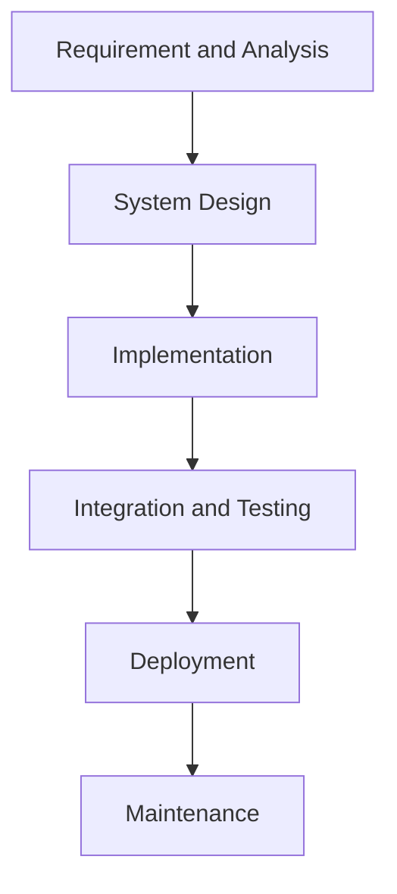
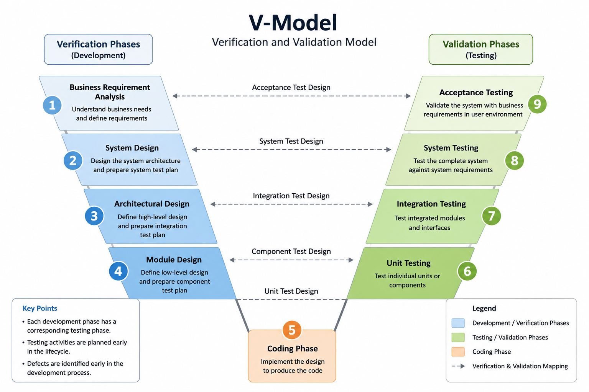
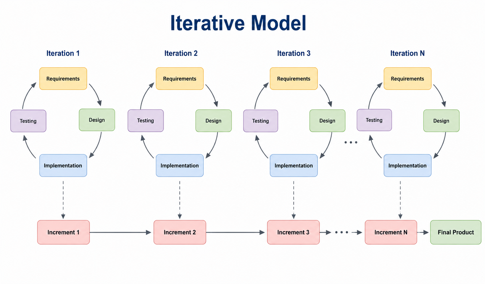
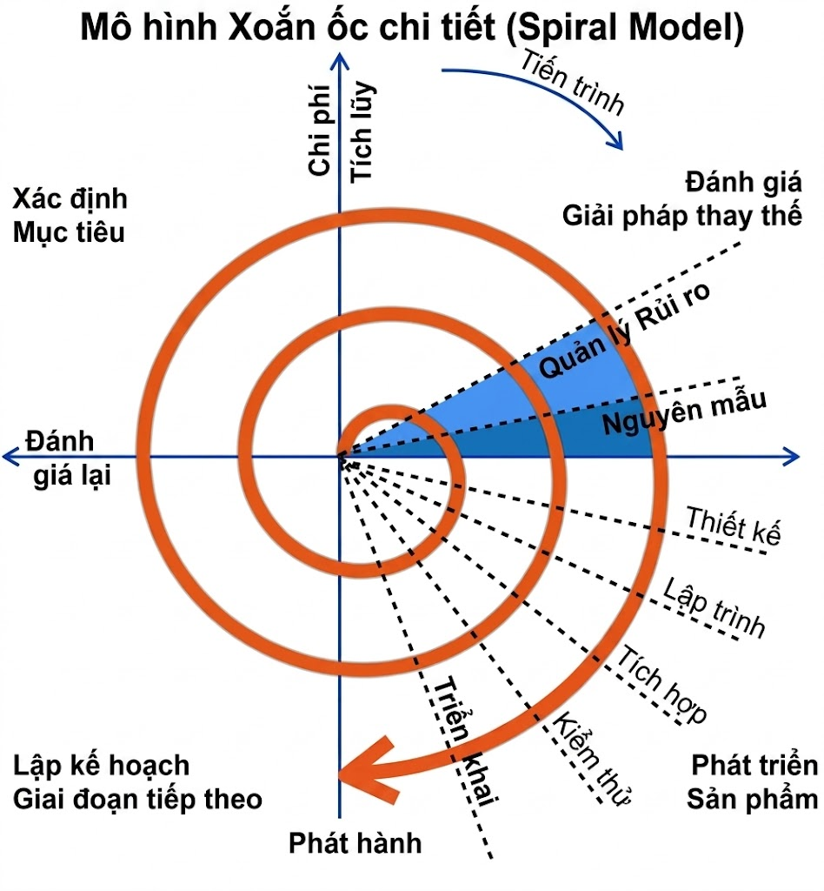
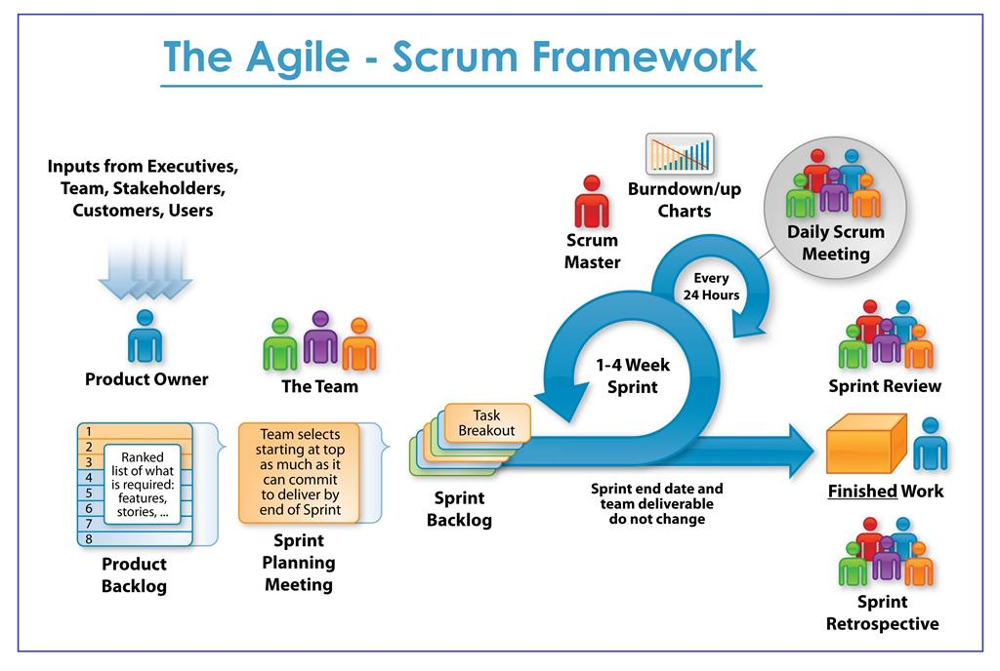

# Software Development Life Cycle (SDLC)

### Table of contents

- [Software Development Life Cycle (SDLC)](#software-development-life-cycle-sdlc)
  - [Table of contents](#table-of-contents)
  - [1. Định nghĩa SDLC](#1-định-nghĩa-sdlc)
  - [2. Các giai đoạn của SDLC](#2-các-giai-đoạn-của-sdlc)
  - [3. Các mô hình SDLC phổ biến](#3-các-mô-hình-sdlc-phổ-biến)
    - [3.1 Waterfall Model](#31-waterfall-model)
    - [3.2 V-Model](#32-v-model)
    - [3.3 Iterative Model (Mô hình lặp)](#33-iterative-model-mô-hình-lặp)
    - [3.4 Spiral Model (Mô hình xoắn ốc)](#34-spiral-model-mô-hình-xoắn-ốc)
    - [3.5 Agile Model](#35-agile-model)
      - [3.5.1 Scrum](#351-scrum)
      - [3.5.2 Kanban](#352-kanban)

## 1. Định nghĩa SDLC

- **SDLC (Software Development Life Cycle)** là vòng đời phát triển phần mềm. Đây là quy trình được ngành công nghiệp phần mềm sử dụng để thiết kế, phát triển và kiểm thử các phần mềm chất lượng cao.

- Mục tiêu: Tạo ra phần mềm chất lượng cao, đáp ứng hoặc vượt mong đợi của khách hàng, hoàn thành đúng thời hạn và trong phạm vi ngân sách.

- Tiêu chuẩn: ISO/IEC 12207 là tiêu chuẩn quốc tế cho các quy trình vòng đời phần mềm.

## 2. Các giai đoạn của SDLC

Quy trình này thường bao gồm **7 giai đoạn cơ bản** sau:

- **Phân tích yêu cầu (Requirement Analysis)**: Thu thập thông tin từ khách hàng và các bên liên quan để xác định phần mềm cần giải quyết vấn đề gì.

- **Lập kế hoạch (Planning)**: Xác định phạm vi dự án, nguồn lực, chi phí, thời gian và các rủi ro có thể xảy ra.

- **Thiết kế (Design)**: Xây dựng kiến trúc hệ thống, thiết kế cơ sở dữ liệu và giao diện người dùng (UI/UX).

- **Phát triển (Implementation/Coding)**: Các lập trình viên tiến hành viết mã nguồn dựa trên các tài liệu thiết kế.

- **Kiểm thử (Testing)**: Giai đoạn quan trọng để tìm lỗi (bugs), đảm bảo phần mềm vận hành ổn định và đúng yêu cầu ban đầu.

- **Triển khai (Deployment)**: Đưa sản phẩm lên môi trường thực tế (production) để người dùng bắt đầu sử dụng.

- **Bảo trì (Maintenance)**: Tiếp nhận phản hồi, sửa lỗi phát sinh và cập nhật các tính năng mới nếu cần.

## 3. Các mô hình SDLC phổ biến

- Waterfall Model (Thác nước)
- V-Model (Mô hình chữ V)
- Iterative Model (Mô hình lặp)
- Spiral Model (Mô hình xoắn ốc)
- Big Bang Model
- RAD Model (Phát triển ứng dụng nhanh)
- Software Prototype Model
- Agile Model

### 3.1 Waterfall Model

Mô hình Waterfall là mô hình quy trình đầu tiên được giới thiệu. Nó còn được gọi là mô hình vòng đời tuyến tính tuần tự (linear-sequential life cycle model). Mô hình này rất dễ hiểu và dễ sử dụng. Trong mô hình Waterfall, mỗi phase phải được hoàn thành trước khi phase tiếp theo bắt đầu và không có sự chồng chéo giữa các phase

Waterfall là cách tiếp cận SDLC sớm nhất được sử dụng cho phát triển phần mềm. Mô hình này mô tả quy trình phát triển phần mềm theo luồng tuần tự tuyến tính. Điều này có nghĩa là bất kỳ phase nào trong quá trình phát triển chỉ được bắt đầu khi phase trước đó đã hoàn thành. Trong Waterfall, các phase không overlap với nhau

**Thiết kế của Waterfall Model**

Trong cách tiếp cận Waterfall, toàn bộ quy trình phát triển phần mềm được chia thành các phase riêng biệt. Thông thường, đầu ra của phase trước sẽ trở thành đầu vào cho phase tiếp theo theo trình tự tuần tự

Các phase chính của Waterfall Model bao gồm:

**1. Requirement Gathering and Analysis**
Tất cả requirement có thể có của hệ thống cần phát triển sẽ được thu thập trong phase này và được tài liệu hóa trong requirement specification document.

**2. System Design**
Các requirement specification từ phase đầu tiên sẽ được phân tích trong phase này và system design sẽ được xây dựng. Thiết kế hệ thống này giúp xác định requirement về hardware, requirement hệ thống và định nghĩa kiến trúc tổng thể của hệ thống.

**3. Implementation**
Dựa trên system design, hệ thống sẽ được phát triển thành các chương trình nhỏ gọi là unit, sau đó sẽ được tích hợp ở phase tiếp theo. Mỗi unit sẽ được phát triển và kiểm thử chức năng riêng, hoạt động này được gọi là Unit Testing.

**4. Integration and Testing**
Tất cả các unit được phát triển trong phase implementation sẽ được tích hợp thành một hệ thống sau khi từng unit đã được kiểm thử. Sau khi tích hợp, toàn bộ hệ thống sẽ được kiểm thử để tìm fault và failure.

**5. Deployment of System**
Sau khi hoàn thành functional testing và non-functional testing, sản phẩm sẽ được deploy vào môi trường khách hàng hoặc release ra thị trường.

**6. Maintenance**
Sau khi triển khai, có thể xuất hiện một số issue trong môi trường của khách hàng. Để xử lý các issue này, patch sẽ được phát hành. Ngoài ra, các version tốt hơn cũng sẽ được release để cải tiến sản phẩm. Maintenance được thực hiện nhằm cung cấp các thay đổi này cho môi trường khách hàng.

Tất cả các phase này liên kết tuần tự với nhau, trong đó tiến trình được hình dung như dòng nước chảy từ trên xuống dưới giống thác nước. Phase tiếp theo chỉ được bắt đầu sau khi phase trước đạt được đầy đủ các mục tiêu đã định và được sign-off. Đó cũng là lý do mô hình này được gọi là “Waterfall Model”

**Khi nào nên sử dụng Waterfall Model?**

Waterfall Model phù hợp trong các trường hợp như:

- Requirement rõ ràng, đầy đủ và cố định
- Product definition ổn định
- Công nghệ được hiểu rõ và không thay đổi nhiều
- Không có requirement mơ hồ
- Có đầy đủ resource và expertise cần thiết
- Dự án ngắn hạn

**Ưu điểm của Waterfall Model**

Một số ưu điểm chính của Waterfall Model bao gồm:

- Đơn giản, dễ hiểu và dễ sử dụng
- Dễ quản lý nhờ tính chặt chẽ của mô hình
- Mỗi phase có deliverable và review process rõ ràng
- Các phase được thực hiện lần lượt từng bước
- Phù hợp với các dự án nhỏ có requirement rõ ràng
- Milestone được định nghĩa rõ ràng
- Process và kết quả được tài liệu hóa tốt

**Nhược điểm của Waterfall Model**

Waterfall Model cũng có nhiều hạn chế:

- Không tạo ra working software cho đến giai đoạn muộn của lifecycle
- Có mức độ risk và uncertainty cao
- Không phù hợp với các dự án phức tạp hoặc object-oriented
- Không phù hợp với dự án dài hạn và ongoing project
- Khó thích nghi với requirement thay đổi
- Khó thay đổi scope trong quá trình phát triển
- Integration thường diễn ra kiểu “big bang” ở cuối dự án nên khó phát hiện bottleneck sớm
- Testing chỉ bắt đầu sau khi development hoàn tất

### 3.2 V-Model

Mô hình V là một mô hình SDLC trong đó việc thực thi các quy trình diễn ra theo trình tự tuần tự theo hình chữ V. Nó còn được gọi là mô hình Verification and Validation.

Mô hình V là phần mở rộng của Waterfall Model và dựa trên sự liên kết giữa một phase testing với mỗi phase development tương ứng. Điều này có nghĩa là với mỗi giai đoạn trong development cycle sẽ tồn tại một giai đoạn testing liên kết trực tiếp với nó. Đây là một mô hình có tính kỷ luật cao, trong đó phase tiếp theo chỉ được bắt đầu sau khi phase trước đã hoàn thành.

**Thiết kế của V-Model**

Trong V-Model, các hoạt động testing được tích hợp vào từng giai đoạn phát triển. Phía bên trái của mô hình biểu diễn các hoạt động verification (xác minh), trong khi phía bên phải biểu diễn các hoạt động validation (xác nhận). Coding phase nằm ở đáy của chữ V.

Các phase trong V-Model thường bao gồm:

**1. Business Requirement Analysis**

Đây là giai đoạn đầu tiên của development cycle, nơi tất cả requirement của sản phẩm được hiểu từ góc nhìn của khách hàng. Phase này liên quan đến việc giao tiếp chi tiết với khách hàng để hiểu chính xác kỳ vọng và yêu cầu của họ. Đây là hoạt động rất quan trọng vì phần lớn khách hàng không biết rõ chính xác họ cần gì ngay từ đầu. Acceptance test design planning được thực hiện ở giai đoạn này vì acceptance testing liên quan trực tiếp đến business requirement.

**2. System Design**

Sau khi có requirement rõ ràng và chi tiết, system design sẽ được bắt đầu. System design giúp hiểu toàn bộ kiến trúc phần cứng và phần mềm của sản phẩm đang được phát triển. Dựa trên đó, kế hoạch cho system test sẽ được chuẩn bị. Việc thiết kế system test sớm giúp tester tập trung vào các khu vực phù hợp trong tương lai.

**3. Architectural Design**

Architectural specification được hiểu và thiết kế trong giai đoạn này. Giai đoạn này thường còn được gọi là High-Level Design (HLD). Dữ liệu kỹ thuật được truyền giữa các module và tích hợp nội bộ được định nghĩa rõ ràng trong giai đoạn này. Integration test plan cũng được xây dựng tại đây.

**4. Module Design**

Trong phase này, detailed internal design cho tất cả system module sẽ được xác định, còn được gọi là Low-Level Design (LLD). Điều quan trọng là design phải tương thích với các module khác trong kiến trúc hệ thống cũng như với các external system khác. Component test đóng vai trò quan trọng trong việc loại bỏ error và defect ở mức sớm. Component test plan sẽ được xây dựng trong giai đoạn này.

**5. Coding Phase**

Actual coding của hệ thống được thực hiện ở giai đoạn này. Coding phải tuân theo coding guideline và coding standard của tổ chức. Việc code được thực hiện dựa trên requirement và architectural specification đã được định nghĩa trước đó.

**Các phase Validation trong V-Model**

**6. Unit Testing**

Unit test plan được xây dựng trong module design phase sẽ được thực thi trong giai đoạn này. Unit testing được thực hiện ở mức code nhằm loại bỏ bug ở giai đoạn sớm, mặc dù không thể phát hiện toàn bộ defect.

**7. Integration Testing**

Integration testing được thực hiện dựa trên integration test plan được phát triển ở architectural design phase. Integration test nhằm kiểm tra xem các module có hoạt động đúng khi tương tác với nhau hay không.

**8. System Testing**

System testing được thực hiện trực tiếp trên toàn bộ hệ thống. Mục tiêu của system testing là xác minh rằng toàn bộ ứng dụng đáp ứng đúng requirement đã được xác định.

**9. Acceptance Testing**

Acceptance testing liên quan đến business requirement và được thực hiện trong môi trường người dùng. Testing này tập trung vào:

- khả năng tương thích với các hệ thống khác,
- tính khả dụng,
- hiệu năng,
- và các vấn đề thực tế khác trong môi trường production.

Acceptance testing giúp xác định sản phẩm có sẵn sàng để release cho khách hàng hay không.

**Khi nào nên sử dụng V-Model?**

V-Model phù hợp trong các trường hợp:

- Requirement rõ ràng và ổn định
- Công nghệ được hiểu rõ
- Dự án có mức độ rủi ro thấp đến trung bình
- Dự án có quy mô nhỏ đến trung bình
- Có đủ resource kỹ thuật phù hợp

**Ưu điểm của V-Model**

- Đơn giản và dễ hiểu
- Dễ quản lý
- Testing được thực hiện sớm
- Tỷ lệ thành công cao hơn nhờ planning và testing sớm
- Phù hợp với dự án có requirement ổn định
- Defect được phát hiện ở giai đoạn đầu

**Nhược điểm của V-Model**

- Khó xử lý requirement thay đổi
- Không phù hợp với dự án phức tạp hoặc object-oriented
- Không phù hợp với dự án dài hạn
- Không có prototype working software ở giai đoạn đầu
- Nếu xuất hiện thay đổi ở giai đoạn giữa thì phải update lại nhiều tài liệu và test artifact

### 3.3 Iterative Model (Mô hình lặp)

Trong Iterative Model, quy trình lặp bắt đầu bằng việc triển khai một phiên bản đơn giản với một tập nhỏ requirement của phần mềm, sau đó các phiên bản đang phát triển sẽ được cải tiến dần qua từng vòng lặp cho đến khi toàn bộ hệ thống hoàn chỉnh và sẵn sàng để deploy.

Mô hình vòng đời lặp không cố gắng bắt đầu với một bộ requirement đầy đủ ngay từ đầu. Thay vào đó, việc phát triển bắt đầu bằng cách xác định và triển khai chỉ một phần của phần mềm, sau đó phần này sẽ được review để xác định thêm các requirement mới. Quy trình này được lặp lại liên tục, tạo ra một phiên bản mới của phần mềm ở cuối mỗi iteration

**Thiết kế của Iterative Model**

Quy trình iterative bắt đầu với việc triển khai đơn giản cho một phần nhỏ requirement của phần mềm, sau đó dần cải tiến các phiên bản đang phát triển cho đến khi toàn bộ hệ thống được hoàn thiện. Ở mỗi iteration, các thay đổi trong design sẽ được thực hiện và các chức năng mới sẽ được bổ sung. Ý tưởng cốt lõi của phương pháp này là phát triển hệ thống thông qua các chu kỳ lặp đi lặp lại (iterative) và theo từng phần nhỏ tại một thời điểm (incremental).

Iterative and Incremental Development là sự kết hợp giữa iterative design (thiết kế lặp) và incremental build model (mô hình xây dựng gia tăng). Trong quá trình phát triển phần mềm, có thể có nhiều iteration của software development cycle diễn ra đồng thời. Quy trình này đôi khi còn được gọi là “evolutionary acquisition” hoặc “incremental build approach”.

Trong incremental model, toàn bộ requirement sẽ được chia thành nhiều build khác nhau. Trong mỗi iteration, module phát triển sẽ trải qua các phase:

- requirement,
- design,
- implementation,
- và testing.

Mỗi lần release tiếp theo sẽ bổ sung thêm chức năng cho phiên bản trước đó. Quy trình tiếp tục cho đến khi hệ thống hoàn chỉnh theo đúng requirement.

Yếu tố quan trọng để sử dụng thành công iterative software development lifecycle là việc validation requirement một cách nghiêm ngặt, cùng với verification và testing cho từng phiên bản phần mềm dựa trên các requirement đó trong mỗi cycle của mô hình. Khi phần mềm phát triển qua các cycle liên tiếp, các test cần được lặp lại và mở rộng để xác minh từng phiên bản của phần mềm

**Ứng dụng của Iterative Model**

Giống như các SDLC model khác, Iterative và Incremental Development có một số ứng dụng cụ thể trong ngành phần mềm. Mô hình này thường được sử dụng trong các trường hợp sau:

- Requirement của toàn bộ hệ thống được xác định và hiểu rõ.
- Các requirement chính cần được xác định trước; tuy nhiên một số chức năng hoặc enhancement có thể thay đổi theo thời gian.
- Có ràng buộc về time-to-market.
- Công nghệ mới đang được sử dụng và team phát triển cần vừa làm vừa học.
- Thiếu resource có skill phù hợp và cần thuê theo từng iteration cụ thể.
- Có các feature hoặc mục tiêu mang mức độ risk cao và có thể thay đổi trong tương lai.

**Ưu điểm của Iterative Model**

Ưu điểm của Iterative và Incremental SDLC Model bao gồm:

- Có thể phát triển một số chức năng hoạt động được ngay từ giai đoạn đầu của lifecycle.
- Kết quả được tạo ra sớm và liên tục theo chu kỳ.
- Có thể lập kế hoạch phát triển song song.
- Tiến độ dễ đo lường.
- Chi phí thay đổi scope hoặc requirement thấp hơn.
- Việc testing và debugging trong các iteration nhỏ trở nên dễ dàng hơn.
- Risk được xác định và xử lý trong từng iteration; mỗi iteration là một milestone dễ quản lý.
- Dễ quản lý risk hơn vì phần có risk cao thường được thực hiện trước.
- Sau mỗi increment sẽ có operational product được deliver.
- Các issue, challenge và risk phát hiện từ iteration trước có thể được áp dụng để cải thiện iteration tiếp theo.
- Risk analysis hiệu quả hơn.
- Hỗ trợ requirement thay đổi.
- Initial operating time ngắn hơn.
- Phù hợp với các dự án lớn và mission-critical project.
- Phần mềm được tạo ra sớm trong lifecycle giúp khách hàng dễ đánh giá và đưa feedback.

**Nhược điểm của Iterative Model**

Nhược điểm của Iterative và Incremental SDLC Model bao gồm:

- Có thể cần nhiều resource hơn.
- Mặc dù chi phí thay đổi thấp hơn, nhưng mô hình này không thực sự phù hợp với requirement thay đổi liên tục.
- Cần nhiều sự quản lý hơn.
- Có thể phát sinh vấn đề về system architecture hoặc design vì không phải toàn bộ requirement đều được thu thập ngay từ đầu.
- Việc định nghĩa increment có thể yêu cầu phải hiểu toàn bộ hệ thống trước.
- Không phù hợp với các dự án nhỏ.
- Độ phức tạp trong quản lý cao hơn.
- Khó xác định rõ thời điểm kết thúc dự án, điều này tạo ra risk.
- Cần resource có trình độ cao để thực hiện risk analysis.
- Tiến độ dự án phụ thuộc nhiều vào phase risk analysis.

### 3.4 Spiral Model (Mô hình xoắn ốc)

Spiral Model kết hợp ý tưởng của iterative development với các đặc điểm có hệ thống và được kiểm soát của waterfall model. Spiral Model là sự kết hợp giữa iterative development process model và sequential linear development model, tức waterfall model, với sự nhấn mạnh rất cao vào risk analysis. Mô hình này cho phép release sản phẩm theo từng increment hoặc cải tiến dần sản phẩm qua mỗi vòng lặp quanh hình xoắn ốc.

**Thiết kế của Spiral Model**

Spiral Model bao gồm bốn phase. Một software project sẽ lặp đi lặp lại qua các phase này trong các iteration được gọi là Spiral

**1. Xác định mục tiêu (Objective Identification)**

- Nhiệm vụ: Phân tích các yêu cầu cụ thể, mục tiêu hiệu suất và các ràng buộc (ngân sách, thời gian) cho vòng lặp hiện tại.

**2. Phân tích rủi ro & Tạo mẫu (Risk Analysis & Prototypes)**

- Đánh giá: Xác định và xử lý các rủi ro kỹ thuật, bảo mật hoặc hiệu năng.

- Nguyên mẫu: Xây dựng bản mẫu (prototype) để xác thực tính khả thi và giúp người dùng hình dung sản phẩm sớm.

**3. Phát triển & Kiểm thử (Development & Testing)**

- Thực thi: Triển khai thiết kế kiến trúc, lập trình (coding) và tích hợp hệ thống.

- Xác thực: Thực hiện các bước kiểm thử (từ Unit Test đến UAT) để đảm bảo chất lượng phần mềm trước khi bàn giao.

**4. Lập kế hoạch giai đoạn tiếp theo (Next Phase Planning)**

- Đánh giá: Xem xét lại tiến độ và kết quả của vòng lặp vừa thực hiện cùng khách hàng.

- Chuẩn bị: Lên kế hoạch cho các tính năng mới và quy mô của vòng lặp tiếp theo dựa trên phản hồi thực tế.

Quy trình này sẽ lặp lại theo hình xoắn ốc, giúp sản phẩm được hoàn thiện dần và rủi ro được kiểm soát chặt chẽ qua từng vòng.

**Ứng dụng của Spiral Model**

Spiral Model được sử dụng rộng rãi trong ngành phần mềm vì nó phù hợp với quy trình phát triển tự nhiên của sản phẩm — tức là học hỏi và cải tiến dần theo thời gian — đồng thời giúp giảm thiểu risk cho cả customer và development team.

Spiral Model thường được sử dụng trong các trường hợp:

- có giới hạn về budget và risk evaluation là quan trọng,
- dự án có mức risk từ trung bình đến cao,
- dự án dài hạn với requirement có thể thay đổi theo thời gian,
- customer chưa chắc chắn hoàn toàn về requirement,
- requirement phức tạp và cần đánh giá thêm để làm rõ,
- sản phẩm mới cần release theo từng phase để lấy feedback,
- dự kiến sẽ có thay đổi lớn trong quá trình phát triển sản phẩm.

**Ưu điểm của Spiral Model**

Một ưu điểm lớn của Spiral Model là cho phép bổ sung các thành phần của sản phẩm khi chúng trở nên rõ ràng hoặc sẵn sàng. Điều này giúp tránh xung đột với requirement và design trước đó.

Ngoài ra:

- mô hình này phù hợp với các dự án có nhiều build và release,
- cho phép chuyển đổi có tổ chức sang maintenance activity,
- thúc đẩy sự tham gia sớm của user trong quá trình phát triển hệ thống.

Các ưu điểm khác bao gồm:

- requirement thay đổi có thể được accommodate,
- hỗ trợ extensive use of prototypes,
- requirement được thu thập chính xác hơn,
- user có thể thấy hệ thống từ sớm,
- development có thể chia thành nhiều phần nhỏ,
- các phần có risk cao có thể được phát triển trước để quản lý risk tốt hơn.

**Nhược điểm của Spiral Model**

Spiral Model yêu cầu quản lý rất chặt chẽ để có thể hoàn thành sản phẩm thành công.

Ngoài ra còn tồn tại risk rằng spiral có thể tiếp tục vô thời hạn nếu việc kiểm soát thay đổi không được thực hiện tốt. Vì vậy, việc quản lý change request và kiểm soát phạm vi thay đổi là rất quan trọng.

Các nhược điểm khác bao gồm:

- management phức tạp hơn,
- khó xác định sớm thời điểm kết thúc dự án,
- không phù hợp với dự án nhỏ hoặc low-risk project,
- chi phí có thể cao đối với dự án nhỏ,
- process khá phức tạp,
- cần expertise về risk assessment.

### 3.5 Agile Model

Agile Software Development là mô hình phát triển phần mềm theo hướng linh hoạt, chia nhỏ công việc thành nhiều phần nhỏ và phát hành liên tục thay vì làm toàn bộ rồi mới release.

Mục tiêu của Agile:

- Phản hồi nhanh với thay đổi
- Tăng tốc độ phát triển
- Giao tiếp thường xuyên với khách hàng
- Cải thiện chất lượng sản phẩm liên tục

Agile không phải là một quy trình cố định mà là **một tư duy/phương pháp luận.**
Trong Agile có nhiều framework như:

- Scrum
- Kanban
- XP (Extreme Programming)
- Lean
- SAFe...

Hai framework phổ biến nhất hiện nay là Scrum và Kanban.

#### 3.5.1 Scrum

Scrum là framework Agile chia công việc thành các vòng lặp ngắn gọi là **_Sprint_**.

Mỗi Sprint thường kéo dài:

- 1 tuần
- 2 tuần
- hoặc 4 tuần

Cuối Sprint phải có sản phẩm chạy được hoặc có giá trị.

---

**Scrum Team**

**1. Product Owner (PO)**

Người đại diện khách hàng/business có trách nhiệm:

- Quản lý yêu cầu
- Ưu tiên tính năng
- Viết User Story
- Quyết định cái gì cần làm trước

**2. Scrum Master (SM)**

Người hỗ trợ team làm đúng Scrum có trách nhiệm:

- Remove blocker
- Điều phối meeting
- Bảo vệ team khỏi scope ngoài
- Cải thiện process

**3. Development Team**

Bao gồm:

- Dev
- QA/QC
- BA
- Designer
- DevOps...

---

**Các công cụ (artifacts) Scrum**

**1. Product backlog**
Product Backlog là danh sách toàn bộ yêu cầu, tính năng, bug hoặc cải tiến của sản phẩm. Đây là nơi chứa tất cả những gì cần làm cho dự án và được quản lý bởi Product Owner. Các item trong Product Backlog thường được viết dưới dạng User Story và có độ ưu tiên khác nhau. Backlog không cố định mà luôn thay đổi theo nhu cầu business hoặc phản hồi từ khách hàng.

**2. Sprint backlog**
Sprint Backlog là tập hợp các công việc được chọn từ Product Backlog để thực hiện trong một Sprint. Sau buổi Sprint Planning, team sẽ quyết định những task nào có thể hoàn thành trong Sprint hiện tại và đưa vào Sprint Backlog.

**3. Burndown chart**
Đây là biểu đồ hiển thị xu hướng của dự án dựa trên lượng thời gian cần thiết còn lại để hoàn tất công việc.

Burndown Chart có thể được dùng để theo dõi tiến độ của Sprint (được gọi là Sprint Burndown Chart) hoặc của cả dự án (Project Burndown Chart).

Biểu đồ burndown không phải là một thành tố tiêu chuẩn của Scrum theo định nghĩa mới, nhưng vẫn được sử dụng rộng rãi do tính hữu ích của nó.

---

**Scrum Workflow**

**1. Product Backlog**

Danh sách toàn bộ yêu cầu/tính năng.

**2. Sprint Planning**

Team chọn task từ backlog để làm trong Sprint.

Output:

- Sprint Goal
- Sprint Backlog

**3. Sprint**

Thời gian thực hiện task.

Ví dụ:

> Ngày 1: Planning
>
> Ngày 2-13: Development + Testing
>
> Ngày 14: Review + Retrospective

**4. Daily Scrum (Daily Standup)**

Meeting ngắn ~15 phút mỗi ngày.

Mỗi người trả lời:

- Hôm qua làm gì?
- Hôm nay làm gì?
- Có blocker không?

**5. Sprint Review**

Demo sản phẩm cuối Sprint cho stakeholder.

**6. Sprint Retrospective**

Team review process để cải thiện.

Ví dụ:

- Điều gì tốt?
- Điều gì chưa tốt?
- Cải thiện gì Sprint sau?

Scrum còn có khái niệm quan trọng là Definition of Done

**DoD (Definition of Done - Định nghĩa về sự Hoàn thành)** là một bản cam kết chung của toàn đội (Scrum Team) về các tiêu chuẩn chất lượng mà một hạng mục công việc (Product Backlog Item) phải đạt được trước khi được coi là chính thức "Xong".

Mục tiêu lớn nhất của DoD là tạo ra sự minh bạch và đảm bảo chất lượng đồng nhất, tránh tình trạng "xong nhưng vẫn còn lỗi".

Tùy vào mỗi dự án, DoD sẽ khác nhau, nhưng thông thường một DoD chuẩn sẽ bao gồm:

- Về Code: Code đã được review (Peer Review), tuân thủ coding standards và đã được đẩy lên hệ thống quản lý phiên bản (Git).

- Về Kiểm thử (Testing):
  - Hoàn thành Unit Test với tỷ lệ bao phủ (coverage) nhất định.
  - Vượt qua Integration Test (Kiểm thử tích hợp).
  - Vượt qua các bài kiểm thử hồi quy (Regression Test) để đảm bảo không làm hỏng tính năng cũ.

- Về Tài liệu: Tài liệu hướng dẫn sử dụng hoặc tài liệu kỹ thuật đã được cập nhật.

- Về Môi trường: Tính năng đã được triển khai (Deploy) lên môi trường Staging hoặc QA để sẵn sàng cho việc nghiệm thu.

#### 3.5.2 Kanban
