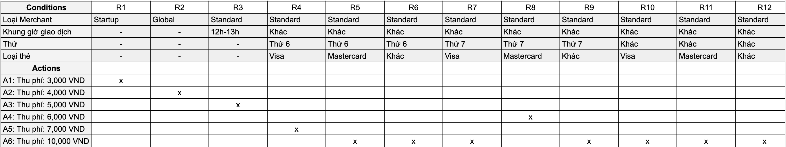
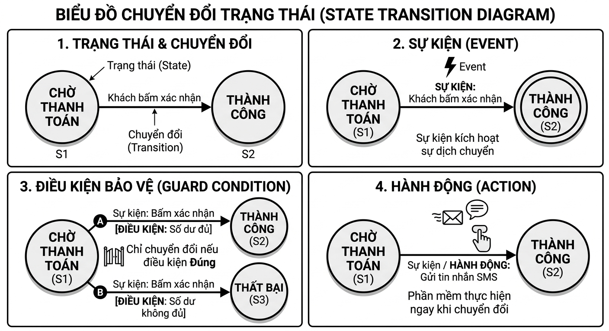
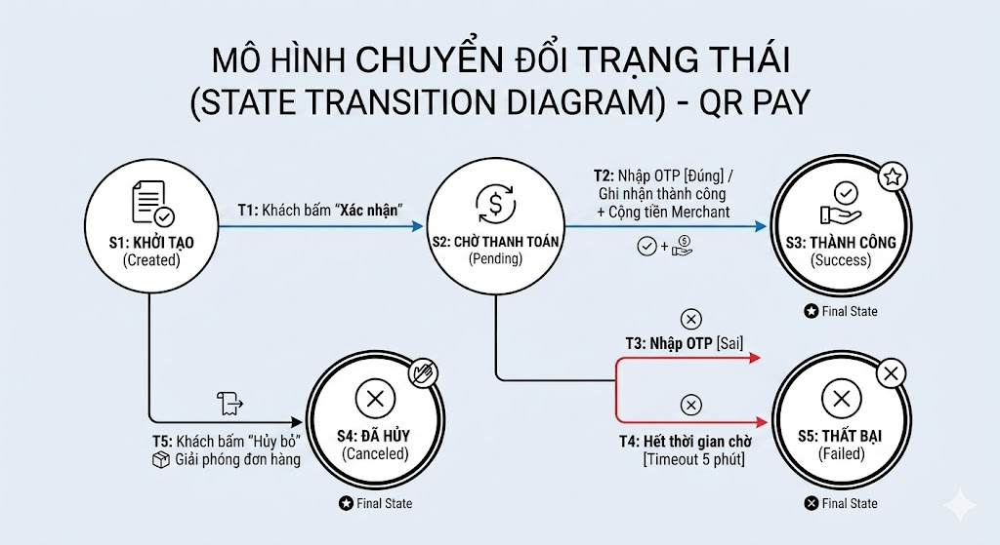
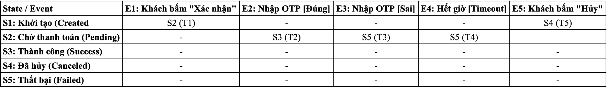
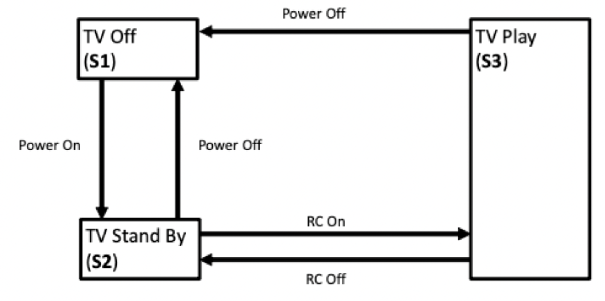

# 4. Test Analysis and Design

### Table of contents

- [4. Test Analysis and Design](#4-test-analysis-and-design)
  - [Table of contents](#table-of-contents)
  - [Keywords](#keywords)
  - [4.1. Test Techniques Overview](#41-test-techniques-overview)
  - [4.2. Black-Box Test Techniques](#42-black-box-test-techniques)
    - [4.2.1. Equivalence Partitioning](#421-equivalence-partitioning)
    - [4.2.2 Boundary Value Analysis](#422-boundary-value-analysis)
    - [4.2.3. Decision Table Testing](#423-decision-table-testing)
    - [4.2.4 State Transition Testing](#424-state-transition-testing)
    - [4.2.5 Pairwise Testing](#425-pairwise-testing)
      - [A. Tổng quan về Pairwise Testing](#a-tổng-quan-về-pairwise-testing)
      - [B. Quy trình thực hiện Pairwise Manual Testing](#b-quy-trình-thực-hiện-pairwise-manual-testing)
      - [C. Lợi ích của việc sử dụng Pairwise Testing](#c-lợi-ích-của-việc-sử-dụng-pairwise-testing)
      - [D. Những thách thức của Pairwise Manual Testing](#d-những-thách-thức-của-pairwise-manual-testing)
      - [F. Mảng trực giao (Orthogonal Arrays) trong Pairwise Testing](#f-mảng-trực-giao-orthogonal-arrays-trong-pairwise-testing)
  - [4.3. White-Box Test Techniques](#43-white-box-test-techniques)
    - [4.3.1. Statement Testing and Statement Coverage](#431-statement-testing-and-statement-coverage)
    - [4.3.2. Branch Testing and Branch Coverage](#432-branch-testing-and-branch-coverage)
    - [4.3.3. The Value of White-box Testing](#433-the-value-of-white-box-testing)
  - [4.4. Experience-based Test Techniques](#44-experience-based-test-techniques)
    - [4.4.1. Error Guessing](#441-error-guessing)
    - [4.4.2. Exploratory Testing](#442-exploratory-testing)
    - [4.4.3. Checklist-Based Testing](#443-checklist-based-testing)
  - [4.5. Collaboration-based Test Approaches](#45-collaboration-based-test-approaches)
    - [4.5.1. Collaborative User Story Writing](#451-collaborative-user-story-writing)
    - [4.5.2. Acceptance Criteria](#452-acceptance-criteria)
    - [4.5.3. Acceptance Test-driven Development (ATDD)](#453-acceptance-test-driven-development-atdd)

## Keywords

| Keyword                                   | Translate                                   |
| ----------------------------------------- | :------------------------------------------ |
| acceptance criteria                       | Tiêu chí chấp nhận                          |
| acceptance test-driven development (ATDD) | Phát triển hướng kiểm thử chấp nhận         |
| black-box test technique                  | Kỹ thuật kiểm thử hộp đen                   |
| boundary value analysis (BVA)             | Phân tích giá trị biên                      |
| branch coverage                           | Độ bao phủ nhánh                            |
| checklist-based testing                   | Kiểm thử dựa trên checklist                 |
| collaboration-based test approach         | Cách tiếp cận kiểm thử dựa trên sự cộng tác |
| coverage                                  | Độ bao phủ                                  |
| coverage item                             | Hạng mục bao phủ (hoặc Phần tử bao phủ)     |
| decision table testing                    | Kiểm thử bảng quyết định                    |
| equivalence partitioning                  | Phân vùng tương đương                       |
| error guessing                            | Đoán lỗi                                    |
| experience-based test technique           | Kỹ thuật kiểm thử dựa trên kinh nghiệm      |
| exploratory testing                       | Kiểm thử khám phá                           |
| state transition testing                  | Kiểm thử chuyển đổi trạng thái              |
| statement coverage                        | Độ bao phủ câu lệnh                         |
| test technique                            | Kỹ thuật kiểm thử                           |
| white-box test technique                  | Kỹ thuật kiểm thử hộp trắng                 |

## 4.1. Test Techniques Overview

> Tổng quan về các kỹ thuật kiểm thử

Test techniques support the tester in test analysis (what to test) and in test design (how to test). Test techniques help to develop a relatively small, but sufficient, set of test cases in a systematic way. Test techniques also help the tester to define test conditions, identify coverage items, and identify test data during the test analysis and design. Further information on test techniques can be found in the ISO/IEC/IEEE 29119-4 standard, and in (Beizer 1990, Craig 2002, Copeland 2004, Koomen 2006, Jorgensen 2014, Ammann 2016, Forgács 2019).

In this syllabus, test techniques are classified as black-box, white-box, and experience-based.

**Black-box test techniques** (also known as specification-based techniques) are based on an analysis of the specified behavior of the test object without reference to its internal structure. Therefore, the test cases are independent of how the software is implemented. Consequently, if the implementation changes, but the required behavior stays the same, then the test cases are still useful.

**White-box test techniques** (also known as structure-based techniques) are based on an analysis of the test object’s internal structure and processing. As the test cases are dependent on how the software is designed, they can only be created after the design or implementation of the test object.

**Experience-based test techniques** effectively use the knowledge and experience of testers for the design and implementation of test cases. The effectiveness of these test techniques depends heavily on the tester’s skills. Experience-based test techniques can detect defects that may be missed using the black-box test techniques and white-box test techniques. Hence, experience-based test techniques are complementary to the black-box test techniques and white-box test techniques.

> Các kỹ thuật kiểm thử hỗ trợ kiểm thử viên trong quá trình phân tích kiểm thử (kiểm thử cái gì - what to test) và thiết kế kiểm thử (kiểm thử như thế nào - how to test). Các kỹ thuật kiểm thử giúp phát triển một bộ kịch bản kiểm thử (test cases) tương đối nhỏ nhưng đầy đủ một cách có hệ thống. Các kỹ thuật kiểm thử cũng giúp kiểm thử viên xác định các điều kiện kiểm thử (test conditions), nhận diện các hạng mục bao phủ (coverage items) và xác định dữ liệu kiểm thử (test data) trong suốt quá trình phân tích và thiết kế kiểm thử. Thông tin chi tiết hơn về các kỹ thuật kiểm thử có thể được tìm thấy trong tiêu chuẩn ISO/IEC/IEEE 29119-4, và trong các tài liệu của (Beizer 1990, Craig 2002, Copeland 2004, Koomen 2006, Jorgensen 2014, Ammann 2016, Forgács 2019).
>
> Trong giáo trình này, các kỹ thuật kiểm thử được phân loại thành: hộp đen (black-box), hộp trắng (white-box) và dựa trên kinh nghiệm (experience-based).
>
> - **Kỹ thuật kiểm thử hộp đen** (Black-box test techniques - còn gọi là kỹ thuật dựa trên đặc tả / specification-based techniques): Dựa trên việc phân tích hành vi đã được đặc tả của đối tượng kiểm thử mà không cần tham chiếu đến cấu trúc bên trong của nó. Do đó, các kịch bản kiểm thử độc lập với cách phần mềm được triển khai. Hệ quả là, nếu việc triển khai thay đổi nhưng hành vi yêu cầu vẫn giữ nguyên thì các kịch bản kiểm thử đó vẫn hữu ích.
> - **Kỹ thuật kiểm thử hộp trắng** (White-box test techniques - còn gọi là kỹ thuật dựa trên cấu trúc / structure-based techniques): Dựa trên việc phân tích cấu trúc bên trong và quá trình xử lý của đối tượng kiểm thử. Vì các kịch bản kiểm thử phụ thuộc vào cách phần mềm được thiết kế, chúng chỉ có thể được tạo ra sau khi có thiết kế hoặc sự triển khai của đối tượng kiểm thử.
> - **Kỹ thuật kiểm thử dựa trên kinh nghiệm** (Experience-based test techniques): Sử dụng một cách hiệu quả kiến thức và kinh nghiệm của các kiểm thử viên để thiết kế và triển khai các kịch bản kiểm thử. Hiệu quả của các kỹ thuật kiểm thử này phụ thuộc rất nhiều vào kỹ năng của kiểm thử viên. Kỹ thuật kiểm thử dựa trên kinh nghiệm có thể phát hiện các khuyết tật (defects) mà các kỹ thuật kiểm thử hộp đen và hộp trắng có thể bỏ sót. Do đó, kỹ thuật kiểm thử dựa trên kinh nghiệm mang tính bổ khuyết cho các kỹ thuật kiểm thử hộp đen và hộp trắng.

## 4.2. Black-Box Test Techniques

> Các kỹ thuật kiểm thử hộp đen

### 4.2.1. Equivalence Partitioning

> Phân vùng tương đương

Equivalence Partitioning (EP) divides data into partitions (known as equivalence partitions) based on the expectation that all the elements of a given partition are to be processed in the same way by the test object. The theory behind this technique is that if a test case, that tests one value from an equivalence partition, detects a defect, this defect should also be detected by test cases that test any other value from the same partition. Therefore, one test for each partition is sufficient.

Equivalence partitions can be identified for any data element related to the test object, including inputs, outputs, configuration items, internal values, time-related values, and interface parameters. The partitions may be continuous or discrete, ordered or unordered, finite or infinite. The partitions must not overlap and must be non-empty sets.

For simple test items, EP can be easy, but in practice, understanding how the test object will treat different values is often complicated. Therefore, partitioning should be done with care.

A partition containing valid values is called a valid partition. A partition containing invalid values is called an invalid partition. The definitions of valid and invalid values may vary among teams and organizations. For example, valid values may be interpreted as those that should be processed by the test object or as those for which the specification defines their processing. Invalid values may be interpreted as those that should be ignored or rejected by the test object or as those for which no processing is defined in the test object specification.

In EP, the coverage items are the equivalence partitions. To achieve 100% coverage with this test technique, test cases must exercise all identified partitions (including invalid partitions) by covering each partition at least once. Coverage is measured as the number of partitions exercised by at least one test case, divided by the total number of identified partitions, and is expressed as a percentage.

Many test items include multiple sets of partitions (e.g., test items with more than one input parameter), which means that a test case will cover partitions from different sets of partitions. The simplest coverage criterion in the case of multiple sets of partitions is called Each Choice coverage (Ammann 2016). Each Choice coverage requires test cases to exercise each partition from each set of partitions at least once. Each Choice coverage does not take into account combinations of partitions.

> Phân vùng tương đương (EP) phân chia dữ liệu thành các phân vùng (được gọi là các vùng tương đương) dựa trên kỳ vọng rằng tất cả các phần tử trong một phân vùng cho trước đều được đối tượng kiểm thử xử lý theo cùng một cách. Cơ sở lý thuyết của kỹ thuật này là: nếu một kịch bản kiểm thử (test case) kiểm tra một giá trị đại diện trong một vùng tương đương và phát hiện ra khuyết tật (defect), thì khuyết tật này cũng sẽ được tìm thấy bởi các kịch bản kiểm thử kiểm tra bất kỳ giá trị nào khác trong cùng phân vùng đó. Do đó, chỉ cần một bài kiểm thử cho mỗi phân vùng là đủ.
>
> Các vùng tương đương có thể được xác định cho bất kỳ phần tử dữ liệu nào liên quan đến đối tượng kiểm thử, bao gồm đầu vào (inputs), đầu ra (outputs), các hạng mục cấu hình (configuration items), các giá trị nội bộ (internal values), các giá trị liên quan đến thời gian và các tham số giao diện (interface parameters). Các phân vùng có thể là liên tục hoặc rời rạc, được sắp xếp hoặc không được sắp xếp, hữu hạn hoặc vô hạn. Các phân vùng phải không được trùng lặp (overlap) và phải là các tập hợp khác rỗng.
>
> Đối với các mục kiểm thử đơn giản, việc áp dụng EP có thể dễ dàng, nhưng trong thực tế, việc thấu hiểu cách đối tượng kiểm thử xử lý các giá trị khác nhau thường rất phức tạp. Vì vậy, việc phân vùng cần phải được thực hiện một cách cẩn trọng.
>
> - Một phân vùng chứa các giá trị hợp lệ được gọi là phân vùng hợp lệ (valid partition).
> - Một phân vùng chứa các giá trị không hợp lệ được gọi là phân vùng không hợp lệ (invalid partition).
>
> Định nghĩa về giá trị hợp lệ và không hợp lệ có thể khác nhau giữa các đội ngũ và tổ chức. Ví dụ, các giá trị hợp lệ có thể được hiểu là những giá trị sẽ được đối tượng kiểm thử xử lý, hoặc là những giá trị đã được tài liệu đặc tả định nghĩa rõ quy trình xử lý. Các giá trị không hợp lệ có thể được hiểu là những giá trị sẽ bị đối tượng kiểm thử bỏ qua hoặc từ chối, hoặc là những giá trị không được định nghĩa quy trình xử lý trong tài liệu đặc tả của đối tượng kiểm thử.
>
> Trong kỹ thuật EP, các hạng mục bao phủ (coverage items) chính là các vùng tương đương. Để đạt được độ bao phủ 100% (100% coverage) với kỹ thuật kiểm thử này, các kịch bản kiểm thử phải thực thi qua tất cả các phân vùng đã được xác định (bao gồm cả các phân vùng không hợp lệ) bằng cách bao phủ mỗi phân vùng ít nhất một lần. Độ bao phủ được đo bằng số lượng phân vùng được thực thi bởi ít nhất một kịch bản kiểm thử, chia cho tổng số phân vùng đã được xác định, và được thể hiện dưới dạng phần trăm.
>
> Nhiều mục kiểm thử bao gồm nhiều tập hợp phân vùng khác nhau (ví dụ: các mục kiểm thử có nhiều hơn một tham số đầu vào), điều này có nghĩa là một kịch bản kiểm thử sẽ bao phủ các phân vùng từ các tập hợp phân vùng khác nhau. Tiêu chí bao phủ đơn giản nhất trong trường hợp có nhiều tập hợp phân vùng được gọi là độ bao phủ Mỗi lựa chọn (Each Choice coverage) (Ammann 2016). Độ bao phủ Mỗi lựa chọn yêu cầu các kịch bản kiểm thử phải thực thi mỗi phân vùng từ mỗi tập hợp phân vùng ít nhất một lần. Độ bao phủ Mỗi lựa chọn không tính đến các tổ hợp (combinations) của các phân vùng.

> **Bài toán ví dụ**: Tính năng Thanh toán bằng Mã QR (QR Pay)
> Giả sử hệ thống cổng thanh toán có một tính năng nhận diện giao dịch QR Pay từ Merchant với hai tham số đầu vào cần kiểm thử:
>
> - Số tiền thanh toán (Amount): Quy định từ 10,000 VND đến 50,000,000 VND cho một giao dịch.
> - Loại tài khoản (Account Type): Hệ thống chỉ chấp nhận hai loại tài khoản là Cá nhân (Personal) và Doanh nghiệp (Business).
>
> Giải bài toán bằng Equivalence Partitioning:
> **Bước 1: Xác định phân vùng tương đương**
> Dựa trên quy định nghiệp vụ (Specification), chia dữ liệu thành các tập hợp phân vùng hợp lệ và không hợp lệ cho từng tham số đầu vào:
>
> - Tập hợp 1: Tham số Amount
>   - Phân vùng 1: (Invalid) < 10,000 -> 5,000
>   - Phân vùng 2: (Valid) [10,000 - 50,000,000] -> 500,000
>   - Phân vùng 3: (Invalid) > 50,000,000 -> 60,000,000
> - Tập hợp 2: Tham số Account Type
>   - Phân vùng 4: (Valid) Personal
>   - Phân vùng 5: (Valid) Business
>   - Phân vùng 6: (Invalid) Null
>
> **Bước 2: Thiết kế Test Cases theo độ bao phủ "Mỗi lựa chọn" (Each Choice Coverage)**
> Để đạt độ bao phủ 100% Each Choice, quy định yêu cầu mỗi phân vùng của mỗi tập hợp phải được xuất hiện ít nhất một lần trong bộ test case, không bắt buộc phải kiểm thử mọi tổ hợp trùng lặp giữa chúng.
> |TC|Amount|Account Type|Phân vùng được bao phủ|Expected Result|
> |---|---|---|---|:---|
> |TC_01| 500,000 VND| Personal| Bao phủ Phân vùng 2 và Phân vùng 4| Giao dịch thành công (Hợp lệ)|
> |TC_02| 5,000 VND| Business |Bao phủ Phân vùng 1 và Phân vùng 5| Hệ thống từ chối - Lỗi số tiền không hợp lệ|
> |TC_03| 60,000,000 VND|Null|Bao phủ Phân vùng 3 và Phân vùng 6|Hệ thống từ chối - Lỗi dữ liệu không hợp lệ|
>
> **Phân tích độ bao phủ:**
> Có thể thấy, chỉ với 3 kịch bản kiểm thử, tất cả 6 phân vùng được xác định (từ Phân vùng 1 đến Phân vùng 6) đều đã được thực thi ít nhất một lần. Bộ test này đã đạt 100% Each Choice Coverage, giúp tiết kiệm tối đa thời gian thay vì phải tạo ra 9 tổ hợp ($3 \times 3$) nếu phối hợp kiểm thử toàn bộ.

### 4.2.2 Boundary Value Analysis

> Phân tích giá trị biên

**Boundary Value Analysis (BVA)** is a test technique based on exercising the boundaries of equivalence partitions. Therefore, BVA can only be used for ordered partitions. The minimum and maximum values of a partition are its boundary values. In the case of BVA, if two elements belong to the same partition, all elements between them must also belong to that partition.

BVA focuses on the boundary values of the partitions because developers are more likely to make errors with these boundary values. Typical defects found by BVA are located where implemented boundaries are misplaced to positions above or below their intended positions or are omitted altogether.

This syllabus covers two versions of the BVA: 2-value and 3-value BVA. They differ in terms of coverage items per boundary that need to be exercised to achieve 100% coverage.

In 2-value BVA (Craig 2002, Myers 2011), for each boundary value there are two coverage items: this boundary value and its closest neighbor belonging to the adjacent partition. To achieve 100% coverage with 2-value BVA, test cases must exercise all coverage items, i.e., all identified boundary values. Coverage is measured as the number of boundary values that were exercised, divided by the total number of identified boundary values, and is expressed as a percentage.

In 3-value BVA (Koomen 2006, O’Regan 2019), for each boundary value there are three coverage items: this boundary value and both its neighbors. Therefore, in 3-value BVA some of the coverage items may not be boundary values. To achieve 100% coverage with 3-value BVA, test cases must exercise all coverage items, i.e., identified boundary values and their neighbors. Coverage is measured as the number of boundary values and their neighbors exercised, divided by the total number of identified boundary values and their neighbors, and is expressed as a percentage.

3-value BVA is more rigorous than 2-value BVA as it may detect defects overlooked by 2-value BVA. For example, if the decision “if (x ≤ 10) …” is incorrectly implemented as “if (x = 10) …”, no test data derived from the 2-value BVA (x = 10, x = 11) can detect the defect. However, x = 9, derived from the 3-value BVA, is likely to detect it.

> **Phân tích giá trị biên (BVA)** là một kỹ thuật kiểm thử dựa trên việc thực thi các giá trị biên của các vùng tương đương. Do đó, BVA chỉ có thể được sử dụng cho các phân vùng được sắp xếp (ordered partitions). Các giá trị nhỏ nhất và lớn nhất của một phân vùng chính là các giá trị biên của nó. Trong trường hợp của BVA, nếu hai phần tử thuộc cùng một phân vùng, thì tất cả các phần tử nằm giữa chúng cũng phải thuộc về phân vùng đó.
>
> BVA tập trung vào các giá trị biên của các phân vùng vì các lập trình viên có nhiều khả năng mắc lỗi tại các giá trị biên này hơn. Các khuyết tật điển hình được tìm thấy bởi BVA thường nằm ở nơi mà các biên được triển khai bị đặt sai vị trí (cao hơn hoặc thấp hơn vị trí mong muốn) hoặc bị bỏ sót hoàn toàn.
>
> Giáo trình này bao gồm hai phiên bản của BVA: BVA 2 giá trị (2-value BVA) và BVA 3 giá trị (3-value BVA). Chúng khác nhau về số lượng hạng mục bao phủ (coverage items) trên mỗi biên cần phải thực thi để đạt được độ bao phủ 100%.
>
> Trong BVA 2 giá trị (Craig 2002, Myers 2011): Đối với mỗi giá trị biên sẽ có hai hạng mục bao phủ: chính giá trị biên đó và người láng giềng gần nhất của nó thuộc về phân vùng kế cận. Để đạt độ bao phủ 100% với BVA 2 giá trị, các kịch bản kiểm thử phải thực thi tất cả các hạng mục bao phủ, tức là tất cả các giá trị biên đã được xác định. Độ bao phủ được đo bằng số lượng giá trị biên đã được thực thi, chia cho tổng số giá trị biên đã được xác định, và được thể hiện dưới dạng phần trăm.
>
> Trong BVA 3 giá trị (Koomen 2006, O’Regan 2019): Đối với mỗi giá trị biên sẽ có ba hạng mục bao phủ: chính giá trị biên đó và cả hai người láng giềng của nó. Do đó, trong BVA 3 giá trị, một số hạng mục bao phủ có thể không phải là giá trị biên. Để đạt độ bao phủ 100% với BVA 3 giá trị, các kịch bản kiểm thử phải thực thi tất cả các hạng mục bao phủ, tức là các giá trị biên đã xác định và các láng giềng của chúng. Độ bao phủ được đo bằng số lượng giá trị biên và các láng giềng của chúng đã được thực thi, chia cho tổng số giá trị biên và các láng giềng đã được xác định, và được thể hiện dưới dạng phần trăm.
>
> BVA 3 giá trị nghiêm ngặt hơn BVA 2 giá trị vì nó có thể phát hiện các khuyết tật bị BVA 2 giá trị bỏ sót. Ví dụ, nếu câu lệnh điều kiện if (x <= 10) ... bị triển khai sai thành if (x == 10) ..., không có dữ liệu kiểm thử nào được tạo ra từ BVA 2 giá trị ($x = 10$, $x = 11$) có thể phát hiện được khuyết tật này. Tuy nhiên, giá trị $x = 9$ được tạo ra từ BVA 3 giá trị có nhiều khả năng sẽ phát hiện được nó.

> **Bài toán ví dụ**: Giới hạn số tiền nạp ví điện tử
> Giả sử hệ thống MMS (Merchant Management System) quy định số tiền cho một lần nạp tiền vào ví điện tử (với kiểu dữ liệu là số nguyên Integer) phải tuân theo điều kiện: Từ _10,000 VND_ đến _50,000,000 VND_.
>
> Giải bài toán bằng 2-value BVA và 3-value BVA
>
> Bài toán này có 2 cột mốc biên là 10,000 và 50,000,000
>
> - **2-Value BVA**
>   Nguyên tắc của BVA 2 giá trị tại mỗi cột mốc là lấy: Chính giá trị biên và Giá trị láng giềng sát sườn thuộc phân vùng kế cận (hiểu đơn giản là 1 giá trị Hợp lệ và 1 giá trị Không hợp lệ nằm ngay sát nhau).
>    
>   - **_Mốc biên 10,000_**
>     - Chọn giá trị **10,000** (Hợp lệ)
>     - Chọn giá trị **9,999** (Láng giềng thuộc phân vùng ngoài - Không hợp lệ)
>        
>   - **_Mốc biên 50,000,000_**
>     - Chọn giá trị 50,000,000 (Hợp lệ)
>     - Chọn giá trị 50,000,001 (Láng giềng thuộc phân vùng ngoài - Không hợp lệ)
>        
> - **3-Value BVA**
>   Nguyên tắc của BVA 3 giá trị tại mỗi cột mốc là lấy: Chính giá trị biên và Cả 2 giá trị láng giềng trái/phải của nó (Bất kể láng giềng đó thuộc phân vùng nào).
>    
>   - **_Mốc biên 10,000_**
>     - Chọn 3 giá trị liền kề là: 9,999 | 10,000 | 10,001
>        
>   - **_Mốc biên 50,000,000_**
>     - Chọn 3 giá trị liền kề là: 49,999,999 | 50,000,000 | 50,000,001
>
> **Cách tính nhanh The number of Boundary Value (N)**
>
> k-value N = [Number of Equivalence Partitioning * k] - k
>
> Ví dụ bài toán trên còn 3 phân vùng tương đương:
>
> - nhỏ hơn 10,000
> - 10,000 - 50,000,000
> - lớn hơn 50,000,000
>
> Áp dụng công thức:
>
> - 2-value N = (3x2)-2 = 4 (giá trị)
> - 3-value N = (3x3)-3 = 6 (giá trị)

### 4.2.3. Decision Table Testing

> Kiểm thử Bảng quyết định

Decision tables are used for testing the implementation of requirements that specify how different combinations of conditions result in different outcomes. Decision tables are an effective way of recording complex logic, such as business rules.

When creating decision tables, the conditions and the resulting actions of the system are defined. These form the rows of the table. Each column corresponds to a decision rule that defines a unique combination of conditions, along with the associated actions. In limited-entry decision tables all the values of the conditions and actions (except for irrelevant or infeasible ones; see below) are shown as Boolean values (true or false). Alternatively, in extended-entry decision tables some or all the conditions and actions may also take on multiple values (e.g., ranges of numbers, equivalence partitions, discrete values).

The notation for conditions is as follows: “T” (true) means that the condition is satisfied. “F” (false) means that the condition is not satisfied. “–” means that the value of the condition is irrelevant for the action outcome. “N/A” means that the condition is infeasible for a given rule. For actions: “X” means that the action should occur. Blank means that the action should not occur. Other notations may also be used.

A full decision table has enough columns to cover every combination of conditions. The table can be simplified by deleting columns containing infeasible combinations of conditions. The table can also be minimized by merging columns, in which some conditions do not affect the outcome, into a single column. Decision table minimization algorithms are out of scope of this syllabus.

In decision table testing, the coverage items are the columns containing feasible combinations of conditions. To achieve 100% coverage with this technique, test cases must exercise all these columns. Coverage is measured as the number of exercised columns, divided by the total number of feasible columns, and is expressed as a percentage.

The strength of decision table testing is that it provides a systematic approach to identify all the combinations of conditions, some of which might otherwise be overlooked. It also helps to find any gaps or contradictions in the requirements. If there are many conditions, exercising all the decision rules may be time consuming, since the number of rules grows exponentially with the number of conditions. In such a case, to reduce the number of rules that need to be exercised, a minimized decision table or a riskbased approach may be used.

> **Bảng quyết định (Decision tables)** được sử dụng để kiểm thử việc triển khai các yêu cầu có quy định rõ cách thức các tổ hợp điều kiện khác nhau dẫn đến các kết quả đầu ra khác nhau. Bảng quyết định là một phương thức hiệu quả để ghi lại các logic phức tạp, chẳng hạn như các quy tắc kinh doanh (business rules).
>
> Khi tạo bảng quyết định, các điều kiện (conditions) và các hành động kết quả (actions) của hệ thống sẽ được xác định. Chúng tạo thành các hàng của bảng. Mỗi cột tương ứng với một quy tắc quyết định (decision rule), định nghĩa một tổ hợp điều kiện duy nhất cùng với các hành động liên quan. Trong các bảng quyết định lối vào giới hạn (limited-entry decision tables), tất cả các giá trị của điều kiện và hành động (ngoại trừ các giá trị không liên quan hoặc không khả thi; xem bên dưới) được hiển thị dưới dạng giá trị Boolean (đúng/true hoặc sai/false). Ngược lại, trong các bảng quyết định lối vào mở rộng (extended-entry decision tables), một số hoặc tất cả các điều kiện và hành động cũng có thể nhận nhiều giá trị khác nhau (ví dụ: các khoảng số, các vùng tương đương, các giá trị rời rạc).
>
> Ký hiệu dành cho các điều kiện được quy định như sau:
>
> - “T” (true): có nghĩa là điều kiện được thỏa mãn.
> - “F” (false): có nghĩa là điều kiện không được thỏa mãn.
> - “–”: có nghĩa là giá trị của điều kiện không liên quan (irrelevant) đến kết quả của hành động.
> - “N/A”: có nghĩa là điều kiện đó không khả thi (infeasible) đối với một quy tắc cho trước.
>
> Đối với các hành động:
>
> - “X”: có nghĩa là hành động đó phải xảy ra.
> - Để trống (Blank): có nghĩa là hành động đó không được xảy ra.
>
> (Các ký hiệu khác cũng có thể được sử dụng).
>
> Một bảng quyết định đầy đủ (full decision table) sẽ có đủ số lượng cột để bao phủ mọi tổ hợp của các điều kiện. Bảng có thể được đơn giản hóa bằng cách xóa bỏ các cột chứa các tổ hợp điều kiện không khả thi. Bảng cũng có thể được tối giảm (minimized) bằng cách gộp các cột (trong đó một số điều kiện không ảnh hưởng đến kết quả đầu ra) thành một cột duy nhất. Các thuật toán tối giảm bảng quyết định nằm ngoài phạm vi của giáo trình này.
>
> Trong kiểm thử bảng quyết định, các hạng mục bao phủ (coverage items) chính là các cột chứa các tổ hợp điều kiện khả thi. Để đạt được độ bao phủ 100% (100% coverage) với kỹ thuật này, các kịch bản kiểm thử phải thực thi qua tất cả các cột này. Độ bao phủ được đo bằng số lượng cột được thực thi, chia cho tổng số cột khả thi, và được thể hiện dưới dạng phần trăm.
>
> Điểm mạnh của kiểm thử bảng quyết định là nó cung cấp một cách tiếp cận có hệ thống để nhận diện tất cả các tổ hợp điều kiện, mà một vài trong số đó có thể bị bỏ sót nếu dùng cách khác. Nó cũng giúp tìm ra bất kỳ khoảng trống (gaps) hoặc sự mâu thuẫn (contradictions) nào trong tài liệu yêu cầu. Nếu có quá nhiều điều kiện, việc thực thi tất cả các quy tắc quyết định có thể gây tốn thời gian, vì số lượng quy tắc sẽ tăng theo cấp số nhân dựa trên số lượng điều kiện. Trong trường hợp đó, để giảm số lượng quy tắc cần thực thi, một bảng quyết định đã tối giảm hoặc một cách tiếp cận dựa trên rủi ro (risk-based approach) có thể được áp dụng.

> **Bài toán ví dụ**: Phí dịch vụ xử lý giao dịch Merchant
> Mỗi giao dịch thanh toán qua cổng thanh toán (Payment Gateway) sẽ bị thu một khoản phí cố định (Transaction Fee).
>
> - Phí tiêu chuẩn: 10,000 VND / giao dịch.
> - Merchant Startup (Hoạt động dưới 3 tháng): 3,000 VND / giao dịch.
> - Merchant Global (Toàn cầu- Đăng ký quốc tế): 4,000 VND / giao dịch.
>
> Các chương trình khuyến mãi/giảm phí dịch vụ:
>
> - Giờ vàng thanh toán: 5,000 VND cho mọi giao dịch phát sinh từ 12h00 đến 13h00 hàng ngày.
> - Ngày hội Visa: 7,000 VND cho giao dịch dùng thẻ Visa vào ngày Thứ 6.
> - Ngày hội Mastercard: 6,000 VND cho giao dịch dùng thẻ Mastercard vào ngày Thứ 7.
>
> _Chú ý (Quy tắc hệ thống): Trong trường hợp giao dịch thỏa măn nhiều điều kiện ưu đãi/giảm phí, hệ thống sẽ tự động tính mức phí rẻ nhất để hỗ trợ đối tác._

> **Giải bài toán bằng Decision Table Testing:**
>
> Conditions:
>
> - Loại Merchant: Startup, Global, Standard (3)
> - Khung giờ giao dịch: 12h-13h, Khác (2)
> - Thứ: Thứ 6, Thứ 7, Khác (3)
> - Loại thẻ: Visa, Mastercard, Khác (3)
>
> Actions:
>
> - A1: Thu phí: 3,000 VND
> - A2: Thu phí: 4,000 VND
> - A3: Thu phí: 5,000 VND
> - A4: Thu phí: 6,000 VND
> - A5: Thu phí: 7,000 VND
> - A6: Thu phí: 10,000 VND
>
> Nếu tổ hợp các conditions lại thì ta sẽ có 3 x 2 x 3 x 3 = 54 (cases) nhưng sau khi tối ưu thì chỉ còn 12 (cases)
>
> [Quá trình tối ưu bảng quyết định](https://drive.google.com/file/d/1aKptwU5TH1QBScsileKFnYx1-VX8zV2j/view?usp=drive_link)
>
> Kết quả sau khi tối ưu:
>
> 

### 4.2.4 State Transition Testing

> Kiểm thử chuyển đổi trạng thái

A state diagram models the behavior of a system by showing its possible states and valid state transitions. A transition is initiated by an event, which may be additionally qualified by a guard condition. The transitions are assumed to be instantaneous and may sometimes result in the software taking action. The common transition labeling syntax is as follows: “event [guard condition] / action”. Guard conditions and actions can be omitted if they do not exist or are irrelevant for the tester.

A state table is a model equivalent to a state diagram. Its rows represent states, and its columns represent events (together with guard conditions if they exist). Table entries (cells) represent transitions, and contain the target state, as well as the resulting actions, if defined. In contrast to the state diagram, the state table explicitly shows invalid transitions, which are represented by empty cells.

A test case based on a state diagram or state table is usually represented as a sequence of events, which results in a sequence of state changes (and actions, if needed). One test case may, and usually will, cover several transitions between states.

There exist many coverage criteria for state transition testing. This syllabus discusses three of them.

**In all states coverage**, the coverage items are the states. To achieve 100% all states coverage, test cases must ensure that all the states are exercised. Coverage is measured as the number of exercised states divided by the total number of states and is expressed as a percentage.

**In valid transitions coverage** (also called 0-switch coverage), the coverage items are single valid transitions. To achieve 100% valid transitions coverage, test cases must exercise all the valid transitions. Coverage is measured as the number of exercised valid transitions divided by the total number of valid transitions and is expressed as a percentage.

**In all transitions coverage,** the coverage items are all the transitions shown in a state table. To achieve 100% all transitions coverage, test cases must exercise all the valid transitions and attempt to execute invalid transitions. Testing only one invalid transition in a single test case helps to avoid defect masking, i.e., a situation in which one defect prevents the detection of another. Coverage is measured as the number of valid and invalid transitions exercised or attempted to be covered by executed test cases, divided by the total number of valid and invalid transitions, and is expressed as a percentage.

All states coverage is weaker than valid transitions coverage, because it can typically be achieved without exercising all the transitions. Valid transitions coverage is the most widely used coverage criterion. Achieving full valid transitions coverage guarantees full all states coverage. Achieving full all transitions coverage guarantees both full all states coverage and full valid transitions coverage and should be a minimum requirement for mission and safety-critical software.

> Một biểu đồ trạng thái (state diagram) mô hình hóa hành vi của một hệ thống bằng cách hiển thị các trạng thái có thể có của nó và các bước chuyển đổi trạng thái hợp lệ (valid state transitions). Một bước chuyển đổi được kích hoạt bởi một sự kiện (event), sự kiện này có thể được bổ sung thêm điều kiện ràng buộc bởi một điều kiện bảo vệ (guard condition). Các bước chuyển đổi được giả định là diễn ra tức thì và đôi khi có thể dẫn đến việc phần mềm thực hiện một hành động (action). Cú pháp nhãn chuyển đổi phổ biến như sau: “sự kiện [điều kiện bảo vệ] / hành động”. Các điều kiện bảo vệ và hành động có thể được bỏ qua nếu chúng không tồn tại hoặc không liên quan đến kiểm thử viên.
>
> Một bảng trạng thái (state table) là một mô hình tương đương với biểu đồ trạng thái. Các hàng của nó đại diện cho các trạng thái, và các cột của nó đại diện cho các sự kiện (cùng với các điều kiện bảo vệ nếu có). Các ô trong bảng (cells) đại diện cho các bước chuyển đổi, chứa trạng thái mục tiêu cũng như các hành động kết quả nếu có định nghĩa. Trái ngược với biểu đồ trạng thái, bảng trạng thái hiển thị một cách rõ ràng các bước chuyển đổi không hợp lệ (invalid transitions), được đại diện bằng các ô trống.
>
> Một kịch bản kiểm thử (test case) dựa trên biểu đồ trạng thái hoặc bảng trạng thái thường được biểu diễn dưới dạng một chuỗi các sự kiện, dẫn đến một chuỗi các thay đổi trạng thái (và các hành động, nếu cần). Một kịch bản kiểm thử có thể, và thường sẽ, bao phủ nhiều bước chuyển đổi giữa các trạng thái.
>
> Có nhiều tiêu chí bao phủ đối với kiểm thử chuyển đổi trạng thái. Giáo trình này thảo luận về ba tiêu chí trong số đó:
>
> - **Độ bao phủ tất cả các trạng thái (All states coverage)**: Các hạng mục bao phủ chính là các trạng thái. Để đạt được độ bao phủ tất cả các trạng thái 100%, các kịch bản kiểm thử phải đảm bảo rằng tất cả các trạng thái đều được thực thi. Độ bao phủ được đo bằng số lượng trạng thái được thực thi chia cho tổng số trạng thái và được thể hiện dưới dạng phần trăm.
> - **Độ bao phủ các chuyển đổi hợp lệ (Valid transitions coverage** - còn gọi là 0-switch coverage): Các hạng mục bao phủ là từng bước chuyển đổi hợp lệ đơn lẻ. Để đạt được độ bao phủ các chuyển đổi hợp lệ 100%, các kịch bản kiểm thử phải thực thi tất cả các bước chuyển đổi hợp lệ. Độ bao phủ được đo bằng số lượng các chuyển đổi hợp lệ được thực thi chia cho tổng số các chuyển đổi hợp lệ và được thể hiện dưới dạng phần trăm.
> - **Độ bao phủ tất cả các chuyển đổi (All transitions coverage)**: Các hạng mục bao phủ là tất cả các bước chuyển đổi được hiển thị trong một bảng trạng thái. Để đạt được độ bao phủ tất cả các chuyển đổi 100%, các kịch bản kiểm thử phải thực thi tất cả các bước chuyển đổi hợp lệ và cố gắng thực thi các bước chuyển đổi không hợp lệ. Việc chỉ kiểm thử một chuyển đổi không hợp lệ trong một kịch bản kiểm thử duy nhất giúp tránh hiện tượng che giấu khuyết tật (defect masking), tức là tình huống mà một khuyết tật này ngăn cản việc phát hiện ra một khuyết tật khác. Độ bao phủ được đo bằng số lượng các chuyển đổi hợp lệ và không hợp lệ đã được thực thi hoặc được cố gắng bao phủ bởi các kịch bản kiểm thử đã chạy, chia cho tổng số các chuyển đổi hợp lệ và không hợp lệ, và được thể hiện dưới dạng phần trăm.
>
> Độ bao phủ tất cả các trạng thái thì yếu hơn độ bao phủ các chuyển đổi hợp lệ, bởi vì thông thường nó có thể đạt được mà không cần phải thực thi tất cả các bước chuyển đổi. Độ bao phủ các chuyển đổi hợp lệ là tiêu chí bao phủ được sử dụng rộng rãi nhất. Việc đạt được toàn bộ độ bao phủ các chuyển đổi hợp lệ đảm bảo sẽ đạt được toàn bộ độ bao phủ tất cả các trạng thái. Việc đạt được toàn bộ độ bao phủ tất cả các chuyển đổi đảm bảo đạt được cả độ bao phủ tất cả các trạng thái và độ bao phủ các chuyển đổi hợp lệ, và nên là một yêu cầu tối thiểu đối với các phần mềm quan trọng mang tính sống còn hoặc có độ an toàn cao (mission and safety-critical software).

> **Ví dụ bài toán nghiệp vụ**: Vòng đời giao dịch QR Pay
>
> Một giao dịch QR Pay trên hệ thống MMS có các trạng thái sau:
>
> - **S1: Khởi tạo (Created)**: Khách vừa quét mã QR thành công, hệ thống hiển thị thông tin đơn hàng trên App.
> - **S2: Chờ thanh toán (Pending)**: Khách đã bấm nút "Thanh toán", hệ thống đang gửi yêu cầu xác thực OTP/Biometric sang Ngân hàng phát hành.
> - **S3: Thành công (Success)**: Khách xác thực thành công, tài khoản bị trừ tiền, Merchant nhận được tiền. (Trạng thái cuối).
> - **S4: Đã hủy (Canceled)**: Khách chủ động bấm "Hủy giao dịch" hoặc thoát App trước khi nhập OTP. (Trạng thái cuối).
> - **S5: Thất bại (Failed)**: Khách nhập sai OTP quá số lần hoặc hệ thống ngân hàng bị lỗi kết nối timeout. (Trạng thái cuối).
>
> 
>
> **All state coverage** thì ta viết TC sao cho đi qua các state:
>
> - TC1: S1 (T1) &rarr; S2 (T2) &rarr; S3
> - TC2: S1 (T1) &rarr; S2 (T3) &rarr; S5
> - TC3: S1 (T5) &rarr; S4
>
> **Valid transition coverage** (phổ biến nhất) thì ta viết TC phải thực thi tất cả các bước chuyển đổi hợp lệ:
>
> - TC1: S1 (T1) &rarr; S2 (T2) &rarr; S3
> - TC2: S1 (T1) &rarr; S2 (T3) &rarr; S5
> - TC3: S1 (T1) &rarr; S2 (T4) &rarr; S5
> - TC4: S1 (T5) &rarr; S4
>
> **All transition coverage** thì ta viết TC phải thực thi tất cả các bước chuyển đổi hợp lệ và cố gắng thực thi các bước chuyển đổi không hợp lệ.
>
> 
>
> (S: State, E: Event, A: Action, -: illegal transition)
>
> Ví dụ: Đang ở trạng thái Thành công S3 mà hệ thống lại nhận được sự kiện Nhập OTP E2 là những _chuyển đổi không hợp lệ_. Nếu test luồng này mà hệ thống vẫn đổi trạng thái hoặc trừ thêm tiền $\rightarrow$ Hệ thống dính Bug logic nghiêm trọng!

Với những sơ đồ có sự di chuyển lặp lại liên tục như hình dưới thì rất khó xác định điểm dừng. Trong trường hợp này các bạn cần áp dụng một hình thức kiểm thử khác, đó là **N-Switch testing** và **N-Switch coverage** (độ bao phủ N-Switch).

**N-Switch testing** là một dạng kiểm thử dựa vào chuyển đổi trạng thái. Nhưng ở đây bạn chỉ tập trung vào các thứ tự di chuyển khác nhau đi qua _N+1_ chuyển đổi (transition).

> **0-switch coverage**
>
> Viết TC cho mỗi transition. Cứ (0+1) transition là 1 testcase
>
> - TC1: S1 (TV Off) (E1 Power On) &rarr; S2 (TV Stand By)
> - TC2: S2 (TV Stand By) (E2 Power Off) &rarr; S1 (TV Off)
> - TC3: S2 (TV Stand By) (E3 RC On) &rarr; S3 (TV Play)
> - TC4: S3 (TV Play) (E4 RC Off) &rarr; S2 (TV Stand By)
> - TC5: S3 (TV Play) (E5 Power Off) &rarr; S1 (TV Off)
>
> **1-switch coverage**
>
> Viết TC cho mỗi transition. Cứ (1+1) transition là 1 testcase
>
> - TC1: S1 (E1) - S2 (E2)
> - TC2: S1 (E1) - S2 (E3)
> - TC3: S2 (E3) - S3 (E4)
> - TC4: S2 (E3) - S3 (E5)
> - TC5: S2 (E2) - S1 (E1)
> - TC6: S3 (E5) - S1 (E1)
> - TC7: S3 (E4) - S2 (E3)
> - TC8: S3 (E4) - S2 (E2)

### 4.2.5 Pairwise Testing

#### A. Tổng quan về Pairwise Testing

Kiểm thử cặp (Pairwise testing), còn được gọi là kiểm thử tất cả các cặp (all-pairs testing), là một phương pháp kiểm thử phần mềm thực hiện kiểm tra mọi tổ hợp cặp có thể có của các tham số đầu vào. Phương pháp tiếp cận này đặc biệt hữu ích khi việc kiểm thử toàn bộ (exhaustive testing) trở nên bất khả thi do số lượng kịch bản kiểm thử tiềm năng quá lớn.

Nghiên cứu cho thấy hầu hết các khuyết tật (defects) trong phần mềm đều bị gây ra bởi sự tương tác giữa một cặp gồm hai biến số. Bằng cách tập trung vào việc kiểm thử các cặp tham số, kỹ thuật này giúp tối ưu hóa quy trình, nâng cao hiệu suất và tăng cường khả năng phát hiện lỗi mà không làm giảm chất lượng kiểm thử.

#### B. Quy trình thực hiện Pairwise Manual Testing

Để tiến hành kiểm thử chức năng thủ công bằng phương pháp này, chúng ta có thể tuân theo các bước sau:

- **Xác định các tham số đầu vào**: Liệt kê và sắp xếp thứ tự ưu tiên cho các tham số dựa trên tài liệu yêu cầu hệ thống.

- **Định nghĩa giá trị tham số**: Xác định toàn bộ các giá trị khả thi cho từng tham số.

- **Tạo các tổ hợp cặp (Pairwise combinations)**: Tạo ra các tổ hợp sao cho mọi cặp giá trị của các tham số xuất hiện cùng nhau một cách hệ thống.

- **Thiết kế kịch bản chi tiết**: Xây dựng các test case toàn diện dựa trên các cặp vừa tạo để đảm bảo tính rõ ràng và đầy đủ.

- **Thực thi và Phân tích**: Tiến hành chạy kiểm thử thủ công, ghi chép tỉ mỉ kết quả để phân tích và phát hiện khuyết tật.

#### C. Lợi ích của việc sử dụng Pairwise Testing

- Giảm thiểu số lượng kịch bản (Reduced test cases): Giảm đáng kể số lượng kịch bản kiểm thử cần thiết để đạt độ bao phủ toàn diện, từ đó đẩy nhanh tốc độ thực thi và cắt giảm chi phí.

- Tăng khả năng phát hiện lỗi (Increased defect detection): Tập trung vào sự tương tác giữa các cặp tham số đầu vào, giúp phát hiện các khuyết tật dễ bị bỏ sót bởi các phương pháp kiểm thử khác.

- Mở rộng độ bao phủ (Enhanced test coverage): Đảm bảo tất cả các cặp tham số đầu vào đều được kiểm tra kỹ lưỡng, củng cố mức độ tin cậy vào chất lượng phần mềm.

- Khả năng mở rộng (Scalability): Dễ dàng thích ứng với cả các hệ thống nhỏ lẫn các hệ thống lớn có vô số tham số đầu vào phức tạp.

#### D. Những thách thức của Pairwise Manual Testing

Mặc dù kiểm thử cặp bằng phương pháp thủ công mang lại hiệu quả cao, kỹ thuật này vẫn đối mặt với một số thách thức lớn sau:

- **Tốn thời gian (Time-consuming)**: Việc tự tạo và thực thi các kịch bản kiểm thử cho tất cả các cặp tham số đầu vào bằng tay tiêu tốn rất nhiều thời gian, đặc biệt là đối với các hệ thống sở hữu lượng tham số lớn.

- **Dễ sai sót (Error-prone)**: Quy trình thủ công này rất dễ bị ảnh hưởng bởi sai sót của con người, dẫn đến việc bỏ sót các tổ hợp quan trọng hoặc thiết kế sai lệch các kịch bản kiểm thử.

- **Thiếu tính nhất quán (Lack of consistency)**: Việc duy trì tính đồng bộ và nhất quán giữa các kịch bản kiểm thử được tạo thủ công là điều vô cùng khó khăn, đặc biệt là trong các dự án có quy mô lớn.

Để giải quyết triệt để các thách thức trên, chúng ta có thể cân nhắc áp dụng các biện pháp sau vào quy trình làm việc của đội ngũ QA/QC

- **Tự động hóa bằng công cụ**: Tận dụng tối đa các công cụ tự động hóa để tạo tổ hợp cặp (như PICT, AllPairs) bất cứ khi nào khả thi nhằm giải phóng sức lao động.

- **Chuẩn hóa quy trình**: Thiết lập các giao thức kiểm thử (testing protocols) rõ ràng, cụ thể cho toàn đội ngũ.

- **Đánh giá nghiêm ngặt (Review)**: Triển khai các quy trình rà soát và kiểm duyệt kịch bản (Test Case Review) kỹ lưỡng nhằm giảm thiểu tối đa sai sót và đảm bảo tính nhất quán trong suốt vòng đời phát triển phần mềm.

#### F. Mảng trực giao (Orthogonal Arrays) trong Pairwise Testing

**Mảng trực giao (Orthogonal arrays)** là một khái niệm toán học được ứng dụng trong kiểm thử cặp để thiết kế kịch bản một cách hệ thống và hiệu quả. Chúng giúp giảm thiểu sai sót do con người, duy trì tính nhất quán bằng cách đảm bảo rằng mỗi cặp tham số đầu vào được kiểm tra chính xác một lần trên toàn bộ tập hợp kịch bản.

> **Bài toán ví dụ: Tính năng Thanh toán hóa đơn Điện/Nước qua App**
>
> Hệ thống cần xử lý giao dịch thanh toán hóa đơn với 3 Tham số đầu vào (Parameters).
>
> Param 1: Mã hóa đơn có các giá trị sau:
>
> - Valid: Điện, Nước
> - Invalid: Mã rác
>
> Param 2: Kênh thanh toán có các giá trị sau:
>
> - Valid: Ví điện tử (Wallet), Thẻ NAPAS, Thẻ Quốc tế (Visa)
> - Invalid: Thẻ hết hạn
>
> Param 3: Khuyến mãi (Voucher) có các giá trị sau:
>
> - Valid: Không dùng, Giảm 10k, Giảm 20k
> - Invalid: Voucher hết hạn
>
> Nếu kiểm thử toàn bộ exhaustive testing thì sẽ cần 2 &times; 3 &times; 3 = 18 cases (với các giá trị Valid). Nếu giải bằng Pairwise để tối ưu hóa để mỗi cặp giá trị gặp nhau ít nhất 1 lần thì số kịch bản kiểm thử sẽ giảm đi đáng kể:
>
> B1: All Valid (Lấy tất cả giá trị valid kết hợp với nhau)
>
> - TC1: Điện, Ví điện tử, Không dùng
> - TC2: Điện, Thẻ NAPAS, Giảm 10k
> - TC3: Điện, Thẻ VISA, Giảm 20k
> - TC4: Nước, Ví điện tử, Giảm 10k
> - TC5: Nước, Thẻ NAPAS, Giảm 20k
> - TC6: Nước, Thẻ VISA, Không dùng
> - TC7: Điện, Ví điện tử, giảm 20k
> - TC8: Nước, Thẻ VISA, Giảm 10k
> - TC9: Nước, Thẻ NAPAS, Không dùng
>
> B2: Each Invalid (1 giá trị invalid bắt cặp với các giá trị valid)
>
> - TC10: Mã rác, Ví điện tử, Không dùng
> - TC11: Điện, Thẻ hết hạn, Giảm 10k
> - TC12: Nước, Thẻ NAPAS, Voucher hết hạn
>
> B3: All Invalid (Lấy tất cả giá trị invalid kết hợp với nhau)
>
> - TC13: Mã rác, Thẻ hết hạn, Voucher hết hạn
>
> Kết quả:
>
> - Kiểm thử tổ hợp Valid (Dùng Pairwise): 9 kịch bản (Thay vì 18).
> - Kiểm thử logic lỗi (Rời rạc): 3 kịch bản.
> - Kiểm thử hiển thị UI (Gom lỗi): 1 kịch bản.
> - TỔNG CỘNG: 13 kịch bản kiểm thử tinh gọn, bao phủ hoàn hảo mọi ngóc ngách của tính năng mà không bị chồng chéo, sót lỗi.

## 4.3. White-Box Test Techniques

> Kỹ thuật kiểm thử hộp trắng

Because of their popularity and simplicity, this section focuses on two code-related white-box test techniques:

- Statement testing
- Branch testing

There are more rigorous white-box test techniques that are used in some safety-critical, mission-critical, or high-integrity environments to achieve more thorough code coverage. There are also white-box test techniques used in higher test levels (e.g., API testing), or using coverage not related to code (e.g., neuron coverage in neural network testing). These techniques are not discussed in this syllabus.

> Do tính phổ biến và sự đơn giản của chúng, phần này tập trung vào hai kỹ thuật kiểm thử hộp trắng liên quan đến mã nguồn (code-related):
>
> - Kiểm thử câu lệnh (Statement testing)
> - Kiểm thử nhánh (Branch testing)
>
> Có những kỹ thuật kiểm thử hộp trắng nghiêm ngặt hơn được sử dụng trong một số môi trường quan trọng mang tính sống còn (safety-critical, mission-critical) hoặc đòi hỏi tính toàn vẹn cao (high-integrity environments) để đạt được độ bao phủ mã nguồn triệt để hơn. Ngoài ra, còn có các kỹ thuật kiểm thử hộp trắng được sử dụng ở các mức độ kiểm thử cao hơn (ví dụ: kiểm thử API), hoặc sử dụng độ bao phủ không liên quan đến mã nguồn (ví dụ: độ bao phủ nơ-ron trong kiểm thử mạng nơ-ron nhân tạo). Các kỹ thuật này không được thảo luận trong phạm vi giáo trình này.

### 4.3.1. Statement Testing and Statement Coverage

> Kiểm thử câu lệnh và Độ bao phủ câu lệnh

In statement testing, the coverage items are executable statements. The aim is to design test cases that exercise statements in the code until an acceptable level of coverage is achieved. Coverage is measured as the number of statements exercised by the test cases divided by the total number of executable statements in the code, and is expressed as a percentage.

When 100% statement coverage is achieved, it ensures that all executable statements in the code have been exercised at least once. In particular, this means that each statement with a defect will be executed, which may cause a failure demonstrating the presence of the defect. However, exercising a statement with a test case will not detect defects in all cases. For example, it may not detect defects that are data dependent (e.g., a division by zero that only fails when a denominator is set to zero). Also, 100% statement coverage does not ensure that all the decision logic has been tested as, for instance, it may not exercise all the branches (see chapter 4.3.2) in the code.

> In kiểm thử câu lệnh (statement testing), các hạng mục bao phủ (coverage items) chính là các câu lệnh có thể thực thi (executable statements). Mục tiêu là thiết kế các kịch bản kiểm thử (test cases) để thực thi các câu lệnh trong mã nguồn cho đến khi đạt được một mức độ bao phủ chấp nhận được. Độ bao phủ được đo bằng số lượng câu lệnh được thực thi bởi các kịch bản kiểm thử chia cho tổng số câu lệnh có thể thực thi trong mã nguồn, và được thể hiện dưới dạng phần trăm.
>
> Khi đạt được độ bao phủ câu lệnh 100%, nó đảm bảo rằng tất cả các câu lệnh có thể thực thi trong mã nguồn đã được thực thi ít nhất một lần. Đặc biệt, điều này có nghĩa là mỗi câu lệnh chứa khuyết tật (defect) sẽ được chạy qua, điều này có thể gây ra một lỗi (failure) nhằm chứng minh sự hiện diện của khuyết tật đó. Tuy nhiên, việc thực thi một câu lệnh bằng một kịch bản kiểm thử sẽ không thể phát hiện ra khuyết tật trong mọi trường hợp. Ví dụ, nó có thể không phát hiện được các khuyết tật phụ thuộc vào dữ liệu (data dependent) (ví dụ: một phép chia cho số không (division by zero) mà chỉ lỗi khi mẫu số được thiết lập bằng 0). Ngoài ra, độ bao phủ câu lệnh 100% không đảm bảo rằng tất cả các logic quyết định (decision logic) đã được kiểm thử, vì chẳng hạn, nó có thể không thực thi được tất cả các nhánh (branches) (xem chương 4.3.2) trong mã nguồn.

### 4.3.2. Branch Testing and Branch Coverage

> Kiểm thử nhánh và Độ bao phủ nhán

A branch is a transfer of control between two nodes in the control flow graph, which shows the possible sequences in which source code statements are executed in the test object. Each transfer of control can be either unconditional (i.e., straight-line code) or conditional (i.e., a decision outcome).

In branch testing the coverage items are branches and the aim is to design test cases to exercise branches in the code until an acceptable level of coverage is achieved. Coverage is measured as the number of branches exercised by the test cases divided by the total number of branches and is expressed as a percentage.

When 100% branch coverage is achieved, all branches in the code, unconditional and conditional, are exercised by test cases. Conditional branches typically correspond to a true or false outcome from an “if...then” decision, an outcome from a switch/case statement, or a decision to exit or continue in a loop. However, exercising a branch with a test case will not detect defects in all cases. For example, it may not detect defects requiring the execution of a specific path in a code.

Branch coverage subsumes statement coverage. This means that any set of test cases achieving 100% branch coverage also achieves 100% statement coverage (but not vice versa).

> Một nhánh (branch) là sự chuyển giao quyền điều khiển (transfer of control) giữa hai nút (nodes) trong đồ thị luồng điều khiển (control flow graph), đồ thị này hiển thị các chuỗi khả thi mà các câu lệnh mã nguồn được thực thi trong đối tượng kiểm thử. Mỗi sự chuyển giao quyền điều khiển có thể là không điều kiện (unconditional - tức là mã nguồn đi theo đường thẳng) hoặc có điều kiện (conditional - tức là kết quả của một quyết định).
>
> Trong kiểm thử nhánh (branch testing), các hạng mục bao phủ (coverage items) chính là các nhánh và mục tiêu là thiết kế các kịch bản kiểm thử (test cases) để thực thi các nhánh trong mã nguồn cho đến khi đạt được một mức độ bao phủ chấp nhận được. Độ bao phủ được đo bằng số lượng nhánh được thực thi bởi các kịch bản kiểm thử chia cho tổng số nhánh trong mã nguồn, và được thể hiện dưới dạng phần trăm.
>
> Khi đạt được độ bao phủ nhánh 100%, tất cả các nhánh trong mã nguồn, bao gồm cả không điều kiện và có điều kiện, đều được thực thi bởi các kịch bản kiểm thử. Các nhánh có điều kiện thường tương ứng với kết quả Đúng (True) hoặc Sai (False) từ một quyết định “if...then”, một kết quả từ câu lệnh "switch/case", hoặc một quyết định thoát khỏi hay tiếp tục vòng lặp. Tuy nhiên, việc thực thi một nhánh bằng một kịch bản kiểm thử sẽ không thể phát hiện ra khuyết tật trong mọi trường hợp. Ví dụ, nó có thể không phát hiện được các khuyết tật đòi hỏi phải thực thi một đường dẫn (path) cụ thể trong mã nguồn.
>
> Độ bao phủ nhánh bao hàm (subsumes) độ bao phủ câu lệnh. Điều này có nghĩa là bất kỳ tập hợp kịch bản kiểm thử nào đạt được độ bao phủ nhánh 100% thì cũng đồng thời đạt được độ bao phủ câu lệnh 100% (nhưng điều ngược lại thì không đúng).

### 4.3.3. The Value of White-box Testing

> Giá trị của kiểm thử hộp trắng

A fundamental strength that all white-box test techniques share is that the entire software implementation is taken into account during testing, which facilitates defect detection even when the software specification is vague, outdated or incomplete. A corresponding weakness is that if the software does not implement one or more requirements, white-box testing may not detect the resulting defects of omission (Watson 1996).

White-box test techniques can be used in static testing (e.g., during dry runs of code). They are well suited to reviewing code not yet ready for execution (Hetzel 1988), pseudocode and other high-level or top-down logic which can be modeled with a control flow graph.

Performing only black-box testing does not provide a measure of actual code coverage. White-box coverage measures provide an objective measurement of coverage and the necessary information to allow additional tests to be generated to increase this coverage, and subsequently increase confidence in the code.

> Một điểm mạnh căn bản mà tất cả các kỹ thuật kiểm thử hộp trắng đều chia sẻ là toàn bộ việc triển khai thực tế của phần mềm (software implementation) đều được xem xét trong quá trình kiểm thử, điều này tạo điều kiện thuận lợi cho việc phát hiện khuyết tật ngay cả khi tài liệu tả đặc tả phần mềm (software specification) bị mơ hồ, lỗi thời hoặc không đầy đủ. Một điểm yếu tương ứng là nếu phần mềm không triển khai một hoặc nhiều yêu cầu, kiểm thử hộp trắng có thể không phát hiện được các khuyết tật do bỏ sót (defects of omission) (Watson 1996).
>
> Các kỹ thuật kiểm thử hộp trắng có thể được sử dụng trong kiểm thử tĩnh (static testing) (ví dụ: trong các buổi chạy thử mã nguồn trên giấy - dry runs of code). Chúng rất phù hợp để xem xét (review) mã nguồn chưa sẵn sàng để thực thi (Hetzel 1988), mã giả (pseudocode) và các logic cấp cao hoặc từ trên xuống (top-down logic) khác vốn có thể được mô hình hóa bằng đồ thị luồng điều khiển (control flow graph).
>
> Việc chỉ thực hiện kiểm thử hộp đen (black-box testing) không cung cấp một thước đo về độ bao phủ mã nguồn thực tế (actual code coverage). Các phép đo độ bao phủ hộp trắng cung cấp một phép đo khách quan về độ bao phủ và các thông tin cần thiết để cho phép tạo thêm các kiểm thử bổ sung nhằm tăng độ bao phủ này, và từ đó nâng cao mức độ tin cậy vào mã nguồn.

## 4.4. Experience-based Test Techniques

> Kỹ thuật kiểm thử dựa trên kinh nghiệm

### 4.4.1. Error Guessing

> Kỹ thuật đoán lỗi (Error Guessing)

Error guessing is a test technique used to anticipate the occurrence of errors, defects, and failures, based
on the tester’s knowledge, including:

- How the application has worked in the past
- The types of errors the developers tend to make and the types of defects that result from these errors
- The types of failures that have occurred in other, similar applications

In general, errors, defects and failures may be related to: input (e.g., correct input not accepted, parameters wrong or missing), output (e.g., wrong format, wrong result), logic (e.g., missing cases, wrong operator), computation (e.g., incorrect operand, wrong computation), interfaces (e.g., parameter mismatch, incompatible types), or data (e.g., incorrect initialization, wrong type).

Fault attacks are a way to implement error guessing. This test technique requires the tester to create or acquire a list of possible errors, defects and failures, and to design tests that will identify defects associated with the errors, expose the defects, or cause the failures. These lists can be built based on experience, defect and failure data, or from common knowledge about why software fails.

See (Whittaker 2002, Whittaker 2003, Andrews 2006) for more information on error guessing and fault attacks.

> Đoán lỗi (Error guessing) là một kỹ thuật kiểm thử được sử dụng để dự đoán trước sự xuất hiện của các lỗi (errors), khuyết tật (defects) và sự cố (failures), dựa trên kiến thức của kiểm thử viên, bao gồm:
>
> - Ứng dụng đã hoạt động như thế nào trong quá khứ.
> - Các loại lỗi mà lập trình viên có xu hướng mắc phải và các loại khuyết tật là hệ quả từ những lỗi đó.
> - Các loại sự cố đã từng xảy ra trong các ứng dụng khác tương tự.
>
> Nhìn chung, các lỗi, khuyết tật và sự cố có thể liên quan đến: đầu vào (ví dụ: đầu vào đúng nhưng không được chấp nhận, tham số bị sai hoặc bị thiếu), đầu ra (ví dụ: sai định dạng, sai kết quả), logic (ví dụ: bỏ sót trường hợp, sai toán tử), tính toán (ví dụ: sai toán hạng, sai phép tính), giao diện kết nối/API (ví dụ: không khớp tham số, không tương thích kiểu dữ liệu), hoặc dữ liệu (ví dụ: khởi tạo không chính xác, sai kiểu dữ liệu).
>
> Tấn công lỗi (Fault attacks) là một cách để triển khai kỹ thuật đoán lỗi. Kỹ thuật kiểm thử này yêu cầu kiểm thử viên tạo ra hoặc thu thập một danh sách các lỗi, khuyết tật và sự cố có thể xảy ra, sau đó thiết kế các bài kiểm thử nhằm xác định các khuyết tật liên quan đến lỗi, vạch trần các khuyết tật đó, hoặc kích phát các sự cố. Các danh sách này có thể được xây dựng dựa trên kinh nghiệm, dữ liệu về khuyết tật và sự cố trước đó, hoặc từ kiến thức phổ thông về lý do tại sao phần mềm bị lỗi.
>
> Xem (Whittaker 2002, Whittaker 2003, Andrews 2006) để biết thêm thông tin về đoán lỗi và tấn công lỗi.

### 4.4.2. Exploratory Testing

> Kiểm thử khám phá (Exploratory Testing)

In exploratory testing, tests are simultaneously designed, executed, and evaluated while the tester learns about the test object. The testing is used to learn more about the test object, to explore it more deeply with focused tests, and to create tests for untested areas.

Exploratory testing is sometimes performed using session-based testing to structure the testing. In a session-based approach, exploratory testing is performed within a defined time box. The tester uses a test charter containing test objectives to guide the testing. The test session is usually followed by a debriefing that involves a discussion between the tester and stakeholders interested in the test results of the test session. In this approach test objectives may be treated as high-level test conditions. Coverage items are identified and exercised during the test session. The tester may use test session sheets to document the steps followed and the discoveries made.

Exploratory testing is useful when there are few or inadequate specifications or there is significant time pressure on the testing. Exploratory testing is also useful to complement other more formal test techniques. Exploratory testing will be more effective if the tester is experienced, has domain knowledge and has a high degree of essential skills, like analytical skills, curiosity and creativeness (see section 1.5.1).

Exploratory testing can incorporate the use of other test techniques (e.g., equivalence partitioning). More information about exploratory testing can be found in (Kaner 1999, Whittaker 2009, Hendrickson 2013).

> Trong kiểm thử khám phá (exploratory testing), các bài kiểm thử được thiết kế, thực thi và đánh giá một cách đồng thời (simultaneously) trong khi kiểm thử viên tìm hiểu thêm về đối tượng kiểm thử. Hoạt động kiểm thử này được sử dụng để hiểu rõ hơn về đối tượng kiểm thử, khám phá nó sâu hơn bằng các bài kiểm thử có trọng tâm, và tạo ra các bài kiểm thử cho các vùng chưa được kiểm thử.
>
> Kiểm thử khám phá đôi khi được thực hiện bằng cách sử dụng phương pháp kiểm thử dựa trên phiên (session-based testing) để tạo cấu trúc cho quá trình kiểm thử. Trong cách tiếp cận dựa trên phiên này, kiểm thử khám phá được thực hiện trong một khung thời gian cố định (time box) đã được xác định trước. Kiểm thử viên sử dụng một hiến chương kiểm thử (test charter) chứa các mục tiêu kiểm thử để định hướng cho việc kiểm thử. Phiên kiểm thử thường được theo sau bởi một buổi báo cáo đúc rút (debriefing) bao gồm một cuộc thảo luận giữa kiểm thử viên và các bên liên quan (stakeholders) quan tâm đến kết quả của phiên kiểm thử đó. Trong cách tiếp cận này, các mục tiêu kiểm thử có thể được coi là các điều kiện kiểm thử cấp cao (high-level test conditions). Các hạng mục bao phủ (coverage items) được xác định và thực thi ngay trong suốt phiên kiểm thử. Kiểm thử viên có thể sử dụng các biểu mẫu ghi chép phiên kiểm thử (test session sheets) để ghi lại các bước đã thực hiện và những phát hiện của mình.
>
> Kiểm thử khám phá đặc biệt hữu ích khi có ít hoặc không có đủ tài liệu đặc tả, hoặc khi có áp lực lớn về mặt thời gian đối với việc kiểm thử. Kiểm thử khám phá cũng hữu ích để bổ trợ cho các kỹ thuật kiểm thử chính thống (formal test techniques) khác. Kiểm thử khám phá sẽ hiệu quả hơn nếu kiểm thử viên là người có kinh nghiệm, có kiến thức chuyên môn về domain nghiệp vụ và có mức độ cao về các kỹ năng thiết yếu, chẳng hạn như kỹ năng phân tích, sự tò mò và tính sáng tạo (xem phần 1.5.1).
>
> Kiểm thử khám phá có thể tích hợp việc sử dụng các kỹ thuật kiểm thử khác (ví dụ: phân chia vùng tương đương). Xem thêm thông tin về kiểm thử khám phá trong (Kaner 1999, Whittaker 2009, Hendrickson 2013).

### 4.4.3. Checklist-Based Testing

> Kiểm thử dựa trên bảng kiểm

In checklist-based testing, a tester designs, implements, and executes tests to cover test conditions from a checklist. Checklists can be built based on experience, knowledge about what is important for the user, or an understanding of why and how software fails. Checklists should not contain items that can be checked automatically, items better suited as entry criteria, exit criteria, or items that are too general (Brykczynski 1999).

Checklist items are often phrased in the form of a question. It should be possible to check each item separately and directly. These items may refer to requirements, graphical interface properties, quality characteristics or other forms of test conditions. Checklists can be created to support various test types, including functional and non-functional testing (e.g., 10 heuristics for usability testing (Nielsen 1994)).

Some checklist entries may gradually become less effective over time because the developers will learn to avoid making the same errors. New entries may also need to be added to reflect newly found high severity defects. Therefore, checklists should be regularly updated based on defect analysis. However, care should be taken to avoid letting the checklist become too long (Gawande 2009).

In the absence of detailed test cases, checklist-based testing can provide guidelines and some degree of consistency for the testing. If the checklists are high-level, some variability in the actual testing is likely to occur, resulting in potentially greater coverage but less repeatability.

> Trong kiểm thử dựa trên bảng kiểm (checklist-based testing), kiểm thử viên thiết kế, triển khai và thực thi các bài kiểm thử để bao phủ các điều kiện kiểm thử (test conditions) từ một bảng kiểm (checklist). Các bảng kiểm có thể được xây dựng dựa trên kinh nghiệm, kiến thức về những điều quan trọng đối với người dùng, hoặc sự thấu hiểu về lý do và cách thức phần mềm bị lỗi. Bảng kiểm không nên chứa các hạng mục có thể kiểm tra một cách tự động, các hạng mục phù hợp hơn để làm tiêu chí bắt đầu (entry criteria), tiêu chí kết thúc (exit criteria), hoặc các hạng mục quá chung chung (Brykczynski 1999).
>
> Các hạng mục trong bảng kiểm thường được diễn đạt dưới dạng một câu hỏi. Mỗi hạng mục cần phải có khả năng kiểm tra một cách độc lập và trực tiếp. Những hạng mục này có thể đề cập đến các yêu cầu (requirements), các đặc tính của giao diện đồ họa (graphical interface properties), các đặc tính chất lượng (quality characteristics) hoặc các dạng điều kiện kiểm thử khác. Bảng kiểm có thể được tạo ra để hỗ trợ cho nhiều loại kiểm thử khác nhau, bao gồm cả kiểm thử chức năng và kiểm thử phi chức năng (ví dụ: 10 nguyên lý kiểm thử định tính - 10 heuristics cho kiểm thử độ khả dụng (Nielsen 1994)).
>
> Một số mục trong bảng kiểm có thể giảm dần hiệu quả theo thời gian vì các lập trình viên sẽ học được cách tránh mắc phải những lỗi tương tự. Các mục mới cũng có thể cần phải được bổ sung để phản ánh những khuyết tật có mức độ nghiêm trọng cao (high severity defects) mới được tìm thấy. Do đó, các bảng kiểm nên được cập nhật thường xuyên dựa trên việc phân tích khuyết tật (defect analysis). Tuy nhiên, cần cẩn trọng để tránh để bảng kiểm trở nên quá dài (Gawande 2009).
>
> Trong trường hợp thiếu các kịch bản kiểm thử chi tiết (detailed test cases), kiểm thử viên có thể sử dụng kiểm thử dựa trên bảng kiểm để cung cấp các hướng dẫn và một mức độ nhất quán nhất định cho việc kiểm thử. Nếu các bảng kiểm ở mức độ vĩ mô/cấp cao (high-level), một số biến động trong việc kiểm thử thực tế có khả năng sẽ xảy ra, dẫn đến việc có tiềm năng đạt độ bao phủ lớn hơn nhưng khả năng lặp lại (repeatability) sẽ thấp hơn.

## 4.5. Collaboration-based Test Approaches

> Các tiếp cận kiểm thử dựa trên sự cộng tác

Each of the above-mentioned test techniques (see sections 4.2, 4.3, 4.4) has a particular objective with respect to defect detection. Collaboration-based approaches, on the other hand, focus also on defect avoidance by collaboration and communication.

> Mỗi kỹ thuật kiểm thử được đề cập ở trên (xem các phần 4.2, 4.3, 4.4) đều có một mục tiêu cụ thể liên quan đến việc phát hiện khuyết tật (defect detection). Mặt khác, các tiếp cận dựa trên sự cộng tác (collaboration-based approaches) còn tập trung vào việc phòng tránh khuyết tật (defect avoidance) thông qua sự cộng tác và giao tiếp.

### 4.5.1. Collaborative User Story Writing

A user story represents a feature that will be valuable to either a user or purchaser of a system or software. User stories have three critical aspects (Jeffries 2000), called together the “3 C’s”:

- Card – the medium describing a user story (e.g., an index card, an entry in an electronic board)
- Conversation – explains how the software will be used (can be documented or verbal)
- Confirmation – the acceptance criteria (see section 4.5.2)

The most common format for a user story is “As a [role], I want [goal to be accomplished], so that I can [resulting business value for the role]”, followed by the acceptance criteria.

Collaborative authorship of the user story can use techniques such as brainstorming and mind mapping. The collaboration allows the team to obtain a shared vision of what should be delivered, by taking into account three perspectives: business, development and testing.

Good user stories should be: Independent, Negotiable, Valuable, Estimable, Small and Testable (INVEST). If a stakeholder does not know how to test a user story, this may indicate that the user story is not clear enough, or that it does not reflect something valuable to them, or that the stakeholder just needs help in testing (Wake 2003).

> Một câu chuyện người dùng (user story) đại diện cho một tính năng mang lại giá trị cho người dùng hoặc người mua hệ thống/phần mềm. Các câu chuyện người dùng có ba khía cạnh quan trọng (Jeffries 2000), được gọi chung là "3 chữ C" (3 C’s):
>
> - Thẻ (Card): Phương tiện dùng để mô tả câu chuyện người dùng (ví dụ: một tấm thẻ ghi chú, một cổng thông tin trên bảng điện tử JIRA/Trello).
> - Thảo luận (Conversation): Giải thích cách phần mềm sẽ được sử dụng (có thể được ghi chép lại hoặc trao đổi bằng lời nói).
> - Xác nhận (Confirmation): Các tiêu chí nghiệm thu (acceptance criteria - xem phần 4.5.2).
>
> Định dạng phổ biến nhất của một câu chuyện người dùng là: "Với vai trò là [đối tượng], tôi muốn [mục tiêu cần đạt được], để tôi có thể [giá trị kinh doanh mang lại cho đối tượng đó]", theo sau là các tiêu chí nghiệm thu.
>
> Việc hợp tác đồng sáng tác câu chuyện người dùng có thể sử dụng các kỹ thuật như động não (brainstorming) và sơ đồ tư duy (mind mapping). Sự cộng tác này cho phép đội ngũ đạt được một tầm nhìn chung về những gì cần được bàn giao, bằng cách xem xét từ ba góc độ: kinh doanh (business), phát triển (development) và kiểm thử (testing).
>
> Các câu chuyện người dùng tốt cần đảm bảo quy tắc **INVEST**
>
> - Độc lập (Independent)
> - Có thể thương lượng (Negotiable)
> - Có giá trị (Valuable)
> - Có thể ước lượng (Estimable)
> - Nhỏ (Small)
> - Có thể kiểm thử (Testable)
>
> Nếu một bên liên quan (stakeholder) không biết cách kiểm thử một câu chuyện người dùng, điều này có thể là dấu hiệu cho thấy câu chuyện người dùng đó chưa đủ rõ ràng, hoặc nó không phản ánh điều gì có giá trị đối với họ, hoặc bên liên quan đó chỉ đơn giản là cần sự trợ giúp trong việc kiểm thử (Wake 2003).

### 4.5.2. Acceptance Criteria

> Tiêu chí nghiệm thu

Acceptance criteria for a user story are the conditions that an implementation of the user story must meet to be accepted by stakeholders. From this perspective, acceptance criteria may be viewed as the test conditions that should be exercised by the tests. Acceptance criteria are usually a result of the Conversation (see section 4.5.1).
Acceptance criteria are used to:

- Define the scope of the user story
- Reach consensus among the stakeholders
- Describe both positive and negative scenarios
- Serve as a basis for the user story acceptance testing (see section 4.5.3)
- Allow accurate planning and estimation

There are several ways to write acceptance criteria for a user story. The two most common formats are:

- Scenario-oriented (e.g., Given/When/Then format used in BDD, see section 2.1.3)
- Rule-oriented (e.g., bullet point verification list, or tabulated form of input-output mapping)

Most acceptance criteria can be documented in one of these two formats. However, the team may use another, custom format, as long as the acceptance criteria are well-defined and unambiguous.

> Tiêu chí nghiệm thu (acceptance criteria) của một câu chuyện người dùng là các điều kiện mà việc triển khai câu chuyện người dùng đó phải đáp ứng để được các bên liên quan chấp nhận. Từ góc độ này, các tiêu chí nghiệm thu có thể được xem như là các điều kiện kiểm thử (test conditions) cần được thực thi bởi các bài kiểm thử. Tiêu chí nghiệm thu thường là kết quả của quá trình Thảo luận (Conversation - xem phần 4.5.1).
> Tiêu chí nghiệm thu được sử dụng để:
>
> - Xác định phạm vi (scope) của câu chuyện người dùng.
> - Đạt được sự đồng thuận giữa các bên liên quan.
> - Mô tả cả kịch bản tích cực (positive scenarios) và tiêu cực (negative scenarios).
> - Làm cơ sở cho việc kiểm thử nghiệm thu câu chuyện người dùng (user story acceptance testing - xem phần 4.5.3).
> - Cho phép lập kế hoạch và ước lượng một cách chính xác.
>
> Có nhiều cách để viết tiêu chí nghiệm thu cho một câu chuyện người dùng. Hai định dạng phổ biến nhất là:
>
> - Hướng kịch bản (Scenario-oriented): (Ví dụ: định dạng Given/When/Then được sử dụng trong BDD, xem phần 2.1.3).
> - Hướng quy tắc (Rule-oriented): (Ví dụ: danh sách kiểm tra dạng đầu dòng - bullet point verification list, hoặc biểu mẫu dạng bảng ánh xạ đầu vào - đầu ra).
>
> Hầu hết các tiêu chí nghiệm thu có thể được ghi lại dưới một trong hai định dạng này. Tuy nhiên, đội ngũ có thể sử dụng một định dạng tùy chỉnh khác, miễn là các tiêu chí nghiệm thu được xác định rõ ràng và không mơ hồ.

### 4.5.3. Acceptance Test-driven Development (ATDD)

> Phát triển hướng kiểm thử nghiệm thu

ATDD is a test-first approach (see section 2.1.3). Test cases are created prior to implementing the user story. The test cases are created by team members with different perspectives, e.g., customers, developers, and testers (Adzic 2009). Test cases may be executed manually or automated.

The first step is a specification workshop where the user story and (if not yet defined) its acceptance criteria are analyzed, discussed, and written by the team members. Incompleteness, ambiguities, or defects in the user story are resolved during this process. The next step is to create the test cases. This can be done by the team as a whole or by the tester individually. The test cases are based on the acceptance criteria and can be seen as examples of how the software works. This will help the team implement the user story correctly.

Since examples and tests are the same, these terms are often used interchangeably. During the test design the test techniques described in sections 4.2, 4.3 and 4.4 may be applied.

Typically, the first test cases are positive, confirming the correct behavior without exceptions or error conditions, and comprising the sequence of activities executed if everything goes as expected. After the positive test cases are done, the team should perform negative testing. Finally, the team should cover non-functional quality characteristics (e.g., performance efficiency, usability). Test cases should be expressed in a way that is understandable for the stakeholders. Typically, test cases contain sentences in natural language involving the necessary preconditions (if any), the inputs, and the postconditions.

The test cases must cover all the characteristics of the user story and should not go beyond the story. However, the acceptance criteria may detail some of the issues described in the user story. In addition, no two test cases should describe the same characteristics of the user story.

When captured in a format supported by a test automation framework, the developers can automate the test cases by writing the supporting code as they implement the feature described by a user story. The acceptance tests then become executable requirements.

> ATDD là một tiếp cận kiểm thử trước (test-first approach) (xem phần 2.1.3). Các kịch bản kiểm thử (test cases) được tạo ra trước khi triển khai câu chuyện người dùng. Những kịch bản kiểm thử này được thiết kế bởi các thành viên trong đội ngũ với nhiều góc độ khác nhau, ví dụ: khách hàng, lập trình viên và kiểm thử viên (Adzic 2009). Các kịch bản kiểm thử có thể được thực thi thủ công hoặc tự động hóa.
>
> Bước đầu tiên là một buổi hội thảo đặc tả (specification workshop), nơi câu chuyện người dùng và các tiêu chí nghiệm thu của nó (nếu chưa được định nghĩa) được phân tích, thảo luận và viết bởi các thành viên trong đội ngũ. Những điểm chưa hoàn thiện, sự mơ hồ hoặc khuyết tật trong câu chuyện người dùng sẽ được giải quyết trong quá trình này. Bước tiếp theo là tạo các kịch bản kiểm thử. Việc này có thể được thực hiện bởi toàn bộ đội ngũ hoặc bởi riêng kiểm thử viên. Các kịch bản kiểm thử được dựa trên các tiêu chí nghiệm thu và có thể được xem như là các ví dụ về cách phần mềm hoạt động. Điều này sẽ giúp đội ngũ triển khai câu chuyện người dùng một cách chính xác.
>
> Vì các ví dụ và các bài kiểm thử là như nhau, các thuật ngữ này thường được sử dụng thay thế cho nhau. Trong quá trình thiết kế kiểm thử, các kỹ thuật kiểm thử được mô tả trong các phần 4.2, 4.3 và 4.4 có thể được áp dụng.
>
> Thông thường, các kịch bản kiểm thử đầu tiên là tích cực (positive), nhằm xác nhận hành vi chính xác không có ngoại lệ hoặc điều kiện lỗi, và bao gồm chuỗi các hoạt động được thực thi nếu mọi thứ diễn ra như mong đợi. Sau khi các kịch bản kiểm thử tích cực hoàn thành, đội ngũ nên thực hiện kiểm thử tiêu cực (negative testing). Cuối cùng, đội ngũ nên bao phủ các đặc tính chất lượng phi chức năng (ví dụ: hiệu năng, độ khả dụng). Các kịch bản kiểm thử nên được diễn đạt theo cách dễ hiểu đối với các bên liên quan. Thông thường, các kịch bản kiểm thử chứa các câu bằng ngôn ngữ tự nhiên bao gồm các điều kiện tiên quyết cần thiết (nếu có), đầu vào và các điều kiện sau thực hiện (postconditions).
>
> Các kịch bản kiểm thử phải bao phủ tất cả các đặc tính của câu chuyện người dùng và không được vượt quá phạm vi của câu chuyện đó. Tuy nhiên, các tiêu chí nghiệm thu có thể chi tiết hóa một số vấn đề được mô tả trong câu chuyện người dùng. Ngoài ra, không được có hai kịch bản kiểm thử nào cùng mô tả các đặc tính giống nhau của câu chuyện người dùng.
>
> Khi được ghi lại dưới một định dạng được hỗ trợ bởi một khung tự động hóa kiểm thử (test automation framework), các lập trình viên có thể tự động hóa các kịch bản kiểm thử bằng cách viết mã nguồn hỗ trợ song song với quá trình họ triển khai tính năng được mô tả bởi câu chuyện người dùng. Các bài kiểm thử nghiệm thu khi đó sẽ trở thành các yêu cầu có thể thực thi được (executable requirements).
