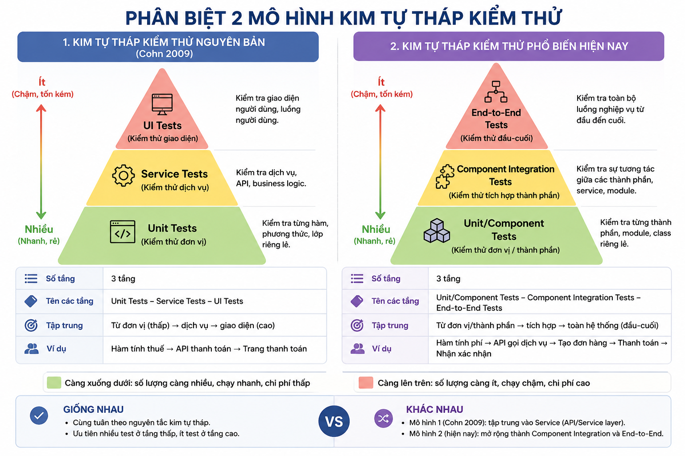
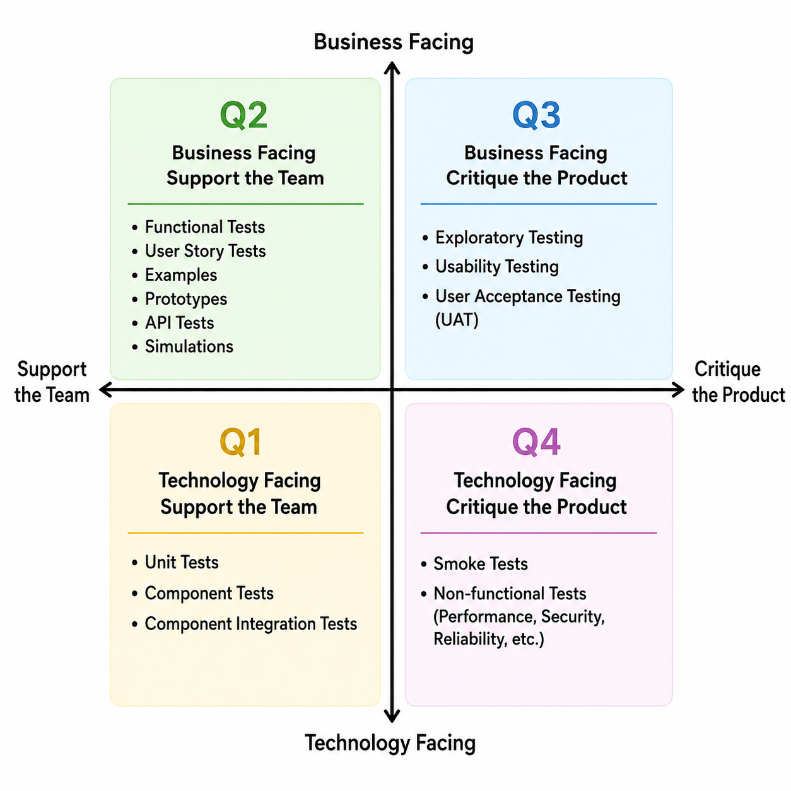

# 5. Managing the Test Activitie

### Table of contents

- [5. Managing the Test Activitie](#5-managing-the-test-activitie)
  - [Table of contents](#table-of-contents)
  - [Keywords](#keywords)
  - [5.1. Test Planning](#51-test-planning)
    - [5.1.1. Purpose and Content of a Test Plan](#511-purpose-and-content-of-a-test-plan)
    - [5.1.2. Tester's Contribution to Iteration and Release Planning](#512-testers-contribution-to-iteration-and-release-planning)
    - [5.1.3. Entry Criteria and Exit Criteria](#513-entry-criteria-and-exit-criteria)
    - [5.1.4. Estimation Techniques](#514-estimation-techniques)
    - [5.1.5. Test Case Prioritization](#515-test-case-prioritization)
    - [5.1.6. Test Pyramid](#516-test-pyramid)
    - [5.1.7. Testing Quadrants](#517-testing-quadrants)
  - [5.2. Risk Management](#52-risk-management)
    - [5.2.1. Risk Definition and Risk Attributes](#521-risk-definition-and-risk-attributes)
    - [5.2.2. Project Risks and Product Risks](#522-project-risks-and-product-risks)
    - [5.2.3. Product Risk Analysis](#523-product-risk-analysis)
    - [5.2.4. Product Risk Control](#524-product-risk-control)
  - [5.3. Test Monitoring, Test Control and Test Completion](#53-test-monitoring-test-control-and-test-completion)

## Keywords

| Keyword                | Translate                 |
| ---------------------- | :------------------------ |
| defect management      | Quản lý lỗi               |
| defect report          | Báo cáo lỗi / Bug report  |
| entry criteria         | Tiêu chí bắt đầu          |
| exit criteria          | Tiêu chí kết thúc         |
| product risk           | Rủi ro sản phẩm           |
| project risk           | Rủi ro dự án              |
| risk                   | Rủi ro                    |
| risk analysis          | Phân tích rủi ro          |
| risk assessment        | Đánh giá rủi ro           |
| risk control           | Kiểm soát rủi ro          |
| risk identification    | Nhận diện rủi ro          |
| risk level             | Mức độ rủi ro             |
| risk management        | Quản lý rủi ro            |
| risk mitigation        | Giảm thiểu rủi ro         |
| risk monitoring        | Giám sát rủi ro           |
| risk-based testing     | Kiểm thử dựa trên rủi ro  |
| test approach          | Tiếp cận kiểm thử         |
| test completion report | Báo cáo kết thúc kiểm thử |
| test control           | Điều khiển kiểm thử       |
| test monitoring        | Giám sát kiểm thử         |
| test plan              | Kế hoạch kiểm thử         |
| test planning          | Lập kế hoạch kiểm thử     |
| test progress report   | Báo cáo tiến độ kiểm thử  |
| test pyramid           | Kim tự tháp kiểm thử      |
| test strategy          | Chiến lược kiểm thử       |
| testing quadrants      | Các phân hạn kiểm thử     |

## 5.1. Test Planning

> Lập kế hoạch kiểm thử

### 5.1.1. Purpose and Content of a Test Plan

> Mục đích và nội dung của Test Plan

A test plan describes the test objectives, resources and processes for a test project. A test plan:

- Documents the means and schedule for achieving test objectives
- Helps to ensure that the performed test activities will meet the established criteria
- Serves as a means of communication with team members and other stakeholders
- Demonstrates that testing will adhere to the existing test policy and test strategy (or explains why the testing will deviate from them)

Test planning guides the testers’ thinking and forces the testers to confront the future challenges related to risks, schedules, people, tools, costs, effort, etc. The process of preparing a test plan is a useful way to think through the efforts needed to achieve the test objectives.

The typical content of a test plan includes:

- Context of testing (e.g., test scope, test objectives, test basis)
- Assumptions and constraints of the test project
- Stakeholders (e.g., roles, responsibilities, relevance to testing, hiring and training needs)
- Communication (e.g., forms and frequency of communication, documentation templates)
- Risk register (e.g., product risks, project risks)
- Test approach (e.g., test levels, test types, test techniques, test deliverables, entry criteria and exit criteria, independence of testing, metrics to be collected, test data requirements, test environment requirements, deviations from the test policy and test strategy)
- Budget and schedule

More details about the test plan and its content can be found in the ISO/IEC/IEEE 29119-3 standard.

> Một kế hoạch kiểm thử (test plan) mô tả các mục tiêu, nguồn lực và quy trình kiểm thử cho một dự án kiểm thử. Một kế hoạch kiểm thử giúp:
>
> - Ghi lại bằng văn bản các phương tiện và lịch trình để đạt được các mục tiêu kiểm thử.
> - Giúp đảm bảo rằng các hoạt động kiểm thử được thực hiện sẽ đáp ứng các tiêu chí đã đề ra.
> - Đóng vai trò như một phương tiện giao tiếp với các thành viên trong đội ngũ và các bên liên quan khác.
> - Chứng minh rằng việc kiểm thử sẽ tuân thủ chính sách kiểm thử (test policy) và chiến lược kiểm thử (test strategy) hiện có (hoặc giải thích lý do tại sao việc kiểm thử lại có sự khác biệt so với chúng).
>
> Hoạt động lập kế hoạch kiểm thử (test planning) định hướng tư duy của kiểm thử viên và buộc họ phải đối mặt với những thách thức trong tương lai liên quan đến rủi ro, lịch trình, con người, công cụ, chi phí, công sức, v.v. Quá trình chuẩn bị một kế hoạch kiểm thử là một cách hữu ích để suy nghĩ thấu đáo về những nỗ lực cần thiết nhằm đạt được các mục tiêu kiểm thử.
>
> Nội dung điển hình của một kế hoạch kiểm thử bao gồm:
>
> - Bối cảnh kiểm thử (Ví dụ: phạm vi kiểm thử, mục tiêu kiểm thử, cơ sở kiểm thử - test basis).
> - Các giả định và ràng buộc của dự án kiểm thử.
> - Các bên liên quan (Ví dụ: vai trò, trách nhiệm, mức độ liên quan đến kiểm thử, nhu cầu tuyển dụng và đào tạo).
> - Giao tiếp (Ví dụ: các hình thức và tần suất giao tiếp, các biểu mẫu tài liệu).
> - Danh mục rủi ro (Ví dụ: rủi ro sản phẩm, rủi ro dự án).
> - Tiếp cận kiểm thử (Ví dụ: các mức độ kiểm thử, loại kiểm thử, kỹ thuật kiểm thử, các sản phẩm bàn giao kiểm thử, tiêu chí bắt đầu và tiêu chí kết thúc, tính độc lập của kiểm thử, các chỉ số cần thu thập, yêu cầu về dữ liệu kiểm thử, yêu cầu về môi trường kiểm thử, các điểm khác biệt so với chính sách và chiến lược kiểm thử).
> - Ngân sách và lịch trình.
>
> Thông tin chi tiết hơn về kế hoạch kiểm thử và nội dung của nó có thể được tìm thấy trong tiêu chuẩn ISO/IEC/IEEE 29119-3.

### 5.1.2. Tester's Contribution to Iteration and Release Planning

> Đóng góp của kiểm thử viên vào việc lập kế hoạch cho Phiên bản phát hành và Vòng lặp

In iterative SDLCs, typically two kinds of planning occur: release planning and iteration planning.

Release planning looks ahead to the release of a product, defines and re-defines the product backlog, and may involve refining larger user stories into a set of smaller user stories. It also serves as the basis for the test approach and test plan across all iterations. Testers involved in release planning participate in writing testable user stories and acceptance criteria (see section 4.5), participate in project and quality risk analyses (see section 5.2), estimate test effort associated with user stories (see section 5.1.4), determine the test approach, and plan the testing for the release.

Iteration planning looks ahead to the end of a single iteration and is concerned with the iteration backlog. Testers involved in iteration planning participate in the detailed risk analysis of user stories, determine the testability of user stories, break down user stories into tasks (particularly testing tasks), estimate test effort for all testing tasks, and identify and refine functional and non-functional aspects of the test object.

> Trong các mô hình vòng đời phát triển phần mềm (SDLC) theo cụm/lặp (iterative SDLCs), thông thường sẽ có hai loại hình lập kế hoạch diễn ra: lập kế hoạch phát hành (release planning) và lập kế hoạch phân đoạn (iteration planning).
>
> **Lập kế hoạch phát hành (Release planning)** hướng tầm nhìn đến việc phát hành của một sản phẩm, định nghĩa và định nghĩa lại danh sách yêu cầu tồn đọng của sản phẩm (product backlog), và có thể bao gồm việc làm mịn các câu chuyện người dùng (user stories) lớn thành một tập hợp các câu chuyện người dùng nhỏ hơn. Nó cũng phục vụ như một cơ sở cho tiếp cận kiểm thử (test approach) và kế hoạch kiểm thử (test plan) xuyên suốt tất cả các phân đoạn. Các kiểm thử viên tham gia vào việc lập kế hoạch phát hành sẽ tham gia vào việc viết các câu chuyện người dùng và tiêu chí nghiệm thu có thể kiểm thử được (see section 4.5), tham gia vào các hoạt động phân tích rủi ro dự án và rủi ro chất lượng (see section 5.2), ước lượng công sức kiểm thử liên quan đến các câu chuyện người dùng (see section 5.1.4), xác định tiếp cận kiểm thử, và lập kế hoạch kiểm thử cho đợt phát hành đó.
>
> **Lập kế hoạch phân đoạn (Iteration planning)** hướng tầm nhìn đến thời điểm kết thúc của một phân đoạn đơn lẻ và liên quan trực tiếp đến danh sách yêu cầu tồn đọng của phân đoạn đó (iteration backlog). Các kiểm thử viên tham gia vào việc lập kế hoạch phân đoạn sẽ tham gia vào việc phân tích rủi ro chi tiết của các câu chuyện người dùng, xác định tính có thể kiểm thử (testability) của các câu chuyện người dùng, chia nhỏ các câu chuyện người dùng thành các tác vụ (đặc biệt là các tác vụ kiểm thử), ước lượng công sức kiểm thử cho tất cả các tác vụ kiểm thử, cũng như nhận diện và làm mịn các khía cạnh chức năng và phi chức năng của đối tượng kiểm thử.

### 5.1.3. Entry Criteria and Exit Criteria

> Tiêu chí đầu vào và tiêu chí đầu ra

Entry criteria define the preconditions for undertaking a given activity. If entry criteria are not met, it is likely that the activity will prove to be more difficult, time-consuming, costly, and riskier. Exit criteria define what must be achieved to declare an activity completed. Entry criteria and exit criteria should be defined for each test level, and will differ based on the test objectives.

Typical entry criteria include: availability of resources (e.g., people, tools, environments, test data, budget, time), availability of testware (e.g., test basis, testable requirements, user stories, test cases), and initial quality level of a test object (e.g., all smoke tests have passed).

Typical exit criteria include: measures of thoroughness (e.g., achieved level of coverage, number of unresolved defects, defect density, number of failed test cases), and binary “yes/no” criteria (e.g., planned tests have been executed, static testing has been performed, all defects found are reported, all regression tests are automated).

Running out of time or budget can also be viewed as valid exit criteria. Even without other exit criteria being satisfied, it can be acceptable to end testing under such circumstances, if the stakeholders have reviewed and accepted the risk to go live without further testing.

In Agile software development, exit criteria are often called Definition of Done, defining the team’s objective metrics for a releasable item. Entry criteria that a user story must fulfill to start the development and/or testing activities are called Definition of Ready.

> Tiêu chí bắt đầu (entry criteria) định nghĩa các điều kiện tiên quyết để thực hiện một hoạt động cụ thể. Nếu các tiêu chí bắt đầu không được đáp ứng, hoạt động đó có khả năng sẽ trở nên khó khăn hơn, tốn thời gian hơn, tốn kém hơn và rủi ro hơn. Tiêu chí kết thúc (exit criteria) định nghĩa những gì phải đạt được để tuyên bố một hoạt động đã hoàn thành. Tiêu chí bắt đầu và tiêu chí kết thúc nên được định nghĩa cho từng mức độ kiểm thử (test level), và sẽ khác nhau dựa trên các mục tiêu kiểm thử.
>
> Các tiêu chí bắt đầu điển hình bao gồm:
>
> - Sự sẵn sàng của các nguồn lực: (Ví dụ: con người, công cụ, môi trường, dữ liệu kiểm thử, ngân sách, thời gian).
> - Sự sẵn sàng của các sản phẩm kiểm thử (testware): (Ví dụ: cơ sở kiểm thử - test basis, các yêu cầu có thể kiểm thử được, các câu chuyện người dùng, các kịch bản kiểm thử).
> - Mức độ chất lượng ban đầu của đối tượng kiểm thử: (Ví dụ: tất cả các bài kiểm thử khói - smoke tests đã vượt qua).
>
> Các tiêu chí kết thúc điển hình bao gồm:
>
> - Các phép đo về độ triệt để: (Ví dụ: mức độ bao phủ đã đạt được, số lượng khuyết tật chưa được giải quyết, mật độ khuyết tật - defect density, số lượng kịch bản kiểm thử bị thất bại).
> - Các tiêu chí nhị phân "đúng/sai" (yes/no criteria): (Ví dụ: các bài kiểm thử theo kế hoạch đã được thực thi, kiểm thử tĩnh đã được thực hiện, tất cả các khuyết tật tìm thấy đã được báo cáo, tất cả các bài kiểm thử hồi quy đã được tự động hóa).
>
> Việc hết thời gian hoặc cạn kiệt ngân sách cũng có thể được xem là các tiêu chí kết thúc hợp lệ. Ngay cả khi các tiêu chí kết thúc khác chưa được thỏa mãn, việc kết thúc kiểm thử trong các hoàn cảnh như vậy vẫn có thể được chấp nhận, nếu các bên liên quan đã xem xét và chấp nhận rủi ro để đưa sản phẩm lên môi trường vận hành (go live) mà không cần kiểm thử thêm.
>
> Trong phát triển phần mềm theo phương pháp Agile, tiêu chí kết thúc thường được gọi là Định nghĩa về sự hoàn thành (Definition of Done - DoD), định nghĩa các chỉ số khách quan của đội ngũ đối với một hạng mục có thể phát hành. Các tiêu chí bắt đầu mà một câu chuyện người dùng phải đáp ứng để bắt đầu các hoạt động phát triển và/hoặc kiểm thử được gọi là Định nghĩa về sự sẵn sàng (Definition of Ready - DoR).

### 5.1.4. Estimation Techniques

> Các kỹ thuật ước lượng

Test effort estimation involves predicting the amount of test-related work needed to meet the test objectives of a test project. It is important to make it clear to the stakeholders that the estimate is based on a number of assumptions and is always subject to estimation error. Estimation for small tasks is usually more accurate than for the large ones. Therefore, when estimating a large task, it can be decomposed into a set of smaller tasks which then in turn can be estimated.

In this syllabus, the following four estimation techniques are described.

Estimation based on ratios. In this metrics-based technique, figures are collected from previous projects within the organization, which makes it possible to derive “standard” ratios for similar projects. The ratios of an organization’s own projects (e.g., taken from historical data) are generally the best source to use in the estimation process. These standard ratios can then be used to estimate the test effort for the new project. For example, if in the previous project the development-to-test effort ratio was 3:2, and in the current project the development effort is expected to be 600 person-days, the test effort can be estimated to be 400 person-days

Extrapolation. In this metrics-based technique, measurements are made as early as possible in the current project to gather the data. Having enough observations, the effort required for the remaining work can be approximated by extrapolating this data (usually by applying a mathematical model). This method is very suitable in iterative SDLCs. For example, the team may extrapolate the test effort in the forthcoming iteration as the averaged effort from the last three iterations.

Wideband Delphi. In this iterative, expert-based technique, experts make experience-based estimations. Each expert, in isolation, estimates the effort. The results are collected and if there are deviations of an expert’s estimate that are out of range of the agreed upon boundaries, the experts discuss their current estimates. Each expert is then asked to make a new estimation based on that feedback, again in isolation. This process is repeated until a consensus is reached. Planning Poker is a variant of Wideband Delphi, commonly used in Agile software development. In Planning Poker, estimates are usually made using cards with numbers that represent the effort size.

Three-point estimation. In this expert-based technique, three estimations are made by the experts: the most optimistic estimation (a), the most likely estimation (m) and the most pessimistic estimation (b). The final estimate (E) is their weighted arithmetic mean. In the most popular version of this technique, the estimate is calculated as E = (a + 4*m + b) / 6. The advantage of this technique is that it allows the experts to calculate the measurement error: SD = (b – a) / 6. For example, if the estimates (in personhours) are: a=6, m=9 and b=18, then the final estimation is 10±2 person-hours (i.e., between 8 and 12 person-hours), because E = (6 + 4*9 + 18) / 6 = 10 and SD = (18 – 6) / 6 = 2.

See (Kan 2003, Koomen 2006, Westfall 2009) for these and many other test estimation techniques.

> Ước lượng công sức kiểm thử (test effort estimation) bao gồm việc dự đoán khối lượng công việc liên quan đến kiểm thử cần thiết để đáp ứng các mục tiêu kiểm thử của một dự án. Điều quan trọng là phải làm rõ với các bên liên quan rằng con số ước lượng dựa trên một số giả định và luôn có sai số ước lượng. Việc ước lượng cho các tác vụ nhỏ thường chính xác hơn so với các tác vụ lớn. Do đó, khi ước lượng một tác vụ lớn, nó có thể được chia nhỏ thành một tập hợp các tác vụ nhỏ hơn để lần lượt ước lượng.
>
> Trong giáo trình này, bốn kỹ thuật ước lượng sau đây được mô tả:
>
> - **Ước lượng dựa trên tỷ lệ (Estimation based on ratios)**: Trong kỹ thuật dựa trên chỉ số (metrics-based) này, các số liệu được thu thập từ các dự án trước đó trong tổ chức, giúp rút ra các tỷ lệ "tiêu chuẩn" cho các dự án tương tự. Tỷ lệ từ chính các dự án của tổ chức (ví dụ: lấy từ dữ liệu lịch sử) nhìn chung là nguồn tốt nhất để sử dụng trong quá trình ước lượng. Các tỷ lệ tiêu chuẩn này sau đó có thể được sử dụng để ước lượng công sức kiểm thử cho dự án mới. Ví dụ: nếu trong dự án trước, tỷ lệ công sức giữa phát triển và kiểm thử là 3:2, và trong dự án hiện tại, công sức phát triển dự kiến là 600 ngày-người, thì công sức kiểm thử có thể được ước lượng là 400 ngày-người.
> - **Ngoại suy (Extrapolation)**: Trong kỹ thuật dựa trên chỉ số này, các phép đo được thực hiện càng sớm càng tốt trong dự án hiện tại để thu thập dữ liệu. Khi có đủ các dữ liệu quan sát, công sức cần thiết cho phần công việc còn lại có thể được tính xấp xỉ bằng cách ngoại suy dữ liệu này (thường bằng cách áp dụng một mô hình toán học). Phương pháp này rất phù hợp trong các mô hình vòng đời phát triển phần mềm (SDLC) theo cụm/lặp. Ví dụ: đội ngũ có thể ngoại suy công sức kiểm thử trong phân đoạn sắp tới bằng mức công sức trung bình của ba phân đoạn gần nhất.
> - **Wideband Delphi:** Trong kỹ thuật lặp đi lặp lại dựa trên chuyên gia (expert-based) này, các chuyên gia sẽ đưa ra các ước lượng dựa trên kinh nghiệm. Mỗi chuyên gia, một cách độc lập, tự ước lượng công sức. Các kết quả được thu thập và nếu có những sai lệch trong ước lượng của một chuyên gia vượt ra ngoài ranh giới đã thỏa thuận, các chuyên gia sẽ thảo luận về các ước lượng hiện tại của họ. Mỗi chuyên gia sau đó được yêu cầu đưa ra một ước lượng mới dựa trên phản hồi đó, một lần nữa thực hiện một cách độc lập. Quá trình này được lặp lại cho đến khi đạt được sự đồng thuận. Planning Poker là một biến thể của Wideband Delphi, thường được sử dụng trong phát triển phần mềm theo phương pháp Agile. Trong Planning Poker, các ước lượng thường được thực hiện bằng cách sử dụng các thẻ bài có các con số đại diện cho quy mô công sức.
> - **Ước lượng ba điểm (Three-point estimation)**: Trong kỹ thuật dựa trên chuyên gia này, ba mức ước lượng được các chuyên gia đưa ra: ước lượng lạc quan nhất (a), ước lượng có khả năng xảy ra nhất (m) và ước lượng bi quan nhất (b). Ước lượng cuối cùng (E) là trung bình cộng có trọng số của chúng. Trong phiên bản phổ biến nhất của kỹ thuật này, giá trị ước lượng được tính theo công thức $E = \frac{a + 4m + b}{6}$. Ưu điểm của kỹ thuật này là nó cho phép các chuyên gia tính toán được sai số của phép đo: $SD = \frac{b - a}{6}$. Ví dụ: nếu các mức ước lượng (tính theo giờ-người) là: a=6, m=9 và b=18, thì ước lượng cuối cùng là $10 \pm 2$ giờ-người (tức là trong khoảng từ 8 đến 12 giờ-người), vì $E = \frac{6 + 4 \times 9 + 18}{6} = 10$ và $SD = \frac{18 - 6}{6} = 2$.
>
> Xem (Kan 2003, Koomen 2006, Westfall 2009) để biết thêm về các kỹ thuật này và nhiều kỹ thuật ước lượng kiểm thử khác.

### 5.1.5. Test Case Prioritization

> Thứ tự ưu tiên của kịch bản kiểm thử

Once the test cases and test procedures are specified and assembled into test suites, these test suites can be arranged in a test execution schedule that defines the order in which they are to be run. When prioritizing test cases, different factors can be taken into account. The most commonly used test case prioritization strategies are as follows:

- Risk-based prioritization, where the order of test execution is based on the results of risk analysis (see section 5.2.3). Test cases covering the most important risks are executed first.
- Coverage-based prioritization, where the order of test execution is based on coverage (e.g., statement coverage). Test cases achieving the highest coverage are executed first. In another variant, called additional coverage prioritization, the test case achieving the highest coverage is executed first; each subsequent test case is the one that achieves the highest additional coverage.
- Requirements-based prioritization, where the order of test execution is based on the priorities of the requirements traced back to the corresponding test cases. Requirement priorities are defined by stakeholders. Test cases related to the most important requirements are executed first.

Ideally, test cases would be ordered to run based on their priority levels, using, for example, one of the above-mentioned prioritization strategies. However, this practice may not work if the test cases or the features being tested have dependencies. If a test case with a higher priority is dependent on a test case with a lower priority, the lower priority test case must be executed first.

The order of test execution must also take into account the availability of resources. For example, the required test tools, test environments or people that may only be available for a specific time window.

> Một khi các kịch bản kiểm thử (test cases) và thủ tục kiểm thử (test procedures) được xác định cụ thể và tập hợp thành các bộ kiểm thử (test suites), các bộ kiểm thử này có thể được sắp xếp vào một lịch trình thực thi kiểm thử (test execution schedule) nhằm định nghĩa thứ tự chạy của chúng. Khi thiết lập thứ tự ưu tiên cho các kịch bản kiểm thử, nhiều yếu tố khác nhau có thể được xem xét. Các chiến lược ưu tiên kịch bản kiểm thử phổ biến nhất bao gồm:
>
> - Ưu tiên dựa trên rủi ro (Risk-based prioritization): Thứ tự thực thi kiểm thử được dựa trên kết quả của hoạt động phân tích rủi ro (xem phần 5.2.3). Các kịch bản kiểm thử bao phủ những rủi ro quan trọng nhất sẽ được thực thi trước tiên.
> - Ưu tiên dựa trên độ bao phủ (Coverage-based prioritization): Thứ tự thực thi kiểm thử được dựa trên độ bao phủ (ví dụ: độ bao phủ câu lệnh). Các kịch bản kiểm thử đạt được độ bao phủ cao nhất sẽ được thực thi trước. Trong một biến thể khác gọi là ưu tiên theo độ bao phủ bổ sung (additional coverage prioritization), kịch bản kiểm thử đạt độ bao phủ cao nhất sẽ chạy đầu tiên; mỗi kịch bản kiểm thử tiếp theo sẽ là kịch bản đạt được độ bao phủ bổ sung cao nhất.
> - Ưu tiên dựa trên yêu cầu (Requirements-based prioritization): Thứ tự thực thi kiểm thử được dựa trên mức độ ưu tiên của các yêu cầu được truy xuất nguồn gốc (traced back) đến các kịch bản kiểm thử tương ứng. Mức độ ưu tiên của yêu cầu do các bên liên quan (stakeholders) định nghĩa. Các kịch bản kiểm thử liên quan đến các yêu cầu quan trọng nhất sẽ được thực thi trước tiên.
>
> Về mặt lý tưởng, các kịch bản kiểm thử sẽ được sắp xếp thứ tự chạy dựa trên các mức độ ưu tiên của chúng, ví dụ như sử dụng một trong các chiến lược ưu tiên nêu trên. Tuy nhiên, việc áp dụng này có thể không khả thi nếu các kịch bản kiểm thử hoặc các tính năng đang được kiểm thử có sự phụ thuộc lẫn nhau (dependencies). Nếu một kịch bản kiểm thử có độ ưu tiên cao hơn lại phụ thuộc vào một kịch bản kiểm thử có độ ưu tiên thấp hơn, thì kịch bản kiểm thử có độ ưu tiên thấp hơn bắt buộc phải được thực thi trước.
>
> Thứ tự thực thi kiểm thử cũng phải tính đến sự sẵn sàng của các nguồn lực. Ví dụ: các công cụ kiểm thử, môi trường kiểm thử hoặc nhân sự cần thiết có thể chỉ sẵn sàng trong một khung thời gian cụ thể.

### 5.1.6. Test Pyramid

> Kim tự tháp kiểm thử

The test pyramid is a model showing that different tests may have different granularity. The test pyramid model supports the team in test automation and in test effort allocation by showing that different test objectives are supported by different levels of test automation. The pyramid layers represent groups of tests. The higher the layer, the lower the test granularity, the lower the test isolation (i.e., the degree of
dependency on other elements of the system) and the higher the test execution time. Tests in the bottom layer are small, isolated, fast, and check a small piece of functionality, so usually a lot of them are needed to achieve a reasonable coverage. The top layer represents complex, high-level, end-to-end tests. These high-level tests are generally slower than the tests from the lower layers, and they typically check a large piece of functionality, so usually just a few of them are needed to achieve a reasonable level of coverage. The number and naming of the layers may differ. For example, the original test pyramid model (Cohn 2009) defines three layers: “unit tests”, “service tests” and “UI tests”. Another popular model defines unit (component) tests, integration (component integration) tests, and end-to-end tests. Other test levels (see section 2.2.1) can also be used.

> Kim tự tháp kiểm thử (test pyramid) là một mô hình thể hiện rằng các bài kiểm thử khác nhau có thể có mức độ chi tiết (granularity) khác nhau. Mô hình kim tự tháp kiểm thử hỗ trợ đội ngũ trong việc tự động hóa kiểm thử và phân bổ công sức kiểm thử bằng cách chỉ ra rằng các mục tiêu kiểm thử khác nhau sẽ được hỗ trợ bởi các mức độ tự động hóa kiểm thử khác nhau.
>
> Các tầng của kim tự tháp đại diện cho các nhóm bài kiểm thử. Tầng càng cao thì mức độ chi tiết của bài kiểm thử càng thấp, tính cô lập của bài kiểm thử càng giảm (tức là mức độ phụ thuộc vào các thành phần khác của hệ thống càng cao) và thời gian thực thi kiểm thử càng lớn. Các bài kiểm thử ở tầng đáy thường nhỏ, cô lập, chạy nhanh và kiểm tra một phần chức năng nhỏ, do đó thường cần rất nhiều bài kiểm thử này để đạt được một độ bao phủ hợp lý. Tầng đỉnh đại diện cho các bài kiểm thử đầu-cuối (end-to-end tests) phức tạp và ở cấp độ cao. Những bài kiểm thử cấp cao này nhìn chung chậm hơn so với các bài kiểm thử ở các tầng dưới, và chúng thường kiểm tra một phần chức năng lớn, vì vậy thường chỉ cần một vài bài kiểm thử loại này là đủ để đạt được mức độ bao phủ hợp lý.
>
> Số lượng và cách đặt tên cho các tầng có thể khác nhau. Ví dụ, mô hình kim tự tháp kiểm thử nguyên bản (Cohn 2009) định nghĩa ba tầng: "kiểm thử đơn vị" (unit tests), "kiểm thử dịch vụ" (service tests) và "kiểm thử giao diện" (UI tests). Một mô hình phổ biến khác định nghĩa các tầng bao gồm: kiểm thử đơn vị/thành phần (unit/component tests), kiểm thử tích hợp thành phần (component integration tests) và kiểm thử đầu-cuối (end-to-end tests). Các mức độ kiểm thử khác (xem phần 2.2.1) cũng có thể được sử dụng.
>
> 

### 5.1.7. Testing Quadrants

> Các phân hạn kiểm thử

The testing quadrants, defined by Brian Marick (Marick 2003, Crispin 2008), group the test levels with the appropriate test types, activities, test techniques and work products in the Agile software development. The model supports test management in visualizing these to ensure that all appropriate test types and test levels are included in the SDLC and in understanding that some test types are more relevant to certain test levels than others. This model also provides a way to differentiate and describe the test types to all stakeholders, including developers, testers, and business representatives.

In this model, tests can be business facing or technology facing. Tests can also support the team (i.e., guide the development) or critique the product (i.e., measure its behavior against the expectations). The combination of these two viewpoints determines the four quadrants:

- Quadrant Q1 (technology facing, support the team). This quadrant contains component tests and component integration tests. These tests should be automated and included in the CI process.

- Quadrant Q2 (business facing, support the team). This quadrant contains functional tests, examples, user story tests, user experience prototypes, API testing, and simulations. These tests check the acceptance criteria and can be manual or automated.

- Quadrant Q3 (business facing, critique the product). This quadrant contains exploratory testing, usability testing, user acceptance testing. These tests are user-oriented and often manual.

- Quadrant Q4 (technology facing, critique the product). This quadrant contains smoke tests and non-functional tests (except usability tests). These tests are often automated.

> Các phân hạn kiểm thử (testing quadrants), được định nghĩa bởi Brian Marick (Marick 2003, Crispin 2008), nhóm các mức độ kiểm thử (test levels) với các loại kiểm thử (test types), hoạt động, kỹ thuật kiểm thử và sản phẩm bàn giao phù hợp trong phát triển phần mềm theo phương pháp Agile. Mô hình này hỗ trợ quản lý kiểm thử trong việc trực quan hóa các yếu tố trên nhằm đảm bảo rằng tất cả các loại kiểm thử và mức độ kiểm thử phù hợp đều được đưa vào vòng đời phát triển phần mềm (SDLC), đồng thời giúp thấu hiểu rằng một số loại kiểm thử sẽ liên quan đến các mức độ kiểm thử này hơn là các mức độ kiểm thử khác. Mô hình này cũng cung cấp một cách thức để phân biệt và mô tả các loại kiểm thử cho tất cả các bên liên quan, bao gồm lập trình viên, kiểm thử viên và đại diện bên kinh doanh.
>
> Trong mô hình này, các bài kiểm thử có thể hướng về mặt kinh doanh (business facing) hoặc hướng về mặt công nghệ (technology facing). Các bài kiểm thử cũng có thể hỗ trợ đội ngũ (tức là định hướng cho việc phát triển) hoặc phản biện sản phẩm (tức là đo lường hành vi của sản phẩm so với các kỳ vọng). Sự kết hợp của hai góc nhìn này tạo nên bốn phân hạn:
>
> - Phân hạn Q1 (hướng công nghệ, hỗ trợ đội ngũ): Phân hạn này chứa các bài kiểm thử thành phần (component tests) và kiểm thử tích hợp thành phần (component integration tests). Các bài kiểm thử này nên được tự động hóa và tích hợp vào quy trình tích hợp liên tục (CI).
> - Phân hạn Q2 (hướng kinh doanh, hỗ trợ đội ngũ): Phân hạn này chứa các bài kiểm thử chức năng, các ví dụ, kiểm thử câu chuyện người dùng (user story tests), các nguyên mẫu trải nghiệm người dùng (user experience prototypes), kiểm thử API và các mô phỏng. Các bài kiểm thử này dùng để kiểm tra các tiêu chí nghiệm thu và có thể thực hiện thủ công hoặc tự động hóa.
> - Phân hạn Q3 (hướng kinh doanh, phản biện sản phẩm): Phân hạn này chứa kiểm thử khám phá (exploratory testing), kiểm thử độ khả dụng (usability testing) và kiểm thử nghiệm thu người dùng (user acceptance testing). Các bài kiểm thử này hướng về phía người dùng và thường là kiểm thử thủ công.
> - Phân hạn Q4 (hướng công nghệ, phản biện sản phẩm): Phân hạn này chứa các bài kiểm thử khói (smoke tests) và các kiểm thử phi chức năng (ngoại trừ kiểm thử độ khả dụng). Các bài kiểm thử này thường được tự động hóa.
>
> 

## 5.2. Risk Management

> Quản lý rủi ro

Organizations face many internal and external factors that make it uncertain whether and when they will achieve their objectives (ISO 31000). Risk management allows the organizations to increase the likelihood of achieving objectives, improve the quality of their products and increase the stakeholders’ confidence and trust.

The main risk management activities are:

- Risk analysis (consisting of risk identification and risk assessment; see section 5.2.3)
- Risk control (consisting of risk mitigation and risk monitoring; see section 5.2.4)

The test approach, in which test activities are selected, prioritized, and managed based on risk analysis and risk control, is called risk-based testing.

> Các tổ chức phải đối mặt với nhiều yếu tố nội bộ và bên ngoài khiến cho việc họ có đạt được mục tiêu của mình và đạt được vào lúc nào trở nên không chắc chắn (ISO 31000). Quản lý rủi ro cho phép các tổ chức tăng khả năng đạt được mục tiêu, cải thiện chất lượng sản phẩm và nâng cao sự tin tưởng cũng như lòng tin của các bên liên quan.
>
> Các hoạt động quản lý rủi ro chính bao gồm:
>
> - Phân tích rủi ro (Risk analysis): Bao gồm nhận diện rủi ro (risk identification) và đánh giá rủi ro (risk assessment); xem phần 5.2.3.
> - Kiểm soát rủi ro (Risk control): Bao gồm giảm thiểu rủi ro (risk mitigation) và giám sát rủi ro (risk monitoring); xem phần 5.2.4.
>
> Tiếp cận kiểm thử (test approach), trong đó các hoạt động kiểm thử được lựa chọn, ưu tiên và quản lý dựa trên việc phân tích rủi ro và kiểm soát rủi ro, được gọi là kiểm thử dựa trên rủi ro (risk-based testing).

### 5.2.1. Risk Definition and Risk Attributes

> Định nghĩa rủi ro và Các thuộc tính rủi ro

Risk is a potential event, hazard, threat, or situation whose occurrence causes an adverse effect. A risk can be characterized by two factors:

- Risk likelihood – the probability of the risk occurrence (greater than zero and less than one)
- Risk impact (harm) – the consequences of this occurrence

These two factors express the risk level, which is a measure for the risk. The higher the risk level, the more important is its treatment.

> Rủi ro (risk) là một sự kiện, mối nguy hại, mối đe dọa hoặc tình huống tiềm ẩn mà sự xuất hiện của nó sẽ gây ra một tác động bất lợi. Một rủi ro có thể được đặc trưng bởi hai yếu tố:
>
> - Xác suất xảy ra rủi ro (Risk likelihood): Khả năng xảy ra rủi ro (lớn hơn 0 và nhỏ hơn 1).
> - Mức độ ảnh hưởng của rủi ro (Risk impact/harm): Các hậu quả của sự xuất hiện rủi ro này.
>
> Hai yếu tố này thể hiện mức độ rủi ro (risk level), vốn là một thước đo cho rủi ro. Mức độ rủi ro càng cao thì việc xử lý rủi ro đó càng trở nên quan trọng.

### 5.2.2. Project Risks and Product Risks

> Rủi ro dự án và rủi ro sản phẩm

In software testing one is generally concerned with two types of risks: project risks and product risks.

**Project risks** are related to the management and control of the project. Project risks include:

- Organizational issues (e.g., delays in work products deliveries, inaccurate estimates, cost cutting)
- People issues (e.g., insufficient skills, conflicts, communication problems, shortage of staff)
- Technical issues (e.g., scope creep, poor tool support)
- Supplier issues (e.g., third-party delivery failure, bankruptcy of the supporting company)

Project risks, when they occur, may have an impact on the project schedule, budget or scope, which affects the project's ability to achieve its objectives.

**Product risks** are related to the product quality characteristics (e.g., described in the ISO 25010 quality model). Examples of product risks include: missing or wrong functionality, incorrect calculations, runtime errors, poor architecture, inefficient algorithms, inadequate response time, poor user experience, security vulnerabilities. Product risks, when they occur, may result in various negative consequences, including:

- User dissatisfaction
- Loss of revenue, trust, reputation
- Damage to third parties
- High maintenance costs, overload of the help desk
- Criminal penalties
- In extreme cases, physical damage, injuries or even death

> Trong kiểm thử phần mềm, chúng ta thường quan tâm đến hai loại rủi ro: rủi ro dự án và rủi ro sản phẩm.

> **Rủi ro dự án (Project risks)** liên quan đến việc quản lý và điều hành dự án. Rủi ro dự án bao gồm:
>
> - Các vấn đề về tổ chức: (Ví dụ: bàn giao sản phẩm công việc bị chậm trễ, ước lượng không chính xác, cắt giảm chi phí).
> - Các vấn đề về con người: (Ví dụ: kỹ năng không đủ, xung đột, vấn đề giao tiếp, thiếu hụt nhân sự).
> - Các vấn đề về kỹ thuật: (Ví dụ: phình đại phạm vi - scope creep, sự hỗ trợ công cụ kém).
> - Các vấn đề về nhà cung cấp: (Ví dụ: bên thứ ba không bàn giao được hàng, công ty hỗ trợ bị phá sản).
>
> Rủi ro dự án khi xảy ra có thể tác động đến lịch trình, ngân sách hoặc phạm vi của dự án, từ đó ảnh hưởng đến khả năng đạt được các mục tiêu của dự án.

> **Rủi ro sản phẩm (Product risks)** liên quan đến các đặc tính chất lượng của sản phẩm (ví dụ: được mô tả trong mô hình chất lượng ISO 25010). Các ví dụ về rủi ro sản phẩm bao gồm: thiếu hoặc sai chức năng, tính toán không chính xác, lỗi thời gian chạy (runtime errors), kiến trúc kém, thuật toán kém hiệu quả, thời gian phản hồi không đạt yêu cầu, trải nghiệm người dùng kém, lỗ hổng bảo mật. Rủi ro sản phẩm khi xảy ra có thể dẫn đến nhiều hậu quả tiêu cực khác nhau, bao gồm:
>
> - Sự không hài lòng của người dùng.
> - Tổn thất về doanh thu, lòng tin, danh tiếng.
> - Gây thiệt hại cho bên thứ ba.
> - Chi phí bảo trì cao, quá tải cho bộ phận hỗ trợ (help desk).
> - Hình phạt hình sự.
> - Trong các trường hợp cực đoan, có thể gây thiệt hại về vật chất, thương tích hoặc thậm chí tử vong.

### 5.2.3. Product Risk Analysis

> Phân tích rủi ro sản phẩm

From a testing perspective, the goal of product risk analysis is to provide an awareness of product risk to focus the test effort in a way that minimizes the residual level of product risk. Ideally, product risk analysis begins early in the SDLC.

Product risk analysis consists of risk identification and risk assessment. Risk identification is about generating a comprehensive list of risks. Stakeholders can identify risks by using various techniques and tools, e.g., brainstorming, workshops, interviews, or cause-effect diagrams. Risk assessment involves: categorization of identified risks, determining their risk likelihood, risk impact and risk level, prioritizing, and proposing ways to handle them. Categorization helps in assigning mitigation actions, because usually risks falling into the same category can be mitigated using a similar approach.

Risk assessment can use a quantitative or qualitative approach, or a mix of them. In the quantitative approach the risk level is calculated as the multiplication of risk likelihood and risk impact. In the qualitative approach the risk level can be determined using a risk matrix.

Product risk analysis may influence the thoroughness and test scope. Its results are used to:

- Determine the test scope to be carried out
- Determine the particular test levels and propose test types to be performed
- Determine the test techniques to be employed and the coverage to be achieved
- Estimate the test effort required for each task
- Prioritize testing in an attempt to find the critical defects as early as possible
- Determine whether any activities in addition to testing could be employed to reduce risk

> Từ góc độ kiểm thử, mục tiêu của phân tích rủi ro sản phẩm là mang lại sự nhận thức về rủi ro sản phẩm để tập trung công sức kiểm thử theo cách tối thiểu hóa mức độ rủi ro sản phẩm còn dư (residual level). Về mặt lý tưởng, phân tích rủi ro sản phẩm nên được bắt đầu từ sớm trong vòng đời phát triển phần mềm (SDLC).
>
> Phân tích rủi ro sản phẩm bao gồm nhận diện rủi ro (risk identification) và đánh giá rủi ro (risk assessment).
>
> - Nhận diện rủi ro là việc tạo ra một danh sách rủi ro toàn diện. Các bên liên quan có thể nhận diện rủi ro bằng cách sử dụng nhiều kỹ thuật và công cụ khác nhau, ví dụ: động não (brainstorming), hội thảo (workshops), phỏng vấn, hoặc sơ đồ nguyên nhân - kết quả (cause-effect diagrams).
> - Đánh giá rủi ro bao gồm: phân loại các rủi ro đã nhận diện, xác định xác suất xảy ra rủi ro, mức độ ảnh hưởng của rủi ro và mức độ rủi ro, thiết lập thứ tự ưu tiên, và đề xuất các cách để xử lý chúng. Việc phân loại giúp ích cho việc chỉ định các hành động giảm thiểu, bởi vì thông thường các rủi ro rơi vào cùng một danh mục có thể được giảm thiểu bằng cách sử dụng một tiếp cận tương tự.
>
> Hoạt động đánh giá rủi ro có thể sử dụng tiếp cận định lượng (quantitative) hoặc định tính (qualitative), hoặc kết hợp cả hai. Trong tiếp cận định lượng, mức độ rủi ro được tính bằng tích của xác suất xảy ra rủi ro và mức độ ảnh hưởng của rủi ro. Trong tiếp cận định tính, mức độ rủi ro có thể được xác định bằng cách sử dụng một ma trận rủi ro (risk matrix).
>
> Phân tích rủi ro sản phẩm có thể ảnh hưởng đến độ triệt để và phạm vi kiểm thử. Kết quả của nó được sử dụng để:
>
> - Xác định phạm vi kiểm thử (test scope) cần được thực hiện.
> - Xác định các mức độ kiểm thử (test levels) cụ thể và đề xuất các loại kiểm thử (test types) cần triển khai.
> - Xác định các kỹ thuật kiểm thử (test techniques) cần áp dụng và độ bao phủ (coverage) cần đạt được.
> - Ước lượng công sức kiểm thử (test effort) cần thiết cho từng tác vụ.
> - Thiết lập thứ tự ưu tiên kiểm thử nhằm cố gắng tìm ra các khuyết tật nghiêm trọng (critical defects) càng sớm càng tốt.
> - Xác định xem có thể áp dụng bất kỳ hoạt động nào khác ngoài kiểm thử để giảm thiểu rủi ro hay không.

### 5.2.4. Product Risk Control

> Kiểm soát rủi ro sản phẩm

Product risk control comprises all measures that are taken in response to identified and assessed product risks. Product risk control consists of risk mitigation and risk monitoring. Risk mitigation involves implementing the actions proposed in risk assessment to reduce the risk level. The aim of risk monitoring is to ensure that the mitigation actions are effective, to obtain further information to improve risk assessment, and to identify emerging risks.

With respect to product risk control, once a risk has been analyzed, several response options to risk are possible, e.g., risk mitigation by testing, risk acceptance, risk transfer, or a contingency plan (Veenendaal 2012). Actions that can be taken to mitigate the product risks by testing are as follows:

- Select the testers with the right level of experience and skills, suitable for a given risk type
- Apply an appropriate level of independence of testing
- Perform reviews and static analysis
- Apply the appropriate test techniques and coverage levels
- Apply the appropriate test types addressing the affected quality characteristics
- Perform dynamic testing, including regression testing

> Kiểm soát rủi ro sản phẩm (product risk control) bao gồm tất cả các biện pháp được thực hiện nhằm phản hồi lại các rủi ro sản phẩm đã được nhận diện và đánh giá. Kiểm soát rủi ro sản phẩm bao gồm giảm thiểu rủi ro (risk mitigation) và giám sát rủi ro (risk monitoring). Giảm thiểu rủi ro liên quan đến việc triển khai các hành động được đề xuất trong bước đánh giá rủi ro để làm giảm mức độ rủi ro. Mục tiêu của giám sát rủi ro là nhằm đảm bảo rằng các hành động giảm thiểu rủi ro đạt hiệu quả, thu thập thêm thông tin để cải thiện hoạt động đánh giá rủi ro, và nhận diện các rủi ro mới phát sinh.
>
> Đối với việc kiểm soát rủi ro sản phẩm, một khi rủi ro đã được phân tích, có nhiều phương án phản hồi rủi ro khả thi có thể lựa chọn, ví dụ: giảm thiểu rủi ro bằng cách kiểm thử, chấp nhận rủi ro, chuyển giao rủi ro, hoặc lập kế hoạch dự phòng (Veenendaal 2012). Các hành động có thể được thực hiện để giảm thiểu rủi ro sản phẩm bằng cách kiểm thử bao gồm:
>
> - Lựa chọn kiểm thử viên có mức độ kinh nghiệm và kỹ năng phù hợp, đáp ứng đúng cho một loại rủi ro cụ thể.
> - Áp dụng mức độ độc lập của kiểm thử (independence of testing) một cách thích hợp.
> - Thực hiện các buổi rà soát (reviews) và phân tích tĩnh (static analysis).
> - Áp dụng các kỹ thuật kiểm thử và các mức độ bao phủ (coverage levels) thích hợp.
> - Áp dụng các loại kiểm thử (test types) thích hợp nhằm giải quyết các đặc tính chất lượng bị ảnh hưởng.
> - Thực hiện kiểm thử động (dynamic testing), bao gồm cả kiểm thử hồi quy (regression testing).

## 5.3. Test Monitoring, Test Control and Test Completion

> Giám sát, Điều khiển và Kết thúc kiểm thử

Test monitoring is concerned with gathering information about testing. This information is used to assess test progress and to measure whether the exit criteria or the test tasks associated with the exit criteria are satisfied, such as meeting the targets for coverage of product risks , requirements, or acceptance criteria.

Test control uses the information from test monitoring to provide, in a form of the control directives, guidance and the necessary corrective actions to achieve the most effective and efficient testing. Examples of control directives include:

- Reprioritizing tests when an identified risk becomes an issue
- Re-evaluating whether a test item meets entry criteria or exit criteria due to rework
- Adjusting the test schedule to address a delay in the delivery of the test environment
- Adding new resources when and where needed

Test completion collects data from completed test activities to consolidate experience, testware, and any other relevant information. Test completion activities occur at project milestones such as when a test level is completed, an agile iteration is finished, a test project is completed (or cancelled), a software system is released, or a maintenance release is completed.

> Hoạt động giám sát kiểm thử (test monitoring) liên quan đến việc thu thập thông tin về các hoạt động kiểm thử. Thông tin này được sử dụng để đánh giá tiến độ kiểm thử và đo lường xem các tiêu chí kết thúc (exit criteria) hoặc các tác vụ kiểm thử gắn liền với tiêu chí kết thúc đã được thỏa mãn hay chưa, chẳng hạn như việc đáp ứng các mục tiêu về độ bao phủ đối với rủi ro sản phẩm, các yêu cầu hoặc các tiêu chí nghiệm thu.
>
> Hoạt động điều khiển kiểm thử (test control) sử dụng thông tin từ giám sát kiểm thử để đưa ra các chỉ thị điều khiển (control directives), các hướng dẫn và các hành động khắc phục cần thiết nhằm đạt được việc kiểm thử hiệu quả và tối ưu nhất. Các ví dụ về chỉ thị điều khiển bao gồm:
>
> - Thiết lập lại thứ tự ưu tiên của các bài kiểm thử khi một rủi ro được nhận diện trở thành một vấn đề thực tế.
> - Đánh giá lại xem một hạng mục kiểm thử có đáp ứng các tiêu chí bắt đầu (entry criteria) hoặc tiêu chí kết thúc hay không do có sự làm lại (rework).
> - Điều chỉnh lịch trình kiểm thử để giải quyết việc chậm trễ trong bàn giao môi trường kiểm thử.
> - Bổ sung các nguồn lực mới khi nào và ở đâu cần thiết.
>
> Hoạt động kết thúc kiểm thử (test completion) thu thập dữ liệu từ các hoạt động kiểm thử đã hoàn thành để củng cố kinh nghiệm, các sản phẩm kiểm thử (testware) và bất kỳ thông tin liên quan nào khác. Các hoạt động kết thúc kiểm thử diễn ra tại các cột mốc của dự án, chẳng hạn như khi một mức độ kiểm thử (test level) hoàn thành, một phân đoạn agile (iteration) kết thúc, một dự án kiểm thử hoàn thành (hoặc bị hủy bỏ), một hệ thống phần mềm được phát hành, hoặc một bản phát hành bảo trì được hoàn tất.
