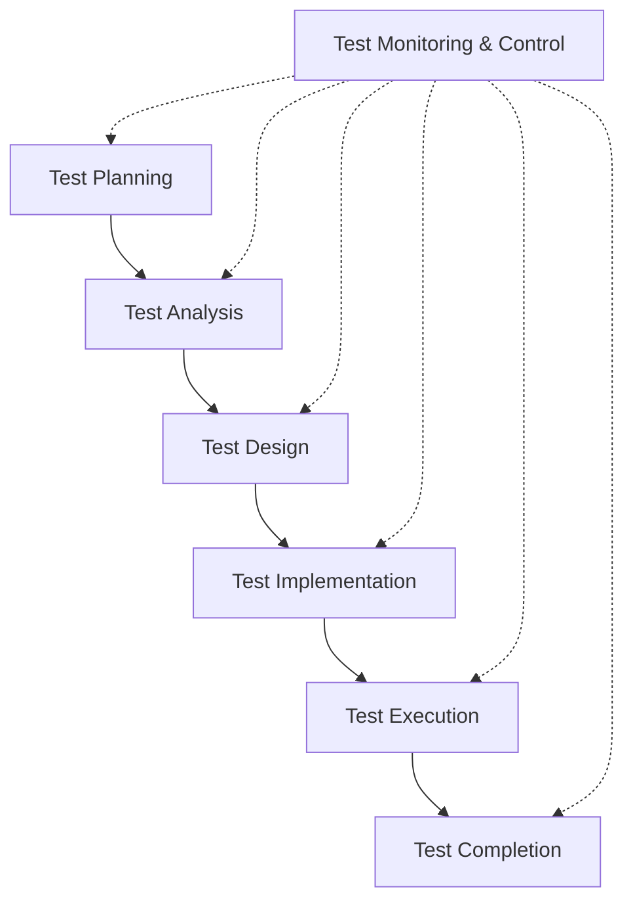

# 1. Fundamentals of Testing

> Nguyên tắc cơ bản của kiểm thử

### Table of contents

- [1. Fundamentals of Testing](#1-fundamentals-of-testing)
  - [Table of contents](#table-of-contents)
  - [Keywords](#keywords)
  - [1.1 What is Testing?](#11-what-is-testing)
    - [1.1.1 Test Objectives](#111-test-objectives)
    - [1.1.2 Testing and Debugging](#112-testing-and-debugging)
  - [1.2 Why is Testing Necessary?](#12-why-is-testing-necessary)
    - [1.2.1 Testing’s Contributions to Success](#121-testings-contributions-to-success)
    - [1.2.2 Testing and Quality Assurance (QA)](#122-testing-and-quality-assurance-qa)
    - [1.2.3. Errors, Defects, Failures, and Root Causes](#123-errors-defects-failures-and-root-causes)
  - [1.3. Testing Principles](#13-testing-principles)
  - [1.4. Test Activities, Testware and Test Roles](#14-test-activities-testware-and-test-roles)
    - [1.4.1. Test Activities and Tasks](#141-test-activities-and-tasks)
    - [1.4.2. Test Process in Context](#142-test-process-in-context)
    - [1.4.3. Testware](#143-testware)
    - [1.4.4. Traceability between the Test Basis and Testware](#144-traceability-between-the-test-basis-and-testware)
    - [1.4.5. Roles in Testing](#145-roles-in-testing)

## Keywords

| Keyword             |          Translate           |
| ------------------- | :--------------------------: |
| coverage            |          độ bao phủ          |
| debugging           |            gỡ lỗi            |
| defect              |      lỗi / khiếm khuyết      |
| error               |    sai sót (do con người)    |
| failure             | sự cố / lỗi xảy ra khi chạy  |
| quality             |          chất lượng          |
| quality assurance   |      đảm bảo chất lượng      |
| root cause          |      nguyên nhân gốc rễ      |
| test analysis       |      phân tích kiểm thử      |
| test basis          |        cơ sở kiểm thử        |
| test case           |     trường hợp kiểm thử      |
| test completion     |      hoàn tất kiểm thử       |
| test condition      |      điều kiện kiểm thử      |
| test control        |      kiểm soát kiểm thử      |
| test data           |       dữ liệu kiểm thử       |
| test design         |      thiết kế kiểm thử       |
| test execution      |      thực thi kiểm thử       |
| test implementation |     triển khai kiểm thử      |
| test monitoring     |      giám sát kiểm thử       |
| test object         |      đối tượng kiểm thử      |
| test objective      |      mục tiêu kiểm thử       |
| test planning       |    lập kế hoạch kiểm thử     |
| test procedure      | quy trình / thủ tục kiểm thử |
| test process        |      quá trình kiểm thử      |
| test result         |       kết quả kiểm thử       |
| testing             |      hoạt động kiểm thử      |
| testware            | tài liệu và công cụ kiểm thử |
| traceability        |      khả năng truy vết       |
| validation          |           xác nhận           |
| verification        |           xác minh           |

## 1.1 What is Testing?

> Kiểm thử là gì?

Software systems are an integral part of our daily life. Most people have had experience with software that did not work as expected. Software that does not work correctly can lead to many problems, including loss of money, time or business reputation, and, in extreme cases, even injury or death. Software testing assesses software quality and helps reducing the risk of software failure in operation.

Software testing is a set of activities to discover defects and evaluate the quality of software work products. These work products, when being tested, are known as test objects. A common misconception about testing is that it only consists of executing tests (i.e., running the software and checking the test results). However, software testing also includes other activities and must be aligned with the software development lifecycle (see chapter 2).

Another common misconception about testing is that testing focuses entirely on verifying the test object. While testing involves verification, i.e., checking whether the system meets specified requirements, it also involves validation, which means checking whether the system meets users’ and other stakeholders’ needs in its operational environment.

Testing may be dynamic or static. Dynamic testing involves the execution of software, while static testing does not. Static testing includes reviews (see chapter 3) and static analysis. Dynamic testing uses different types of test techniques and test approaches to derive test cases (see chapter 4).

Testing is not only a technical activity. It also needs to be properly planned, managed, estimated, monitored and controlled (see chapter 5).

Testers use tools (see chapter 6), but it is important to remember that testing is largely an intellectual activity, requiring the testers to have specialized knowledge, use analytical skills and apply critical thinking and systems thinking (Myers 2011, Roman 2018).

The ISO/IEC/IEEE 29119-1 standard provides further information about software testing concepts.

> Các hệ thống phần mềm là một phần không thể thiếu trong cuộc sống hằng ngày của chúng ta. Hầu hết mọi người đều từng trải qua việc phần mềm không hoạt động như mong đợi. Phần mềm hoạt động không đúng có thể dẫn đến nhiều vấn đề, bao gồm mất tiền, mất thời gian hoặc ảnh hưởng đến uy tín doanh nghiệp, và trong những trường hợp nghiêm trọng thậm chí có thể gây thương tích hoặc tử vong.
>
> Kiểm thử phần mềm đánh giá chất lượng phần mềm và giúp giảm thiểu rủi ro xảy ra lỗi phần mềm trong quá trình vận hành.
>
> Kiểm thử phần mềm là tập hợp các hoạt động nhằm phát hiện lỗi và đánh giá chất lượng của các sản phẩm công việc phần mềm. Những sản phẩm công việc này, khi được kiểm thử, được gọi là đối tượng kiểm thử (test objects).
>
> Một hiểu lầm phổ biến về kiểm thử là cho rằng nó chỉ bao gồm việc thực thi kiểm thử (tức là chạy phần mềm và kiểm tra kết quả kiểm thử). Tuy nhiên, kiểm thử phần mềm còn bao gồm nhiều hoạt động khác và phải được liên kết với vòng đời phát triển phần mềm (xem chương 2).
>
> Một hiểu lầm phổ biến khác là kiểm thử chỉ tập trung hoàn toàn vào việc xác minh đối tượng kiểm thử. Mặc dù kiểm thử có bao gồm verification, tức là kiểm tra xem hệ thống có đáp ứng các yêu cầu đã được đặc tả hay không, nó cũng bao gồm validation, nghĩa là kiểm tra xem hệ thống có đáp ứng nhu cầu của người dùng và các bên liên quan khác trong môi trường vận hành thực tế hay không.
>
> Kiểm thử có thể là kiểm thử động hoặc kiểm thử tĩnh. Kiểm thử động liên quan đến việc thực thi phần mềm, trong khi kiểm thử tĩnh thì không. Kiểm thử tĩnh bao gồm review (xem chương 3) và phân tích tĩnh (static analysis). Kiểm thử động sử dụng nhiều loại kỹ thuật và phương pháp kiểm thử khác nhau để thiết kế test case (xem chương 4).
>
> Kiểm thử không chỉ là một hoạt động kỹ thuật. Nó còn cần được lập kế hoạch, quản lý, ước lượng, giám sát và kiểm soát một cách phù hợp (xem chương 5).
>
> Người kiểm thử sử dụng các công cụ (xem chương 6), nhưng điều quan trọng cần nhớ là kiểm thử phần lớn vẫn là một hoạt động mang tính trí tuệ, đòi hỏi tester phải có kiến thức chuyên môn, kỹ năng phân tích, tư duy phản biện và tư duy hệ thống (Myers 2011, Roman 2018).
>
> Tiêu chuẩn ISO/IEC/IEEE 29119-1 cung cấp thêm thông tin về các khái niệm kiểm thử phần mềm.

### 1.1.1 Test Objectives

The typical test objectives are:
• Evaluating work products such as requirements, user stories, designs, and code
• Causing failures and finding defects
• Ensuring required coverage of a test object
• Reducing the risk level of inadequate software quality
• Verifying whether specified requirements have been fulfilled
• Verifying that a test object complies with contractual, legal, and regulatory requirements
• Providing information to stakeholders to allow them to make informed decisions
• Building confidence in the quality of the test object
• Validating whether the test object is complete and works as expected by the stakeholders

Test objectives can vary, depending upon the context, which includes the work product being tested, the test level, risks, the software development lifecycle (SDLC) being followed, and factors related to the business context, e.g., corporate structure, competitive considerations, or time to market

> Các mục tiêu điển hình của kiểm thử bao gồm:
>
> - Đánh giá các sản phẩm công việc như yêu cầu, user story, thiết kế và mã nguồn
> - Gây ra failure và tìm defect
> - Đảm bảo mức độ bao phủ cần thiết cho đối tượng kiểm thử
> - Giảm mức độ rủi ro do chất lượng phần mềm không đạt yêu cầu
> - Xác minh xem các yêu cầu đã được đặc tả có được đáp ứng hay chưa
> - Xác minh rằng đối tượng kiểm thử tuân thủ các yêu cầu về hợp đồng, pháp lý và quy định
> - Cung cấp thông tin cho các bên liên quan để họ có thể đưa ra quyết định chính xác
> - Xây dựng niềm tin vào chất lượng của đối tượng kiểm thử
> - Xác nhận rằng đối tượng kiểm thử đã hoàn chỉnh và hoạt động đúng như kỳ vọng của các bên liên quan

> Mục tiêu kiểm thử có thể khác nhau tùy thuộc vào ngữ cảnh, bao gồm sản phẩm công việc đang được kiểm thử, mức kiểm thử (test level), rủi ro, vòng đời phát triển phần mềm (SDLC) được áp dụng, và các yếu tố liên quan đến bối cảnh kinh doanh, ví dụ như cơ cấu tổ chức doanh nghiệp, yếu tố cạnh tranh hoặc thời gian đưa sản phẩm ra thị trường

### 1.1.2 Testing and Debugging

Testing and debugging are separate activities. Testing can trigger failures that are caused by defects in the software (dynamic testing) or can directly find defects in the test object (static testing).

When dynamic testing (see chapter 4) triggers a failure, debugging is concerned with finding causes of this failure (defects), analyzing these causes, and eliminating them. The typical debugging process in this case involves:
• Reproduction of a failure
• Diagnosis (finding the defect)
• Fixing the defect

Subsequent confirmation testing checks whether the fixes resolved the problem. Preferably, confirmation testing is done by the same person who performed the initial test. Subsequent regression testing can also be performed, to check whether the fixes are causing failures in other parts of the test object (see section 2.2.3 for more information on confirmation testing and regression testing).

When static testing identifies a defect, debugging is concerned with removing it. There is no need for reproduction or diagnosis, since static testing directly finds defects, and cannot cause failures (see chapter 3).

> Kiểm thử (testing) và gỡ lỗi (debugging) là hai hoạt động riêng biệt. Kiểm thử có thể kích hoạt failure do defect trong phần mềm gây ra (dynamic testing) hoặc có thể trực tiếp tìm ra defect trong đối tượng kiểm thử (static testing).
>
> Khi dynamic testing (xem chương 4) gây ra failure, debugging sẽ tập trung vào việc tìm nguyên nhân của failure đó (các defect), phân tích nguyên nhân và loại bỏ chúng. Quy trình debugging điển hình trong trường hợp này bao gồm:
>
> - Tái hiện failure
> - Chẩn đoán (tìm defect)
> - Sửa defect
>
> Sau đó, confirmation testing sẽ kiểm tra xem việc sửa lỗi đã giải quyết được vấn đề hay chưa. Tốt nhất, confirmation testing nên được thực hiện bởi cùng một người đã thực hiện kiểm thử ban đầu.
>
> Tiếp theo, regression testing cũng có thể được thực hiện để kiểm tra xem việc sửa lỗi có gây ra failure ở những phần khác của đối tượng kiểm thử hay không (xem mục 2.2.3 để biết thêm thông tin về confirmation testing và regression testing).
>
> Khi static testing xác định được defect, debugging sẽ tập trung vào việc loại bỏ defect đó. Trong trường hợp này không cần tái hiện hay chẩn đoán lỗi, vì static testing trực tiếp tìm ra defect và không thể gây ra failure (xem chương 3).

## 1.2 Why is Testing Necessary?

> Tại sao kiểm thử lại cần thiết?

Testing, as a form of quality control, helps in achieving the agreed upon test objectives within the set scope, time, quality, and budget constraints. Testing’s contribution to success should not be restricted to the test team activities. Any stakeholder can use their testing skills to bring the project closer to success. Testing components, systems, and associated work products (e.g., documentation) helps to identify defects in software.

> Kiểm thử, với vai trò là một hình thức kiểm soát chất lượng (quality control), giúp đạt được các mục tiêu kiểm thử đã được thống nhất trong phạm vi, thời gian, chất lượng và ngân sách đã đặt ra.
>
> Sự đóng góp của kiểm thử vào thành công của dự án không nên chỉ giới hạn trong các hoạt động của đội ngũ kiểm thử. Bất kỳ bên liên quan nào cũng có thể sử dụng kỹ năng kiểm thử của mình để giúp dự án tiến gần hơn đến thành công.
>
> Việc kiểm thử các thành phần, hệ thống và các sản phẩm công việc liên quan (ví dụ: tài liệu) giúp xác định các defect trong phần mềm.

### 1.2.1 Testing’s Contributions to Success

> Sự đóng góp của kiểm thử đối với thành công

Testing provides a cost-effective means of detecting defects. These defects can then be removed (by debugging – a non-testing activity), so testing indirectly contributes to higher quality test objects.

Testing provides a means of directly evaluating the quality of a test object at various phases in the SDLC. These measures are used as part of a larger project management activity, contributing to decisions to move to the next phase of the SDLC, such as the release decision.

Testing provides users with indirect representation on the development project. Testers ensure that their understanding of users’ needs are considered throughout the development lifecycle. The alternative is to involve a representative set of users as part of the development project, which is not usually possible due to the high costs and lack of availability of suitable users.

Testing may also be required to meet contractual or legal requirements, or to comply with regulatory standards.

> Kiểm thử cung cấp một phương pháp hiệu quả về mặt chi phí để phát hiện defect. Những defect này sau đó có thể được loại bỏ (thông qua debugging – một hoạt động không thuộc kiểm thử), vì vậy kiểm thử gián tiếp góp phần nâng cao chất lượng của đối tượng kiểm thử.
>
> Kiểm thử cung cấp phương tiện để đánh giá trực tiếp chất lượng của đối tượng kiểm thử tại nhiều giai đoạn khác nhau trong vòng đời phát triển phần mềm (SDLC). Các kết quả đánh giá này được sử dụng như một phần của hoạt động quản lý dự án tổng thể, hỗ trợ cho các quyết định chuyển sang giai đoạn tiếp theo của SDLC, ví dụ như quyết định phát hành sản phẩm.
>
> Kiểm thử đại diện gián tiếp cho người dùng trong dự án phát triển. Tester đảm bảo rằng sự hiểu biết của họ về nhu cầu người dùng được xem xét xuyên suốt vòng đời phát triển. Giải pháp thay thế là đưa một nhóm người dùng đại diện tham gia trực tiếp vào dự án phát triển, tuy nhiên điều này thường không khả thi do chi phí cao và khó tìm được người dùng phù hợp.
>
> Kiểm thử cũng có thể được yêu cầu nhằm đáp ứng các điều khoản hợp đồng hoặc yêu cầu pháp lý, hay để tuân thủ các tiêu chuẩn quy định.

### 1.2.2 Testing and Quality Assurance (QA)

> Kiểm thử và Đảm bảo chất lượng (QA)

While people often use the terms “testing” and “quality assurance” (QA) interchangeably, testing and QA are not the same.

Testing is a product-oriented, corrective approach that focuses on those activities supporting the achievement of appropriate levels of quality. Testing is a major form of quality control, while others include formal methods (model checking and proof of correctness), simulation and prototyping.

QA is a process-oriented, preventive approach that focuses on the implementation and improvement of processes. It works on the basis that if a good process is followed correctly, then it will generate a good product. QA applies to both the development and testing processes, and is the responsibility of everyone on a project.

Test results are used by QA and testing. In testing they are used to fix defects, while in QA they provide feedback on how well the development and test processes are performing.

> Mặc dù mọi người thường sử dụng hai thuật ngữ “testing” và “quality assurance” (QA) thay thế cho nhau, nhưng kiểm thử và QA không giống nhau.
>
> Kiểm thử là một phương pháp mang định hướng sản phẩm (product-oriented), mang tính khắc phục (corrective), tập trung vào các hoạt động hỗ trợ đạt được mức chất lượng phù hợp. Kiểm thử là một hình thức chính của quality control (kiểm soát chất lượng), bên cạnh các hình thức khác như phương pháp hình thức (formal methods – model checking và proof of correctness), mô phỏng (simulation) và tạo mẫu (prototyping).
>
> QA là một phương pháp mang định hướng quy trình (process-oriented), mang tính phòng ngừa (preventive), tập trung vào việc triển khai và cải tiến các quy trình. QA hoạt động dựa trên nguyên tắc rằng nếu một quy trình tốt được tuân thủ đúng cách, thì nó sẽ tạo ra một sản phẩm tốt. QA áp dụng cho cả quy trình phát triển và quy trình kiểm thử, đồng thời là trách nhiệm của tất cả mọi người trong dự án.
>
> Kết quả kiểm thử được sử dụng bởi cả QA và testing. Trong testing, chúng được dùng để sửa defect, còn trong QA, chúng cung cấp phản hồi về mức độ hiệu quả của các quy trình phát triển và kiểm thử.

### 1.2.3. Errors, Defects, Failures, and Root Causes

Human beings make errors (mistakes), which produce defects (faults, bugs), which in turn may result in failures. Humans make errors for various reasons, such as time pressure, complexity of work products, processes, infrastructure or interactions, or simply because they are tired or lack adequate training

Defects can be found in documentation, such as a requirements specification or a test script, in source code, or in a supporting work product such as a build file. Defects in work products produced earlier in the SDLC, if undetected, often lead to defective work products later in the lifecycle. If a defect in code is executed, the system may fail to do what it should do, or do something it shouldn’t, causing a failure. Some defects will always result in a failure if executed, while others will only result in a failure in specific circumstances, and some may never result in a failure

Errors and defects are not the only cause of failures. Failures can also be caused by environmental conditions, such as when radiation or electromagnetic fields cause defects in firmware

A root cause is a fundamental reason for the occurrence of a problem (e.g., a situation that leads to an error). Root causes are identified through root cause analysis, which is typically performed when a failure occurs or a defect is identified. It is believed that further similar failures or defects can be prevented or their frequency reduced by addressing the root cause, such as by removing it.

> Con người tạo ra error (sai sót), từ đó sinh ra defect (faults, bugs), và các defect này có thể dẫn đến failure. Con người mắc lỗi vì nhiều lý do khác nhau, chẳng hạn như áp lực thời gian, độ phức tạp của sản phẩm công việc, quy trình, cơ sở hạ tầng hoặc các tương tác, hoặc đơn giản là do mệt mỏi hay thiếu đào tạo đầy đủ.
>
> Defect có thể được tìm thấy trong tài liệu, ví dụ như đặc tả yêu cầu hoặc test script, trong source code, hoặc trong các sản phẩm công việc hỗ trợ như build file. Các defect xuất hiện ở những sản phẩm công việc được tạo ra sớm trong SDLC nếu không được phát hiện thường sẽ dẫn đến defect ở các sản phẩm công việc về sau trong vòng đời phát triển.
>
> Nếu một defect trong code được thực thi, hệ thống có thể không làm được điều mà nó cần làm, hoặc làm điều mà nó không nên làm, từ đó gây ra failure.
>
> Một số defect sẽ luôn dẫn đến failure khi được thực thi, trong khi một số khác chỉ gây failure trong những điều kiện cụ thể, và một số defect thậm chí có thể không bao giờ gây ra failure.
>
> Error và defect không phải là nguyên nhân duy nhất gây ra failure. Failure cũng có thể do các điều kiện môi trường gây nên, ví dụ như bức xạ hoặc trường điện từ tạo ra defect trong firmware.
>
> Root cause (nguyên nhân gốc rễ) là lý do cốt lõi dẫn đến sự xuất hiện của một vấn đề (ví dụ: một tình huống dẫn đến error). Root cause được xác định thông qua root cause analysis, hoạt động thường được thực hiện khi xảy ra failure hoặc khi phát hiện defect.
>
> Người ta tin rằng việc xử lý root cause, chẳng hạn như loại bỏ nó, có thể ngăn chặn các failure hoặc defect tương tự xảy ra trong tương lai hoặc làm giảm tần suất xuất hiện của chúng.

## 1.3. Testing Principles

A number of testing principles offering general guidelines applicable to all testing have been suggested over the years. This syllabus describes 7 such principles.

1. **Testing shows the presence, not the absence of defects.** Testing can show that defects are present in the test object, but cannot prove that there are no defects (Buxton 1970). Testing reduces the probability of defects remaining undiscovered in the test object, but even if no defects are found, testing cannot prove test object correctness.
    

   > **_Kiểm thử chỉ cho thấy sự tồn tại của defect, không chứng minh được không có defect_**
   >
   > Testing có thể cho thấy defect tồn tại trong đối tượng kiểm thử, nhưng không thể chứng minh rằng hoàn toàn không có defect (Buxton 1970). Testing giúp giảm khả năng còn defect chưa được phát hiện, nhưng ngay cả khi không tìm thấy defect nào thì cũng không thể khẳng định phần mềm hoàn toàn đúng.
   >
   > _Ví dụ_:
   > Bạn test chức năng đăng nhập:
   >
   > - Login đúng → pass
   > - Sai password → pass
   > - Sai captcha → pass
   >
   >   Dù tất cả testcase đều pass, vẫn có thể tồn tại bug như:
   >
   > - Login fail khi username chứa emoji
   > - Login lỗi trên Safari
   > - SQL Injection chưa được xử lý
   >
   >   => Không tìm thấy bug ≠ Không có bug.

2. **Exhaustive testing is impossible**. Testing everything is not feasible except in trivial cases (Manna 1978). Rather than attempting to test exhaustively, test techniques (see chapter 4), test case prioritization (see section 5.1.5), and risk-based testing (see section 5.2), should be used to focus test efforts.
    

   > **_Kiểm thử toàn diện là không thể_**
   >
   > Không thể test mọi trường hợp ngoại trừ các hệ thống rất đơn giản (Manna 1978). Thay vì cố test tất cả, cần sử dụng:
   > Test techniques - Prioritization - Risk-based testing
   > để tập trung effort vào những phần quan trọng nhất.
   >
   > Ví dụ:
   > Form số điện thoại cho phép nhập:
   >
   > - 10 chữ số
   > - Có khoảng trắng
   > - Có ký tự đặc biệt
   > - Copy/paste
   > - Unicode
   > - SQL injection
   > - XSS
   > - Nhiều browser
   > - Nhiều device
   >
   > Số lượng combination gần như vô hạn.
   >   => Không thể test hết mọi input và mọi môi trường

3. **Early testing saves time and money**. Defects that are removed early in the process will not cause subsequent defects in derived work products. The cost of quality will be reduced since fewer failures will occur later in the SDLC (Boehm 1981). To find defects early, both static testing (see chapter 3) and dynamic testing (see chapter 4) should be started as early as possible
    

   > **_Kiểm thử sớm giúp tiết kiệm thời gian và chi phí_**
   >
   > Defect được phát hiện càng sớm thì càng ít ảnh hưởng đến các sản phẩm phía sau trong SDLC. Chi phí sửa lỗi ở giai đoạn đầu thường thấp hơn rất nhiều so với khi đã release.
   > Để phát hiện defect sớm, nên bắt đầu:
   >
   > - Static testing
   > - Dynamic testing
   >
   > càng sớm càng tốt.
   >
   > Ví dụ:
   > BA viết sai requirement:
   > Nếu tester review requirement sớm: Chỉ mất vài phút để sửa document.
   > Nếu phát hiện sau khi:
   >
   > - Dev code xong
   > - QA test xong
   > - App release production
   >
   >   => Có thể phải:
   >
   > - sửa code
   > - sửa DB
   > - retest
   > - deploy lại
   > - ảnh hưởng user thật
   >
   >   => Chi phí tăng lên rất nhiều.

4. **Defects cluster together**. A small number of system components usually contain most of the defects discovered or are responsible for most of the operational failures (Enders 1975). This phenomenon is an illustration of the Pareto principle. Predicted defect clusters, and actual defect clusters observed during testing or in operation, are an important input for risk-based testing (see section 5.2).
    

   > **_Defect thường tập trung theo cụm_**
   >
   > Một số ít component thường chứa phần lớn defect hoặc gây ra phần lớn failure trong hệ thống (Pareto Principle).
   >
   > Ví dụ
   > Trong hệ thống e-commerce, 80% bug nằm ở:
   >
   > - thanh toán
   > - voucher
   > - checkout
   >
   > Trong khi trang About Us gần như không có bug.
   >
   > => QA nên tập trung nhiều effort hơn vào khu vực có risk cao.

5. **Tests wear out**. If the same tests are repeated many times, they become increasingly ineffective in detecting new defects (Beizer 1990). To overcome this effect, existing tests and test data may need to be modified, and new tests may need to be written. However, in some cases, repeating the same tests can have a beneficial outcome, e.g., in automated regression testing (see section 2.2.3).
    

   > **_Test case sẽ “chai lì”_**
   >
   > Nếu cùng một test được lặp đi lặp lại quá nhiều lần, nó sẽ ngày càng kém hiệu quả trong việc tìm defect mới.
   > Để tránh điều này:
   >
   > - cần update test data
   > - thêm testcase mới
   > - thay đổi approach
   >
   > Tuy nhiên, việc lặp lại test vẫn hữu ích trong regression testing.
   >
   > Ví dụ
   > Bạn luôn test login bằng: admin / 123456
   > Sau nhiều sprint: testcase này luôn pass, không phát hiện bug mới
   > Nhưng nếu đổi:
   >
   > - password Unicode
   > - password dài 500 ký tự
   > - nhiều request cùng lúc
   >
   > => Có thể phát hiện defect mới.

6. **Testing is context dependent**. There is no single universally applicable approach to testing. Testing is done differently in different contexts (Kaner 2011).
    

   > **_Kiểm thử phụ thuộc vào ngữ cảnh_**
   >
   > Không có một phương pháp testing nào phù hợp cho mọi hệ thống. Cách test sẽ khác nhau tùy:
   >
   > - domain
   > - risk
   > - business
   > - technology
   >
   > Ví dụ
   >
   > Banking system, cần tập trung:
   >
   > - security
   > - transaction accuracy
   > - audit log
   >
   > Game mobile, cần tập trung:
   >
   > - performance
   > - UX
   > - compatibility device
   >
   >   => Mỗi loại sản phẩm cần strategy khác nhau.

7. **Absence-of-defects fallacy**. It is a fallacy (i.e., a misconception) to expect that software verification will ensure the success of a system. Thoroughly testing all the specified requirements and fixing all the defects found could still produce a system that does not fulfill the users’ needs and expectations, that does not help in achieving the customer’s business goals, and that is inferior compared to other competing systems. In addition to verification, validation should also be carried out (Boehm 1981)
    
   > **_Không có defect không đồng nghĩa sản phẩm thành công_**
   >
   > Đây là một ngộ nhận phổ biến. Dù software có pass tất cả requirement, fix toàn bộ defect thì vẫn có thể thất bại nếu:
   >
   > - không đáp ứng nhu cầu user
   > - không đạt business goal
   > - kém hơn đối thủ
   >
   >   Ngoài verification còn cần validation.
   > Ví dụ
   > Một app đặt đồ ăn:
   >
   > - Không crash
   > - Không bug
   > - API ổn định
   > - Test pass hết
   >
   > Nhưng:
   >
   > - UI khó dùng
   > - Đặt món quá nhiều bước
   > - App chậm hơn đối thủ
   >
   > => Người dùng vẫn bỏ app.
   >   Phần mềm “đúng requirement” chưa chắc là “đúng nhu cầu thực tế”.

## 1.4. Test Activities, Testware and Test Roles

> Các hoạt động kiểm thử, tài liệu và công cụ kiểm thử và các vai trò trong kiểm thử

Testing is context dependent, but, at a high level, there are common sets of test activities without which testing is less likely to achieve test objectives. These sets of test activities form a test process. The test process can be tailored to a given situation based on various factors. Which test activities are included in this test process, how they are implemented, and when they occur is normally decided as part of the test planning for the specific situation (see section 5.1).

The following sections describe the general aspects of this test process in terms of test activities and tasks, the impact of context, testware, traceability between the test basis and testware, and testing roles.

The ISO/IEC/IEEE 29119-2 standard provides further information about test processes

> Kiểm thử phụ thuộc vào ngữ cảnh, tuy nhiên ở mức độ tổng quát vẫn tồn tại những nhóm hoạt động kiểm thử chung. Nếu thiếu các hoạt động này, khả năng đạt được mục tiêu kiểm thử sẽ thấp hơn. Những nhóm hoạt động đó tạo thành một quy trình kiểm thử (test process).
>
> Quy trình kiểm thử có thể được điều chỉnh để phù hợp với từng tình huống cụ thể dựa trên nhiều yếu tố khác nhau. Những hoạt động kiểm thử nào được đưa vào quy trình, cách chúng được thực hiện và thời điểm chúng diễn ra thường được quyết định trong quá trình lập kế hoạch kiểm thử (test planning) cho từng tình huống cụ thể (xem mục 5.1).
>
> Các phần tiếp theo sẽ mô tả những khía cạnh tổng quát của quy trình kiểm thử này, bao gồm các hoạt động và nhiệm vụ kiểm thử, ảnh hưởng của ngữ cảnh, testware, traceability giữa test basis và testware, các vai trò trong kiểm thử
>
> Tiêu chuẩn ISO/IEC/IEEE 29119-2 cung cấp thêm thông tin về các quy trình kiểm thử.

### 1.4.1. Test Activities and Tasks

A test process usually consists of the main groups of activities described below. Although many of these activities may appear to follow a logical sequence, they are often implemented iteratively or in parallel. These testing activities usually need to be tailored to the system and the project.

> Một quy trình kiểm thử (test process) thường bao gồm các nhóm hoạt động chính được mô tả dưới đây. Mặc dù nhiều hoạt động này có vẻ diễn ra theo một trình tự logic, **_trên thực tế chúng thường được thực hiện lặp lại (iterative) hoặc song song_**. Các hoạt động kiểm thử này thường cần được điều chỉnh để phù hợp với hệ thống và dự án cụ thể.

**Test planning** consists of defining the test objectives and then selecting an approach that best achieves the objectives within the constraints imposed by the overall context. Test planning is further explained in section 5.1.

> **_Test planning (Lập kế hoạch kiểm thử)_**
>
> Test planning bao gồm việc xác định các mục tiêu kiểm thử, sau đó lựa chọn phương pháp tiếp cận phù hợp nhất để đạt được các mục tiêu đó trong phạm vi các ràng buộc của bối cảnh tổng thể.
>
> Nội dung về test planning được giải thích chi tiết hơn trong mục 5.1.
>
> Ví dụ
>
> Xác định:
>
> - test scope
> - resource
> - timeline
> - risk
> - strategy
>
> Quyết định:
>
> - manual hay automation
> - test trên browser nào
> - có cần performance test không

**Test monitoring and test control.** Test monitoring involves the ongoing checking of all test activities and the comparison of actual progress against the plan. Test control involves taking the actions necessary to meet the test objectives. Test monitoring and test control are further explained in section 5.3.

> **_Giám sát và kiểm soát kiểm thử_**
>
> _Test monitoring_ là hoạt động liên tục theo dõi tất cả các hoạt động kiểm thử và so sánh tiến độ thực tế với kế hoạch.
>
> _Test control_ là việc thực hiện các hành động cần thiết để đạt được mục tiêu kiểm thử.
>
> Nội dung này được giải thích thêm trong mục 5.3.
>
> Ví dụ
>
> Theo dõi:
>
> - số testcase đã chạy
> - pass/fail rate
> - defect trend
>
> Nếu test bị chậm:
>
> - tăng thêm tester
> - giảm scope
> - ưu tiên testcase critical

**Test analysis** includes analyzing the test basis to identify testable features. Associated test conditions are defined and prioritized, taking the related risks and risk levels into account (see section 5.2). The test basis and the test object are also evaluated to identify defects they may contain and to assess their testability. Test analysis is often supported by the use of test techniques (see chapter 4). Test analysis answers the question “what to test?” in terms of measurable coverage criteria

> **_Phân tích kiểm thử_**
>
> Test analysis bao gồm việc phân tích test basis để xác định các feature có thể kiểm thử.
>
> Các test condition liên quan sẽ được xác định và ưu tiên dựa trên risk và mức độ risk.
>
> Ngoài ra, test basis và test object cũng được đánh giá nhằm tìm defect và đánh giá khả năng test (testability)
>
> Test analysis thường được hỗ trợ bằng các test technique.
>
> Test analysis trả lời câu hỏi: “Cần test cái gì?” theo các tiêu chí coverage có thể đo lường được.
>
> Ví dụ
>
> Requirement: User có thể reset password bằng email
>
> Tester phân tích:
>
> - Email hợp lệ
> - Email không tồn tại
> - Link expired
> - Spam multiple request
> - Security risk
>
> => Đây là các test condition.

**Test design** includes elaborating the test conditions into test cases and other testware (e.g., test charters). This activity often involves the identification of coverage items, which serve as a guide to specify test case inputs. Test techniques (see chapter 4) can be used to support this activity. Test design also includes defining the test data requirements, designing the test environment and identifying the necessary infrastructure and tools. Test design answers the question “how to test?”.

> **_Thiết kế kiểm thử_**
>
> Test design bao gồm việc phát triển các test condition thành test case và testware khác (ví dụ: test charter)
>
> Hoạt động này thường bao gồm xác định coverage item và thiết kế input cho testcase
>
> Test technique có thể được sử dụng để hỗ trợ.
>
> Ngoài ra, test design còn bao gồm xác định yêu cầu test data, thiết kế test environment và xác định infrastructure và tools cần thiết
>
> Test design trả lời câu hỏi: “Test như thế nào?”
>
> Ví dụ
>
> Test case:
>
> - Input: email hợp lệ
> - Expected: gửi mail reset thành công

**Test implementation** includes creating or acquiring the testware necessary for test execution (e.g., test data). Test cases can be organized into test procedures, which are often assembled into test suites. Manual and automated test scripts are created. Test procedures are prioritized and arranged within a test execution schedule for efficient test execution (see section 5.1.5). The test environment is built and verified to be set up correctly.

> **_Triển khai kiểm thử_**
>
> Test implementation bao gồm việc tạo hoặc chuẩn bị testware cần thiết cho test execution.
>
> Ví dụ: test data, test script, test suite
>
> Test case có thể được tổ chức thành:
>
> - test procedure
> - test suite
>
> Các test script manual hoặc automation sẽ được tạo.
>
> Ngoài ra:
>
> - testcase được prioritize
> - sắp xếp lịch chạy test
> - build và verify test environment
>
> Ví dụ
>
> - Tạo account test
> - Seed data DB
> - Setup staging environment
> - Viết automation script Selenium/Postman

**Test execution** includes running the tests in accordance with the test execution schedule (test runs). Test execution may be manual or automated. Test execution can take many forms, including continuous testing or pair testing sessions. Actual test results are compared with the expected results. The test results are logged. Anomalies are analyzed to identify their likely causes. This analysis allows us to report the anomalies based on the failures observed (see section 5.5).

> **_Thực thi kiểm thử_** bao gồm việc chạy các test theo test execution schedule (test runs).
>
> Test execution có thể được thực hiện thủ công hoặc tự động.
>
> Test execution có thể tồn tại dưới nhiều hình thức khác nhau, bao gồm:
>
> - continuous testing
> - pair testing sessions
>
> Kết quả kiểm thử thực tế được so sánh với kết quả mong đợi.
>
> Các test result được ghi nhận lại.
>
> Các anomaly được phân tích để xác định nguyên nhân có khả năng gây ra chúng.
>
> Việc phân tích này cho phép báo cáo anomaly dựa trên các failure quan sát được (xem mục 5.5).

**Test completion** usually occurs at project milestones (e.g., release, end of iteration, test level completion). For any unresolved defects, change requests or product backlog items are created. Any testware that may be useful in the future is identified and archived or handed over to the appropriate teams. The test environment is shut down to an agreed state. The test activities are analyzed to identify lessons learned and improvements for future iterations, releases, or projects (see section 2.1.6). A test completion report is created and communicated to the stakeholders.

> **_Hoàn tất kiểm thử_** thường diễn ra tại các cột mốc của dự án (ví dụ: release, kết thúc iteration, hoàn thành test level).
>
> Đối với các defect chưa được giải quyết, change request hoặc product backlog item sẽ được tạo ra.
>
> Những testware có thể hữu ích trong tương lai sẽ được xác định và lưu trữ hoặc bàn giao cho các nhóm phù hợp.
>
> Test environment được đưa về trạng thái đã được thống nhất.
>
> Các hoạt động kiểm thử được phân tích nhằm:
>
> - xác định bài học kinh nghiệm
> - cải tiến cho các iteration, release hoặc dự án trong tương lai (xem mục 2.1.6)
>
> Một test completion report sẽ được tạo ra và truyền đạt tới các stakeholder.

**Test process:**

### 1.4.2. Test Process in Context

> Test Process trong ngữ cảnh thực tế

Testing is not performed in isolation. Test activities are an integral part of the development processes carried out within an organization. Testing is also funded by stakeholders and its final goal is to help fulfill the stakeholders’ business needs. Therefore, the way the testing is carried out will depend on a number of contextual factors including:

- Stakeholders (needs, expectations, requirements, willingness to cooperate, etc.)
- Team members (skills, knowledge, level of experience, availability, training needs, etc.)
- Business domain (criticality of the test object, identified risks, market needs, specific legal regulations, etc.)
- Technical factors (type of software, product architecture, technology used, etc.)
- Project constraints (scope, time, budget, resources, etc.)
- Organizational factors (organizational structure, existing policies, practices used, etc.)
- Software development lifecycle (engineering practices, development methods, etc.)
- Tools (availability, usability, compliance, etc.)

These factors will have an impact on many test-related issues, including: test strategy, test techniques used, degree of test automation, required level of coverage, level of detail of testware, test reporting, etc.

> Kiểm thử không được thực hiện một cách tách biệt. Các hoạt động kiểm thử là một phần không thể tách rời của các quy trình phát triển được thực hiện trong tổ chức.
>
> Kiểm thử cũng được tài trợ bởi các stakeholder và mục tiêu cuối cùng của nó là hỗ trợ đáp ứng các nhu cầu kinh doanh của stakeholder.
>
> Vì vậy, cách thức kiểm thử được thực hiện sẽ phụ thuộc vào nhiều yếu tố ngữ cảnh khác nhau, bao gồm:
>
> - Stakeholder (nhu cầu, kỳ vọng, yêu cầu, mức độ sẵn sàng hợp tác, v.v.)
> - Các thành viên trong nhóm (kỹ năng, kiến thức, mức độ kinh nghiệm, khả năng sẵn sàng tham gia, nhu cầu đào tạo, v.v.)
> - Lĩnh vực kinh doanh (mức độ quan trọng của test object, các rủi ro đã xác định, nhu cầu thị trường, các quy định pháp lý đặc thù, v.v.)
> - Yếu tố kỹ thuật (loại phần mềm, kiến trúc sản phẩm, công nghệ được sử dụng, v.v.)
> - Ràng buộc của dự án (phạm vi, thời gian, ngân sách, nguồn lực, v.v.)
> - Yếu tố tổ chức (cơ cấu tổ chức, chính sách hiện có, các quy trình đang áp dụng, v.v.)
> - Vòng đời phát triển phần mềm (SDLC) (các thực hành kỹ thuật, phương pháp phát triển, v.v.)
> - Công cụ (mức độ sẵn có, tính dễ sử dụng, khả năng tuân thủ yêu cầu, v.v.)
>
> Những yếu tố này sẽ ảnh hưởng đến nhiều vấn đề liên quan đến kiểm thử, bao gồm:
>
> - test strategy
> - test technique được sử dụng
> - mức độ tự động hóa kiểm thử
> - mức độ coverage cần thiết
> - mức độ chi tiết của testware
> - test reporting
> - v.v.

### 1.4.3. Testware

Testware is created as output work products from the test activities described in section 1.4.1. There is a significant variation in how different organizations produce, shape, name, organize and manage their work products. Proper configuration management (see section 5.4) ensures consistency and integrity of work products. The following list of work products is not exhaustive:

- **Test planning work products** include: test plan, test schedule, risk register, entry criteria and exit criteria (see section 5.1). Risk register is a list of risks together with risk likelihood, risk impact and information about risk mitigation (see section 5.2). Test schedule risk register, entry criteria and exit criteria are often a part of the test plan.
- **Test monitoring and test control** work products include: test progress reports (see section 5.3.2), documentation of control directives (see section 5.3) and information about risks (see section 5.2).
- **Test analysis** work products include: (prioritized) test conditions (e.g., acceptance criteria, see section 4.5.2), and defect reports regarding defects in the test basis (if not fixed directly).
- **Test design** work products include: (prioritized) test cases, test charters, coverage items, test data requirements and test environment requirements.
- **Test implementation** work products include: test procedures, manual and automated test scripts, test suites, test data, test execution schedule, and test environment items. Examples of test environment items include: stubs, drivers, simulators, and service virtualizations.
- **Test execution** work products include: test logs, and defect reports (see section 5.5).
- **Test completion** work products include: test completion report (see section 5.3.2), action items for improvement of subsequent projects or iterations, documented lessons learned, and change requests (e.g., as product backlog items).

> Testware là các sản phẩm công việc đầu ra được tạo ra từ các hoạt động kiểm thử được mô tả ở mục 1.4.1.
>
> Có sự khác biệt đáng kể giữa các tổ chức trong cách tạo ra, định dạng, đặt tên, tổ chức và quản lý các sản phẩm công việc này.
>
> Quản lý cấu hình (configuration management) phù hợp (xem mục 5.4) giúp đảm bảo tính nhất quán và toàn vẹn của các sản phẩm công việc.
>
> Danh sách dưới đây không phải là đầy đủ toàn bộ

> Các sản phẩm công việc của **test planning** bao gồm:
>
> - test plan
> - test schedule
> - risk register
> - entry criteria
> - exit criteria (xem mục 5.1)
>
> Risk register là danh sách các rủi ro cùng với:
>
> - khả năng xảy ra rủi ro (risk likelihood)
> - mức độ ảnh hưởng của rủi ro (risk impact)
> - thông tin về biện pháp giảm thiểu rủi ro (risk mitigation) (xem mục 5.2)
>
> Test schedule, risk register, entry criteria và exit criteria thường là một phần của test plan.

> Các sản phẩm công việc của **test monitoring và test control** bao gồm:
>
> - test progress report (xem mục 5.3.2)
> - tài liệu về các control directive (xem mục 5.3)
> - thông tin về rủi ro (xem mục 5.2)

> Các sản phẩm công việc của **test analysis** bao gồm:
>
> - các test condition đã được ưu tiên (ví dụ: acceptance criteria, xem mục 4.5.2)
> - defect report liên quan đến defect trong test basis (nếu defect không được sửa trực tiếp)

> Các sản phẩm công việc của **test design** bao gồm:
>
> - các test case đã được ưu tiên
> - test charter
> - coverage item
> - yêu cầu về test data
> - yêu cầu về test environment

> Các sản phẩm công việc của **test implementation** bao gồm:
>
> - test procedure
> - manual test script
> - automated test script
> - test suite
> - test data
> - test execution schedule
> - các thành phần của test environment
>
> Ví dụ về các thành phần của test environment bao gồm:
>
> - stub
> - driver
> - simulator
> - service virtualization

> Các sản phẩm công việc của **test execution** bao gồm:
>
> - test log
> - defect report (xem mục 5.5)

> Các sản phẩm công việc của **test completion** bao gồm:
>
> - test completion report (xem mục 5.3.2)
> - action item nhằm cải tiến cho các dự án hoặc iteration tiếp theo
> - các bài học kinh nghiệm đã được ghi nhận (documented lessons learned)
> - change request (ví dụ: product backlog item)

### 1.4.4. Traceability between the Test Basis and Testware

> Khả năng truy vết giữa Test Basis và Testware

To implement effective test monitoring and test control, it is important to establish and maintain traceability throughout the test process between the test basis elements, testware associated with these elements (e.g., test conditions, risks, test cases), test results, and defects.

Accurate traceability supports coverage evaluation, so it is very useful if measurable coverage criteria are defined in the test basis. The coverage criteria can function as key performance indicators to drive the activities that show to what extent the test objectives have been achieved (see section 1.1.1). For example:

- Traceability of test cases to requirements can verify that the requirements are covered by test
  cases.
- Traceability of test results to risks can be used to evaluate the level of residual risk in a test
  object.

In addition to evaluating coverage, good traceability makes it possible to determine the impact of changes, facilitates audits, and helps meet IT governance criteria. Good traceability also makes test progress reports and test completion reports more easily understandable by including the status of test basis elements. This can also assist in communicating the technical aspects of testing to stakeholders in an understandable manner. Traceability provides information to assess product quality, process capability, and project progress against business goals.

> Để triển khai hiệu quả hoạt động test monitoring và test control, điều quan trọng là phải thiết lập và duy trì traceability xuyên suốt toàn bộ test process giữa:
>
> - các thành phần của test basis,
> - testware liên quan tới các thành phần đó (ví dụ: test condition, risk, test case),
> - test result,
> - và defect.
>
> Traceability chính xác hỗ trợ cho việc đánh giá coverage, do đó sẽ rất hữu ích nếu các coverage criteria có thể đo lường được được định nghĩa trong test basis.
>
> Các coverage criteria có thể đóng vai trò là các key performance indicator (KPI) nhằm định hướng các hoạt động thể hiện mức độ mà các test objective đã được đạt tới (xem mục 1.1.1).
> Ví dụ:
>
> - Traceability giữa test case và requirement có thể xác minh rằng các requirement đã được bao phủ bởi test case.
> - Traceability giữa test result và risk có thể được sử dụng để đánh giá mức độ residual risk còn lại trong test object
>
> Ngoài việc đánh giá coverage, traceability tốt còn giúp:
>
> - xác định tác động của thay đổi,
> - hỗ trợ audit,
> - và giúp đáp ứng các tiêu chí quản trị CNTT (IT governance).
>
> Traceability tốt cũng giúp cho test progress report và test completion report dễ được hiểu hơn thông qua việc bao gồm trạng thái của các thành phần thuộc test basis.
>
> Điều này cũng có thể hỗ trợ trong việc truyền đạt các khía cạnh kỹ thuật của testing tới stakeholder theo cách dễ hiểu.
>
> Traceability cung cấp thông tin để đánh giá:
>
> - chất lượng sản phẩm,
> - năng lực của quy trình,
> - và tiến độ dự án so với các mục tiêu kinh doanh.

### 1.4.5. Roles in Testing

> Vai trò trong kiểm thử

In this syllabus, two principal roles in testing are covered: a test management role and a testing role. The activities and tasks assigned to these two roles depend on factors such as the project and product context, the skills of the people in the roles, and the organization.

The test management role takes overall responsibility for the test process, test team and leadership of the test activities. The test management role is mainly focused on the activities of test planning, test monitoring, test control and test completion. The way in which the test management role is carried out varies depending on the context. For example, in Agile software development, some of the test management tasks may be handled by the Agile team. Tasks that span multiple teams or the entire organization may be performed by test managers outside of the development team.

The testing role takes overall responsibility for the engineering (technical) aspect of testing. The testing role is mainly focused on the activities of test analysis, test design, test implementation and test execution

Different people may take on these roles at different times. For example, the test management role can be performed by a team leader, by a test manager, by a development manager, etc. It is also possible for one person to take on the roles of testing and test management at the same time.

> Trong giáo trình này, hai vai trò chính trong kiểm thử được đề cập là vai trò quản lý kiểm thử (test management role) và vai trò kiểm thử (testing role). Các hoạt động và nhiệm vụ được giao cho hai vai trò này phụ thuộc vào nhiều yếu tố như bối cảnh của dự án và sản phẩm, kỹ năng của những người đảm nhận vai trò, và tổ chức.
>
> **Vai trò quản lý kiểm thử (Test Management Role)**
>
> Vai trò quản lý kiểm thử chịu trách nhiệm tổng thể đối với test process, test team và việc lãnh đạo các hoạt động kiểm thử.
>
> Vai trò này chủ yếu tập trung vào các hoạt động:
>
> - test planning,
> - test monitoring,
> - test control,
> - test completion.
>
> Cách thức thực hiện vai trò quản lý kiểm thử sẽ khác nhau tùy theo ngữ cảnh.
>
> Ví dụ trong phát triển phần mềm Agile, một số nhiệm vụ quản lý kiểm thử có thể được đảm nhiệm bởi Agile team. Các nhiệm vụ liên quan đến nhiều team hoặc toàn bộ tổ chức có thể được thực hiện bởi test manager nằm ngoài development team.
>
> **Vai trò kiểm thử (Testing Role)**
>
> Vai trò kiểm thử chịu trách nhiệm tổng thể đối với các khía cạnh kỹ thuật (engineering/technical aspect) của kiểm thử.
>
> Vai trò này chủ yếu tập trung vào các hoạt động:
>
> - test analysis,
> - test design,
> - test implementation,
> - test execution.
>
> Những vai trò này có thể được đảm nhiệm bởi những người khác nhau vào những thời điểm khác nhau.
>
> Ví dụ
> Vai trò quản lý kiểm thử có thể được thực hiện bởi team leader, test manager, development manager, v.v. Ngoài ra, cũng có thể một người đồng thời đảm nhận cả vai trò kiểm thử và vai trò quản lý kiểm thử.
