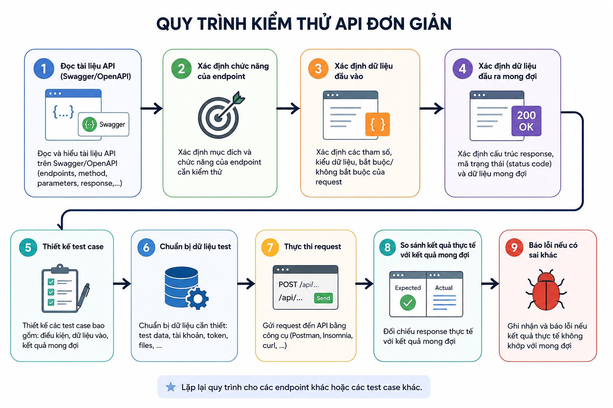

# How to Test an API

### Table of contents

- [How to Test an API](#how-to-test-an-api)
  - [Table of contents](#table-of-contents)
  - [1. Tư duy kiểm thử API (API Testing Mindset)](#1-tư-duy-kiểm-thử-api-api-testing-mindset)
  - [2. Quy trình kiểm thử API](#2-quy-trình-kiểm-thử-api)
  - [3. Functional Testing (Kiểm thử chức năng)](#3-functional-testing-kiểm-thử-chức-năng)

## 1. Tư duy kiểm thử API (API Testing Mindset)

Khi mới bắt đầu học API Testing, nhiều người có xu hướng chỉ kiểm tra xem API có trả về 200 OK hay không. Tuy nhiên, đây chỉ là bước kiểm tra đầu tiên. Một API trả về mã trạng thái thành công không đồng nghĩa với việc chức năng hoạt động chính xác.

Ví dụ, một API lấy thông tin người dùng:

```
GET /users/1001
```

Response:

```
{
    "id": 1001,
    "name": "",
    "email": "abc@gmail",
    "age": -10
}
```

API trả:

```
HTTP/1.1 200 OK
```

Nếu chỉ nhìn vào Status Code, bạn sẽ nghĩ API hoạt động bình thường. Nhưng dưới góc nhìn của QA, response này có rất nhiều vấn đề:

- `name` rỗng trong khi là trường bắt buộc.
- `email` không đúng định dạng.
- `age` âm, không hợp lệ theo nghiệp vụ.

Dữ liệu trả về không phản ánh đúng yêu cầu của hệ thống.

Vì vậy, khi kiểm thử API, QA luôn phải trả lời các câu hỏi:

- API có trả đúng dữ liệu không?
- Dữ liệu có đúng nghiệp vụ không?
- Có đầy đủ field không?
- Có đúng kiểu dữ liệu không?
- Có xử lý đúng các trường hợp lỗi không?
- Hiệu năng có đáp ứng yêu cầu không?

&rarr; Đây chính là tư duy nền tảng của API Testing.

## 2. Quy trình kiểm thử API

Trong thực tế, QA không mở Postman lên và gửi request ngay. Trước tiên, cần hiểu API sẽ được kiểm thử như thế nào.

Một quy trình phổ biến gồm các bước:

1. Đọc tài liệu API (Swagger/OpenAPI).
2. Xác định chức năng của endpoint.
3. Xác định dữ liệu đầu vào.
4. Xác định dữ liệu đầu ra mong đợi.
5. Thiết kế test case.
6. Chuẩn bị dữ liệu test.
7. Thực thi request.
8. So sánh kết quả thực tế với kết quả mong đợi.
9. Báo lỗi nếu có sai khác.



Ví dụ với API đăng nhập:

```
POST /login
```

QA cần trả lời:

- Username bắt buộc không?
- Password có giới hạn độ dài không?
- Sai password trả về gì?
- Sai username trả về gì?
- Có khóa tài khoản sau nhiều lần đăng nhập sai không?
- Token có thời gian hết hạn bao lâu?

## 3. Functional Testing (Kiểm thử chức năng)

Functional Testing là việc xác minh API thực hiện đúng chức năng theo yêu cầu.

Ví dụ API tạo người dùng:

```
POST /users
```

Body:

```
{
    "name": "Trung",
    "email": "trung@gmail.com"
}
```

Expected:

- Status Code = 201.
- User được tạo.
- Database có bản ghi mới.
- Response trả đúng dữ liệu vừa tạo.

Nếu response như sau thì API hoạt động đúng:

```
{
    "id": 15,
    "name": "Trung",
    "email": "trung@gmail.com"
}
```

Ngược lại:

```
{
    "id": 15,
    "name": "Nguyen Van A",
    "email": "abc@gmail.com"
}
```

thì đây là lỗi chức năng, mặc dù Status Code vẫn là `201 Created`.
