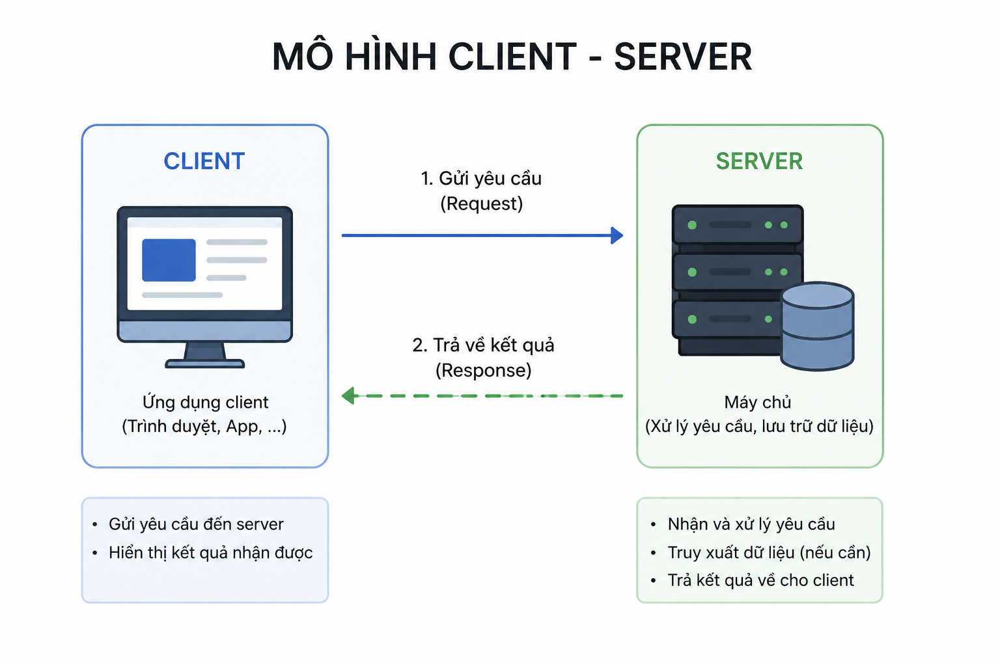

# Mô hình Client - Server

### Table of contents

- [Mô hình Client - Server](#mô-hình-client---server)
  - [Table of contents](#table-of-contents)
  - [1. Khái niệm](#1-khái-niệm)
  - [2. Thành phần của mô hình Client - Server](#2-thành-phần-của-mô-hình-client---server)
    - [2.1 Client](#21-client)
    - [2.2 Server](#22-server)
  - [3. Quy trình hoạt động](#3-quy-trình-hoạt-động)

## 1. Khái niệm

Mô hình Client - Server là kiến trúc mạng trong đó một hoặc nhiều Client (máy khách) gửi yêu cầu (request) đến Server (máy chủ) để truy cập dữ liệu hoặc sử dụng dịch vụ. Server sẽ xử lý yêu cầu và trả về kết quả (response) cho Client.

Ví dụ:
Trình duyệt Chrome mở website.
Ứng dụng Mobile Banking truy vấn số dư tài khoản.
Ứng dụng thương mại điện tử lấy danh sách sản phẩm.

## 2. Thành phần của mô hình Client - Server

### 2.1 Client

Client là thiết bị hoặc ứng dụng gửi yêu cầu đến Server.

Ví dụ:

Trình duyệt web (Chrome, Firefox)
Ứng dụng mobile
Desktop application
API Client (Postman)

Chức năng:

- Hiển thị giao diện cho người dùng.
- Thu thập dữ liệu đầu vào.
- Gửi request đến Server.
- Nhận và hiển thị response.

### 2.2 Server

Server là hệ thống tiếp nhận và xử lý yêu cầu từ Client.

Ví dụ:

Web Server
Application Server
Database Server

Chức năng:

- Xử lý nghiệp vụ.
- Xác thực người dùng.
- Truy xuất dữ liệu.
- Trả kết quả về Client.

## 3. Quy trình hoạt động

Ví dụ người dùng đăng nhập vào hệ thống:

1. User nhập username/password
2. Client gửi request Login
3. Server nhận request
4. Server kiểm tra thông tin
5. Server trả kết quả
6. Client hiển thị thành công/thất bại

