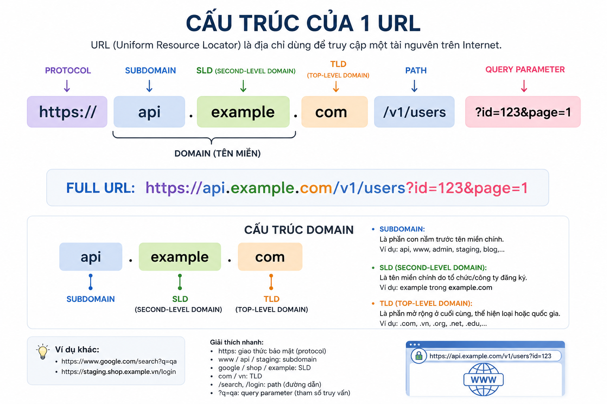
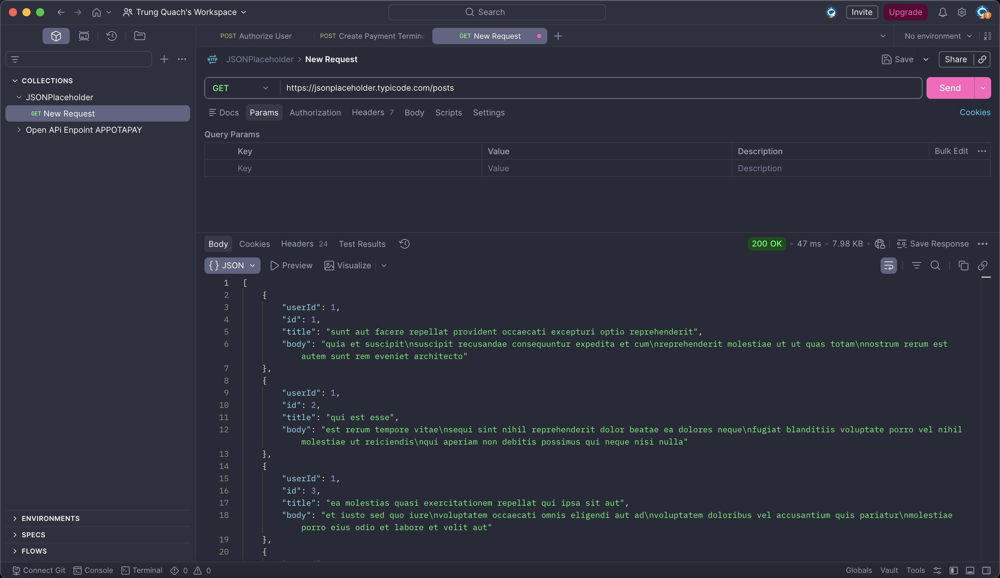
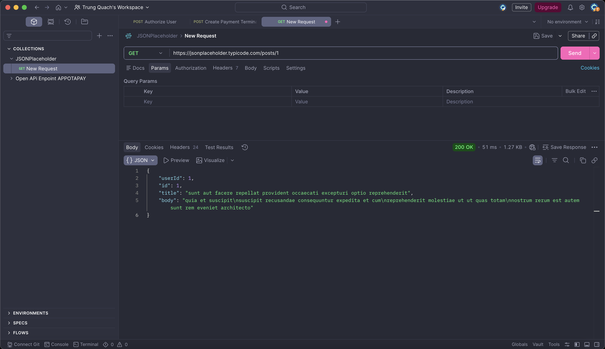
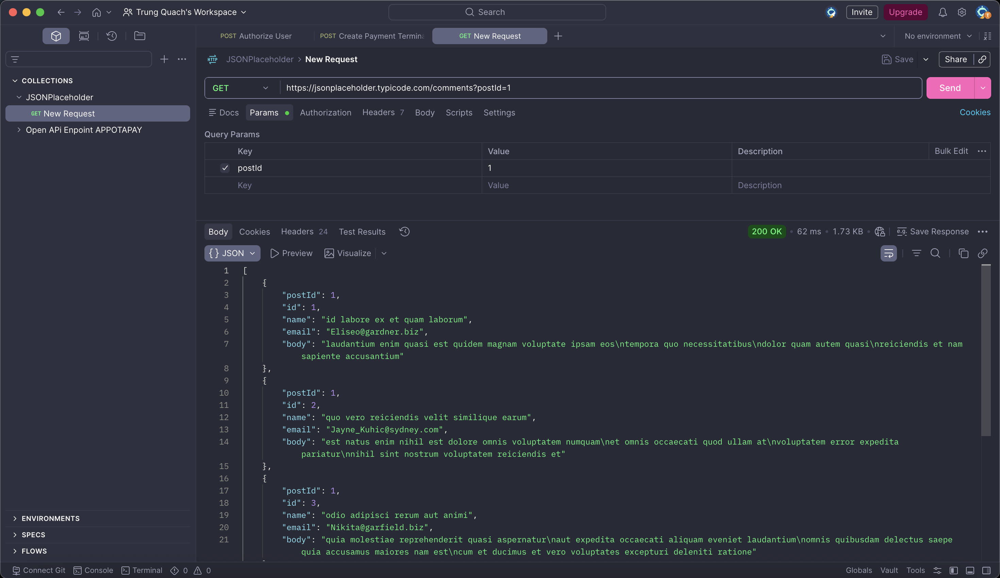

# Kiến thức tổng quan về API Testing

### Table of contents

- [Kiến thức tổng quan về API Testing](#kiến-thức-tổng-quan-về-api-testing)
  - [Table of contents](#table-of-contents)
  - [1. API (Application Programming Interface)](#1-api-application-programming-interface)
  - [2. URL và Endpoint](#2-url-và-endpoint)
  - [3. Request và Response](#3-request-và-response)
    - [Cấu trúc một HTTP Request](#cấu-trúc-một-http-request)
    - [Cấu trúc một HTTP Response](#cấu-trúc-một-http-response)
  - [4. HTTP Headers (Các loại Headers phổ biến)](#4-http-headers-các-loại-headers-phổ-biến)
  - [5. HTTP Status Codes](#5-http-status-codes)
  - [6. REST API (Các nguyên tắc cốt lõi)](#6-rest-api-các-nguyên-tắc-cốt-lõi)
  - [7. JSON (JavaScript Object Notation)](#7-json-javascript-object-notation)
  - [Bài tập thực hành](#bài-tập-thực-hành)

## 1. API (Application Programming Interface)

API (Application Programming Interface) là tập hợp các quy tắc cho phép hai ứng dụng giao tiếp với nhau.

Nói đơn giản:

> API giống như một người phục vụ trong nhà hàng.
> Khách (Client) gọi món.
> Người phục vụ (API) mang yêu cầu vào bếp.
> Bếp (Server) nấu.
> Người phục vụ đem món ra cho khách

Cơ chế hoạt động: Hoạt động theo mô hình Client-Server. Client gửi yêu cầu (Request) $\rightarrow$ API tiếp nhận, kiểm tra tính hợp lệ và chuyển đến Server $\rightarrow$ Server xử lý, truy vấn Database $\rightarrow$ API nhận kết quả từ Server và trả về Client (Response).

Ví dụ thục tế:
Bạn mở ứng dụng Shopee. Ứng dụng cần lấy danh sách sản phẩm.

```
GET /products
```

Server trả:

```
[
  {
    "id":1,
    "name":"iPhone",
    "price":25000000
  },
  {
    "id":2,
    "name":"Laptop"
  }
]
```

App chỉ việc hiển thị.

## 2. URL và Endpoint

Một URL của API thường được chia nhỏ thành nhiều phần để máy chủ định tuyến (routing) chính xác:

$$\text{https://} \underbrace{\text{api.pay.com}}_{\text{Domain/Host}} \text{/} \underbrace{\text{v1}}_{\text{Versioning}} \text{/} \underbrace{\text{transactions}}_{\text{Resource/Endpoint}} \underbrace{\text{?status=success\&page=2}}_{\text{Query Parameters}}$$

- Base URL (`https://api.pay.com`): Địa chỉ máy chủ lưu trữ API.

- Versioning (`/v1`): Phiên bản của API. Cực kỳ quan trọng trong kiểm thử để đảm bảo tính tương thích ngược khi hệ thống nâng cấp lên /v2.

- Endpoint (`/transactions`): Đường dẫn trỏ thẳng đến tài nguyên cụ thể.

- Query Parameters (`?status=success&page=2`): Phần nằm sau dấu `?` . Dùng để lọc, sắp xếp hoặc phân trang` dữ liệu.

- Path Param: Dùng để định danh 1 đối tượng duy nhất và nằm trực tiếp trong đường dẫn (`/transactions/TXN9988`)

Ví dụ:



## 3. Request và Response

### Cấu trúc một HTTP Request

- **Request Method (Phương thức)**: Hành động muốn thực hiện (GET, POST, PUT, DELETE...).

- **Request URL**: Địa chỉ Endpoint nhận yêu cầu.

- **Request Headers**: Các thông tin cấu hình đi kèm (Token, Loại dữ liệu...).

- **Request Body**: Nội dung gửi lên (thường dùng cho POST, PUT, PATCH).

Ví dụ:

```
POST

/users

Headers

Content-Type: application/json

Body

{
  "name":"John"
}
```

### Cấu trúc một HTTP Response

- **Status Code & Status Message**: Trạng thái xử lý (Ví dụ: 200 OK, 400 Bad Request).

- **Response Headers**: Thông tin cấu hình từ server trả về (Thời gian xử lý, kiểu dữ liệu trả về, cơ chế bảo mật...).

- **Response Body**: Dữ liệu kết quả (thường là JSON).

Ví dụ gửi request:

```
GET /users/1
```

Response:

```
HTTP/1.1 200 OK
Content-Type: application/json
Cache-Control: no-cache

{
    "id": 1,
    "name": "John",
    "email": "john@gmail.com",
    "active": true
}
```

## 4. HTTP Headers (Các loại Headers phổ biến)

Headers được chia làm 2 loại: Request Headers (Client gửi đi) và Response Headers (Server trả về).

- **Authentication/Authorization**: `Authorization: Bearer <Token>`. Nếu không có hoặc token hết hạn $\rightarrow$ API phải trả về lỗi 401.
- **Content-Type**: Định nghĩa định dạng dữ liệu gửi đi (Ví dụ: `application/json`, `application/x-www-form-urlencoded`).
- **Accept**: Client báo cho Server biết nó muốn nhận lại dữ liệu dạng gì (Ví dụ: `Accept: application/json`).
- **Custom Headers**: Do lập trình viên tự định nghĩa để phục vụ logic riêng. Ví dụ hệ thống thanh toán thường có: `X-Signature` (Chữ ký số để chống gian lận dữ liệu).

## 5. HTTP Status Codes

| Mã trạng thái | Tên chuẩn (Reason Phrase) | Ý nghĩa                                                                          | Kịch bản kiểm thử (QC/Tester Edge Cases)                                               |
| :------------ | :------------------------ | :------------------------------------------------------------------------------- | :------------------------------------------------------------------------------------- |
| **200**       | OK                        | Yêu cầu thành công. Server trả về dữ liệu chuẩn.                                 | Kiểm tra xem cấu trúc JSON trả về có đúng và đủ các field hay không.                   |
| **201**       | Created                   | Khởi tạo tài nguyên thành công.                                                  | Thường gặp khi POST tạo mới một giao dịch thanh toán hoặc hóa đơn.                     |
| **304**       | Not Modified              | Dữ liệu không thay đổi so với bản lưu trong bộ nhớ đệm (Cache).                  | Dùng để test hiệu năng và cơ chế lưu cache của ứng dụng.                               |
| **400**       | Bad Request               | Lỗi cú pháp từ Client (Thiếu trường bắt buộc, sai định dạng dữ liệu).            | Test case: Gửi thiếu `amount`, điền sai định dạng ngày tháng trong Body.               |
| **401**       | Unauthorized              | Chưa xác thực tài khoản (Thiếu hoặc sai Token).                                  | Test case: Không truyền header `Authorization`, hoặc truyền token đã hết hạn.          |
| **403**       | Forbidden                 | Đã xác thực nhưng tài khoản không có quyền truy cập tài nguyên này.              | Test case: Dùng tài khoản của Khách hàng để gọi API dành riêng cho Admin/Merchant.     |
| **404**       | Not Found                 | Không tìm thấy đường dẫn Endpoint hoặc Tài nguyên yêu cầu.                       | Test case: Gọi sai URL endpoint, hoặc truyền một `transaction_id` không tồn tại.       |
| **422**       | Unprocessable Entity      | Dữ liệu đúng cú pháp cấu trúc nhưng sai quy tắc logic nghiệp vụ.                 | Test case: Nhập số tiền thanh toán là số âm (`amount: -50000`).                        |
| **500**       | Internal Server Error     | Lỗi hệ thống từ phía Server (Sập nguồn, crash code, lỗi kết nối DB).             | API trả về mã này nghĩa là code server chưa bắt ngoại lệ (try-catch) tốt. Bug của Dev. |
| **502**       | Bad Gateway               | Server trung gian (Gateway/Proxy) nhận phản hồi không hợp lệ từ server phía sau. | Thường xảy ra khi deploy code lỗi hoặc server backend bị sập đột ngột.                 |
| **504**       | Gateway Timeout           | Server phía sau không phản hồi kịp thời cho Gateway trong thời gian quy định.    | Test case: Kiểm thử hiệu năng (Performance/Stress test) khi hệ thống bị quá tải xử lý. |

## 6. REST API (Các nguyên tắc cốt lõi)

**REST (REpresentational State Transfer)** không phải là một công nghệ, mà là một phong cách thiết kế. Một API được gọi là RESTful khi tuân thủ các nguyên tắc:

**Stateless (Không lưu trạng thái)**: Mỗi Request gửi lên phải độc lập và chứa đầy đủ thông tin để Server hiểu được (bao gồm cả Token xác thực). Server không lưu bất kỳ ngữ cảnh nào của Client trước đó.

**Sử dụng danh từ cho Endpoint**: Không dùng hành động trong endpoint.

- Sai: `POST /create_transaction` hoặc `GET /get_all_transactions`
- Đúng: Dùng chung endpoint danh từ `/transactions` nhưng thay đổi HTTP Method:
  - `POST /transactions` $\rightarrow$ Tạo giao dịch.
  - `GET /transactions` $\rightarrow$ Lấy danh sách giao dịch.

**Idempotency (Tính đồng nhất):** Một số Method như GET, PUT, DELETE nếu gọi 1 lần hay 100 lần cùng một dữ liệu thì kết quả trên server vẫn không đổi. Ngược lại, POST không có tính chất này (gọi 2 lần POST sẽ tạo ra 2 giao dịch, gây trùng lặp thanh toán).

## 7. JSON (JavaScript Object Notation)

JSON là định dạng dữ liệu văn bản (text-only), độc lập với ngôn ngữ lập trình.

Cú pháp nghiêm ngặt: Chỉ cần sai một dấu phẩy `,` hoặc thiếu một dấu ngoặc `}`, JSON sẽ bị lỗi cú pháp (400 Bad Request)

Dưới đây là một ví dụ JSON Response điển hình của một giao dịch thanh toán thành công qua cổng kết nối:

```
{
  "transaction_id": "TXN20260626-99",
  "amount": 1500000,
  "currency": "VND",
  "is_success": true,
  "error_code": null,
  "customer_info": {
    "name": "Nguyen Van A",
    "phone": "0901234567"
  },
  "payment_items": [
    {
      "item_id": "PROD-01",
      "quantity": 2,
      "price": 500000
    },
    {
      "item_id": "PROD-02",
      "quantity": 1,
      "price": 500000
    }
  ]
}
```

## Bài tập thực hành

Hãy sử dụng Postman để làm việc với API công khai của JSONPlaceholder:

1. Gửi `GET /posts` và quan sát danh sách bài viết.

   

2. Gửi `GET /posts/1` và phân tích response.
   

3. Gửi `GET /comments?postId=1` để hiểu cách dùng Query Parameter.
   

4. Gửi `POST /posts` với một body JSON để tạo dữ liệu.
5. Gửi `PUT /posts/1` và so sánh với `PATCH /posts/1`.
6. Gửi `DELETE /posts/1` và quan sát status code cùng response.
